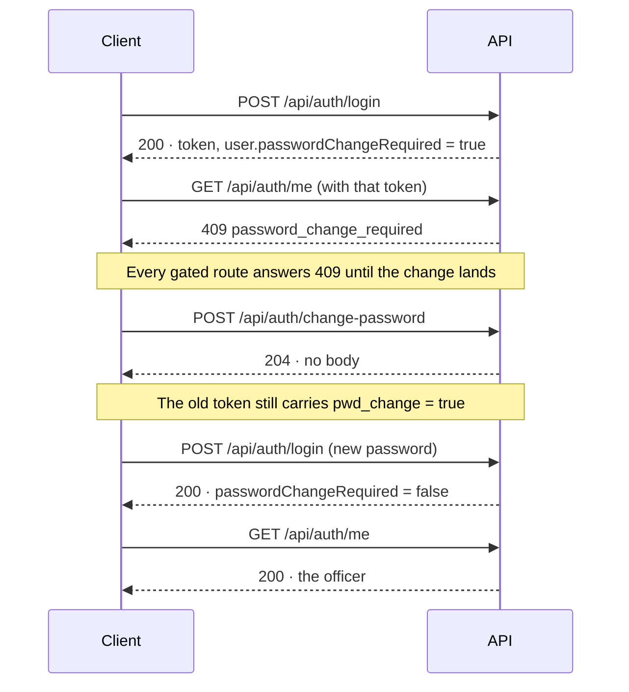
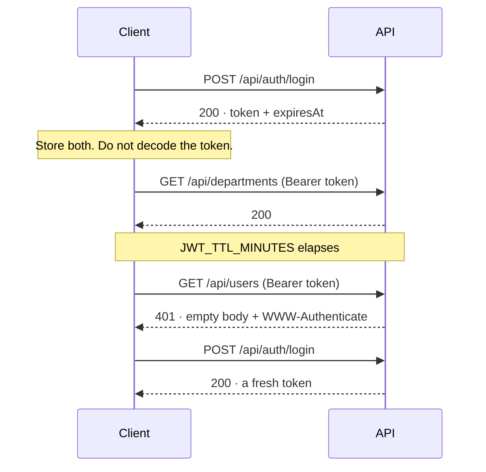

# Authentication API Contract

> **Status:** LIVE
> **Last Updated:** 2026-09-18 (ERT-1145, first issue)

Sign-in for HR staff, and the signed-in officer's own account. A handful of HR users, **local accounts
held in this system**, two roles, bcrypt, no SSO — settled as Q4 on 2026-09-16.

There is no self-service password reset. A user who is locked out is reset by an admin through
[User administration](USER_ADMINISTRATION_API_CONTRACT.md); self-service needs a mail transport and a
second bearer credential with its own expiry and threat model, and for a handful of people who share
an office an admin resetting has a property a mailed link does not — the admin knows who they handed
it to.

Read [the conventions](README.md) first: the envelope, the error codes, CORS, and the four responses
that carry no envelope.

---

## Endpoints

| Method | Path | Auth | Description |
|--------|------|------|-------------|
| POST | `/api/auth/login` | none | Exchange an email and password for a bearer token |
| POST | `/api/auth/change-password` | bearer | Change your own password — the one route a gated account may reach |
| GET | `/api/auth/me` | bearer | The signed-in officer, read from `users` rather than from the token |

`POST /api/auth/login` is **the only public `/api` route in the system**.

---

## The shape, and why

Two things about this module will look like defects and are not. Both are load-bearing, and both have
a finding behind them.

**Every sign-in failure is identical, in body and in elapsed time.** A malformed address, an address
with no account, a wrong password and a deactivated account all return the same `401` with the same
body — and take the same time, because every path verifies a password against *some* hash, the
absent-account case against a decoy. Byte-identical bodies are worth nothing if one branch returns in
1 ms and another in 100. Anything that separates them turns this endpoint into an oracle for who
works in HR.

**A password change is owed on every account that was handed to its user** — the bootstrap admin,
every account an admin creates, every account an admin resets. While that flag is set, **every route
except change-password is refused with `409`**, including `GET /api/auth/me`. That gate is what makes
a credential which exists in a deployment variable or a chat message safe to hand over: it works
exactly once, and only to replace itself.

It is a `409` rather than a `403` because the caller **is** entitled to the route, and will be again
the moment they act.

---

## 1. `POST /api/auth/login`

**Roles:** none — public.

### Request

| Field | Type | Required | Notes |
|-------|------|----------|-------|
| `email` | string | yes | Not validated for shape before the credential check; a malformed address fails the same way a wrong password does |
| `password` | string | yes | |

```bash
curl -s -X POST http://localhost:8080/api/auth/login \
  -H 'Content-Type: application/json' \
  -d '{"email":"admin@example.com","password":"BootstrapPass123"}'
```

### Response — `200`

```json
{
  "result": "success",
  "data": {
    "token": "eyJhbGciOiJIUzI1NiIsInR5cCI6IkpXVCJ9.eyJzdWIiOiJka1VFMU9KQyIsInJvbGUiOiJIUl9BRE1JTiJ9.signature",
    "expiresAt": "2026-09-18T10:42:29Z",
    "user": {
      "id": "dkUE1OJC",
      "email": "admin@example.com",
      "fullName": "Bootstrap Administrator",
      "role": "HR_ADMIN",
      "isActive": true,
      "passwordChangeRequired": true,
      "createdAt": "2026-09-18T09:42:18.742663Z"
    }
  }
}
```

| Field | Notes |
|-------|-------|
| `token` | Opaque. Send as `Authorization: Bearer <token>`; do not decode it. It carries `sub`, `role` and `pwd_change` and nothing else — no email, no name |
| `expiresAt` | Sent as a string rather than left for the client to dig out of the token, which would reach through the boundary that makes the token opaque |
| `user` | Rides along so the client can render a name and branch on a role without a second call on the one request that happens before it knows anything |
| `user.role` | `HR_OFFICER` or `HR_ADMIN` |
| `user.passwordChangeRequired` | **Read this.** `true` means route to the change-password screen and call nothing else |

No password material appears here or in any other response. `HrUserDto` has no hash field.

### Failure — `401`

```json
{
  "result": "fail",
  "error": {
    "code": "authentication_failed",
    "message": "Email or password is incorrect."
  }
}
```

**All four failures return exactly this. Do not "improve" the message.** See *The shape, and why*.

| Status | Cause |
|--------|-------|
| `401` | wrong password · unknown address · malformed address · deactivated account — indistinguishable |
| `415` | `Content-Type` missing or not `application/json` |
| `422` | body was JSON but not this shape — `request_malformed` |

Unlike a `401` from a gated route, this one **carries a body and sends no `WWW-Authenticate`
challenge**. There is no scheme to re-present to a caller trying to obtain a credential.

Not rate-limited yet — ERT-660 owns that, and until then the audit row is the detection. Every
attempt, successful or not, writes one.

---

## 2. `POST /api/auth/change-password`

**Roles:** any authenticated user, **including one that owes a password change**. This is the only
route in the system with that property.

### Request

| Field | Type | Required | Notes |
|-------|------|----------|-------|
| `currentPassword` | string | yes | |
| `newPassword` | string | yes | At least 12 characters, at most 72 **bytes** |

```bash
curl -s -X POST http://localhost:8080/api/auth/change-password \
  -H "Authorization: Bearer $TOKEN" \
  -H 'Content-Type: application/json' \
  -d '{"currentPassword":"BootstrapPass123","newPassword":"OfficerPass456789"}'
```

### Response — `204`

**Zero bytes.** There is no body to parse, despite a `Content-Type: application/json` header being
sent. Branch on the status, not on the header.

> **Sign in again afterwards.** The token you are holding still carries the old `pwd_change` claim, so
> every gated route keeps answering `409` until you exchange it. A replacement is deliberately **not**
> minted here: issuing a token outside the one use case that decides a sign-in succeeded would build
> a second, unaudited grant path.

### Failures

| Status | `code` | Cause |
|--------|--------|-------|
| `401` | `authentication_failed` | the current password is wrong — the same body a failed sign-in returns |
| `422` | `password.too_short` / `password.too_long` on `newPassword` | the replacement fails the length rule |
| `415` | `unsupported_media_type` | missing or wrong `Content-Type` |

There is no "the new password must differ from the current one" rule, **on purpose**: enforcing it
would answer whether a guessed string is the current password, from a route that is not rate-limited.

---

## 3. `GET /api/auth/me`

**Roles:** any authenticated user **not** owing a password change.

Resolved against the `users` table rather than rendered from the token's claims, so a role changed
since sign-in is reported correctly. The token is up to `JWT_TTL_MINUTES` stale by design, and this is
the one endpoint whose entire job is to say who the caller currently is.

```bash
curl -s http://localhost:8080/api/auth/me -H "Authorization: Bearer $TOKEN"
```

### Response — `200`

```json
{
  "result": "success",
  "data": {
    "id": "dkUE1OJC",
    "email": "admin@example.com",
    "fullName": "Bootstrap Administrator",
    "role": "HR_ADMIN",
    "isActive": true,
    "passwordChangeRequired": false,
    "createdAt": "2026-09-18T09:42:18.742663Z"
  }
}
```

### Failures

| Status | `code` | Cause |
|--------|--------|-------|
| `401` | — | no token, or an invalid one. **Empty body**, with a `WWW-Authenticate` challenge |
| `409` | `password_change_required` | a password change is owed |

```json
{
  "result": "fail",
  "error": {
    "code": "password_change_required",
    "message": "Change your password before using this application"
  }
}
```

This route is behind the full gate deliberately — the acceptance criterion read literally is *"every
route except change-password refuses"*. It costs the client nothing: the sign-in response already
carried the profile, including the flag that says where to go.

---

## Suggested client flow

### First sign-in on a handed-over account

**The flow a client gets wrong by default**, because step 4 is invisible until it is missing.



1. `POST /api/auth/login` → `200`. **Read `data.user.passwordChangeRequired`.** If `true`, go to the
   change-password screen and call nothing else.
2. Any other route with that token → `409 password_change_required`.
3. `POST /api/auth/change-password` → `204`, empty.
4. **`POST /api/auth/login` again.** This is the step that gets missed. The token from step 1 still
   carries the old claim, so reusing it keeps returning `409` and the screen appears to have done
   nothing.
5. The new token works everywhere.

Branching on the `409` code rather than on the flag at step 1 also works, and is more robust: an
admin reset can set the flag at any time, not only at first sign-in. Handling both is best.

### A normal session, and a token expiring under it



Store `token` and `expiresAt` together; identity comes from `data.user`. A `401` on a gated route has
**no body** — a client that unconditionally parses JSON on failure breaks here, which is why this case
belongs in the client's own test suite.

---

## Guarantees

- **Every sign-in attempt is an audit row**, successful or not. A **failure** row records the
  attempted address in `actor` and nothing else that varies: it always points at the sentinel subject
  with a null `actor_user_id`, **even when the account exists**, so the trail is not an oracle either.
- **Uniformity is enforced in elapsed time, not just in bytes.** Every losing branch of the sign-in
  use case verifies a password against some hash.
- **No response in this module carries password material.** The DTO has no field for it.
- **`AppError.AuthenticationFailed` is a `data object`** — one value, carrying no fields — so a second
  call site cannot render a slightly more helpful variant. It is HR-side only; the portal keeps
  `Denied`.

## Known limits

- **Token lifetime is the revocation window.** The verifier validates claims and does not resolve
  `sub` against `users` per request, so deactivating an account — or resetting its password — does
  **not** invalidate a token already issued to it. For an account disabled for cause, revoke what the
  person can reach; do not rely on this taking effect immediately.
- **`POST /api/auth/login` is not rate-limited.** It is the third public endpoint in the system and
  the easiest to forget. ERT-660 owns it; until then the `SIGN_IN_FAILED` audit row is the detection,
  and sign-in measures about 3.95 req/s at concurrency 1 because invariant 10 requires a bcrypt
  verification on every losing path. That cost is correct and must not be weakened — ERT-1170 bounds
  how many attempts reach it instead.
- **There is no self-service reset, and no "forgot password" endpoint.** See
  [User administration](USER_ADMINISTRATION_API_CONTRACT.md).
- **Two roles differ in configuration rights, not validation rights.** An `HR_OFFICER` can still
  create a hire, change its email and approve every document unaided. §8.13 keeps one effective role
  for v1 and mitigates it with the exception report.

## Configuration

| Key | Default | Notes |
|---|---|---|
| `JWT_SECRET` | — | Required outside dev; startup refuses without it. In dev a per-process key is generated, so **every restart invalidates every token** |
| `JWT_TTL_MINUTES` | `60` | Also the revocation window |
| `JWT_ISSUER` | `http://localhost:8080/` | |
| `JWT_AUDIENCE` | `employee-requirements-tracker` | |
| `HR_BOOTSTRAP_EMAIL` / `HR_BOOTSTRAP_PASSWORD` | — | The first `HR_ADMIN`, created **only when the `users` table is empty**, owing a password change. Required outside dev when the table is empty. Changing these and restarting rewrites nothing — a startup path that can rewrite a live credential from an environment variable is a backdoor with a nice name |
