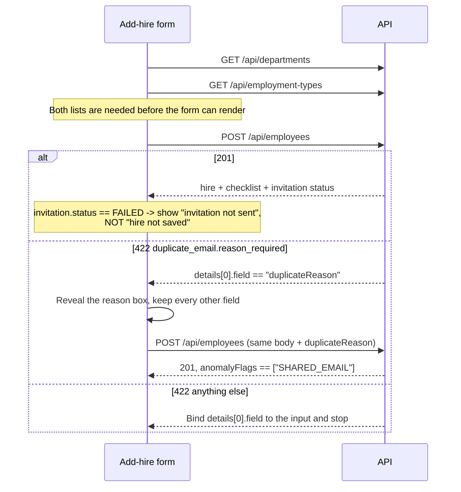

# Hire Creation API Contract

> **Status:** LIVE — this describes an endpoint that is built and running.
> **Last Updated:** 2026-09-18 (ERT-450, first issue)

HR creates a hire. One call does four things: writes the employee, copies the requirement checklist
from the catalogue, issues a tokenised upload link, and queues the invitation email.

Read [the conventions](README.md) first — the envelope, the error-code table and the CORS rules live
there rather than being repeated here.

**Every payload below was captured from a running server.** The one exception is called out by name
under *Known limits*.

---

## Endpoints

| Method | Path | Auth | Description |
|---|---|---|---|
| `POST` | `/api/employees` | `HR_OFFICER` or `HR_ADMIN` | Create a hire, snapshot its checklist, issue its link, queue its invitation |

---

## The shape, and why

**Every failure is a `422`, including an unknown department.** The reference ids arrive in the body,
and the rule across this API is that a body field's failure is a validation error naming that field.
A `404` would be a statement about the URL, which is correct here whatever the ids say. There are two
codes rather than one — `department_unknown` and `employment_type_unknown` — because both ids are
12-character identifiers and structurally indistinguishable, so one code could not tell the form
which picker to fix.

**A duplicate address is a `422` asking for a reason, not a `409` refusing.** The system does not
reject the request; it asks for a justification and then proceeds. That justification is the
artefact: it reaches the audit trail and the exception report, which a boolean "force" flag never
could. The `details` entry names **`duplicateReason`** — the body field a form has to fill.

So the duplicate flow is two requests, and the second is not a retry of the first:

1. `POST` without `duplicateReason` → `422 duplicate_email.reason_required`
2. `POST` again with `duplicateReason` filled → `201`, and the new hire carries `SHARED_EMAIL`

Only the **new** hire is flagged. The hire it duplicates is left untouched, and the audit trail is
what recovers the pair.

**A duplicate against a completed or cancelled hire needs no reason.** The rule is about two *active*
records sharing a mailbox.

**`invitation.status` is `QUEUED`, never `SENT`.** The invitation is written durably to an outbox;
nothing transmits until the mail relay ships (ERT-1010). Do not tell the officer the employee has
received anything.

**A failed invitation still returns `201`.** The hire was created; only the queueing failed. The two
outcomes are deliberately separable because an officer who cannot tell them apart re-creates the
hire. The retry is `resend-link` (ERT-1030), which reissues the credential — not a replay of this
call.

**No credential appears in this response, ever.** The link token travels in the invitation email and
nowhere else; returning it here would put a live credential into a browser, a proxy log and the
OpenAPI examples. Only the link's expiry is published. There is no recovery PIN until HR issues one.

---

## 1. `POST /api/employees`

**Roles:** `HR_OFFICER` or `HR_ADMIN`.

### Request

| Field | Type | Required | Notes |
|-------|------|----------|-------|
| `firstName` | string | yes | Not blank; whitespace alone is refused |
| `middleInitial` | string \| null | no | Omit or send `null` |
| `lastName` | string | yes | Not blank |
| `departmentId` | string | yes | An id from `GET /api/departments`. `422` if unknown |
| `position` | string | yes | Not blank |
| `employmentTypeId` | string | yes | An id from `GET /api/employment-types`. `422` if unknown. **Decides the checklist** |
| `email` | string | yes | Normalised to lower case. A duplicate on an *active* hire needs `duplicateReason` |
| `duplicateReason` | string \| null | no | Required **only** after a `duplicate_email.reason_required` refusal. Whitespace alone counts as absent |

```bash
curl -s -X POST http://localhost:8080/api/employees \
  -H "Authorization: Bearer $TOKEN" \
  -H 'Content-Type: application/json' \
  -d '{"firstName":"Jose","middleInitial":"P","lastName":"Dela Cruz",
       "departmentId":"d00000000001","position":"Cashier",
       "employmentTypeId":"e00000000001","email":"jose.delacruz@example.com"}'
```

### Response — `201`

```json
{
  "result": "success",
  "data": {
    "id": "ifGvd1HI",
    "firstName": "Jose",
    "middleInitial": "P",
    "lastName": "Dela Cruz",
    "departmentId": "d00000000001",
    "position": "Cashier",
    "employmentTypeId": "e00000000001",
    "email": "jose.delacruz@example.com",
    "packetStatus": "DRAFT_COLLECTING",
    "anomalyFlags": [],
    "createdAt": "2026-09-18T11:16:15.296523Z",
    "requirements": [
      {"id": "Z9UJWBnekv05", "name": "Government-issued ID", "isRequired": true, "sortOrder": 1, "status": "PENDING"},
      {"id": "qL7YM2Iaao6S", "name": "Birth certificate", "isRequired": true, "sortOrder": 2, "status": "PENDING"},
      {"id": "30OedlhHbUSa", "name": "Tax identification number", "isRequired": true, "sortOrder": 3, "status": "PENDING"},
      {"id": "N0MCWEjCynpk", "name": "Social security number", "isRequired": true, "sortOrder": 4, "status": "PENDING"},
      {"id": "A4ei7InkBDeM", "name": "Health insurance number", "isRequired": true, "sortOrder": 5, "status": "PENDING"},
      {"id": "RJFXlfTRit1m", "name": "Housing fund number", "isRequired": true, "sortOrder": 6, "status": "PENDING"},
      {"id": "2SBr455FcnJc", "name": "Police / background clearance", "isRequired": true, "sortOrder": 7, "status": "PENDING"},
      {"id": "CSgm2MoeGAoZ", "name": "Pre-employment medical result", "isRequired": true, "sortOrder": 8, "status": "PENDING"},
      {"id": "K95w1kw5sBnN", "name": "Transcript of records or diploma", "isRequired": true, "sortOrder": 9, "status": "PENDING"},
      {"id": "6rRbI1Fxygak", "name": "Certificate of employment (previous employer)", "isRequired": false, "sortOrder": 10, "status": "PENDING"},
      {"id": "opIhjKG3fYBx", "name": "Tax form from previous employer", "isRequired": false, "sortOrder": 11, "status": "PENDING"},
      {"id": "Rc3f8aqOvbwL", "name": "ID photos", "isRequired": true, "sortOrder": 12, "status": "PENDING"},
      {"id": "2n7kzJbJiA9C", "name": "Marriage certificate", "isRequired": false, "sortOrder": 13, "status": "PENDING"},
      {"id": "zUWrHANEzZJ6", "name": "Dependents' birth certificates", "isRequired": false, "sortOrder": 14, "status": "PENDING"}
    ],
    "linkExpiresAt": "2026-12-17T11:16:15.296523Z",
    "invitation": {
      "status": "QUEUED"
    }
  }
}
```

| Field | Notes |
|---|---|
| `id` | 8 characters. The id the server **stored**, which is not always the first one it drew |
| `packetStatus` | `DRAFT_COLLECTING` on creation, always |
| `anomalyFlags` | Empty, or `["SHARED_EMAIL"]` when a duplicate was overridden |
| `requirements` | The checklist **copied** from the catalogue at this instant, in `sortOrder`. Editing a template later never changes this list |
| `requirements[].id` | 12 characters, and it is the *employee requirement*, not the template. This is the id the upload endpoints take |
| `requirements[].isRequired` | Optional items are listed too, and are excluded from progress denominators |
| `requirements[].status` | `PENDING` on creation, always |
| `linkExpiresAt` | The link's absolute ceiling, fixed at issue. It does not move when policy changes |
| `invitation.status` | `QUEUED` or `FAILED` — see *The shape, and why* |
| `invitation.reason` | Present only when `FAILED` |

**The checklist is decided by `employmentTypeId` alone**, and the fourteen rows above are what the
default seed assigns to `Regular`. Do not hard-code the list or its length.

### Failures

| Status | `code` | Cause |
|--------|--------|-------|
| `422` | `duplicate_email.reason_required` | the address belongs to an active hire and `duplicateReason` is absent |
| `422` | `email.invalid_format` | the address does not parse |
| `422` | `department_unknown` | no department has that id |
| `422` | `employment_type_unknown` | no employment type has that id — **including a department id sent in this slot** |
| `422` | `employment_type_no_requirements` | that employment type has no active templates, so the hire would be complete with nothing uploaded |
| `422` | `first_name.required` · `last_name.required` · `position.required` | blank or whitespace only |
| `422` | `request_malformed` | the body is not readable JSON |
| `415` | `unsupported_media_type` | no `Content-Type: application/json` |
| `409` | `password_change_required` | the caller still owes a password change |
| `401` | — | no token, or an expired or unrecognised one. **Empty body** |

**Validation stops at the first failure**, so there is never more than one `details` entry. The order
is: email format, first name, last name, position, department, employment type, catalogue, then the
duplicate check. A form that submits and re-submits surfaces them one at a time.

```json
{
  "result": "fail",
  "error": {
    "code": "duplicate_email.reason_required",
    "message": "Give a reason to continue.",
    "details": [
      {"code": "duplicate_email.reason_required", "field": "duplicateReason"}
    ]
  }
}
```

```json
{
  "result": "fail",
  "error": {
    "code": "validation_failed",
    "message": "Some fields need attention.",
    "details": [
      {"code": "department_unknown", "field": "departmentId", "message": "No department with that id"}
    ]
  }
}
```

```json
{
  "result": "fail",
  "error": {
    "code": "validation_failed",
    "message": "Some fields need attention.",
    "details": [
      {"code": "email.invalid_format", "field": "email", "message": "Not a valid email address"}
    ]
  }
}
```

```json
{
  "result": "fail",
  "error": {
    "code": "password_change_required",
    "message": "Change your password before using this application"
  }
}
```

**The duplicate refusal is the odd one out and a client must handle it specially**: its top-level
`code` is `duplicate_email.reason_required` rather than `validation_failed`, and its `details` entry
carries no `message`. Branch on `error.code` first, then on `details[].field`.

---

## Suggested client flow

### Adding a hire



Three things worth building in from the start:

1. **Keep the form populated across the duplicate round trip.** The second request is the same body
   plus one field. Clearing it makes officers retype a hire to justify it.
2. **Render `invitation.status == "FAILED"` as a non-blocking warning with the hire's id**, not as an
   error dialog. The hire exists; re-submitting the form creates a second one.
3. **Do not derive progress from this response.** Everything is `PENDING` here by definition. The
   hire list is where progress lives.

---

## Guarantees

- **The checklist is a snapshot.** A template renamed, reordered, retired or made optional tomorrow
  does not change any hire created today. `requirements[].name` is the text to display; there is no
  need to join it back to the catalogue.
- **`linkExpiresAt` is fixed at issue.** A later policy change does not move it.
- **`id` is the stored id.** If the server's first draw collided, the value here is the one that was
  written, and every later call uses it.
- **No credential is ever in this body** — no token, no digest, no PIN.
- **A `422` wrote nothing.** No hire, no checklist rows, no link, no invitation.

## Known limits

- **The `FAILED` invitation body is the one payload here not captured from a running server.** The
  only way to produce it is for the outbox insert itself to fail, which a healthy server does not do
  on demand. Its shape — `{"status": "FAILED", "reason": "…"}` — is pinned by a route test rather
  than by an observed sample, and this note exists so that is visible rather than assumed. Treat
  `reason` as diagnostic text for an operator, not as something to branch on.
- **Reference data is seeded, not managed.** There is no create, update or delete for departments or
  employment types in Phase 1, and the default seed holds one department (`Unassigned`).
- **Nothing is emailed yet.** `QUEUED` means a row in the outbox table. The relay is ERT-1010.
- **There is no length cap on the text fields beyond the database columns** — `firstName` and
  `lastName` 128, `position` 256, `email` 320. An over-long value is currently a `500` rather than a
  `422` (C26, open). Cap them client-side until that closes.
- **No bulk or CSV import.** One hire per call.
