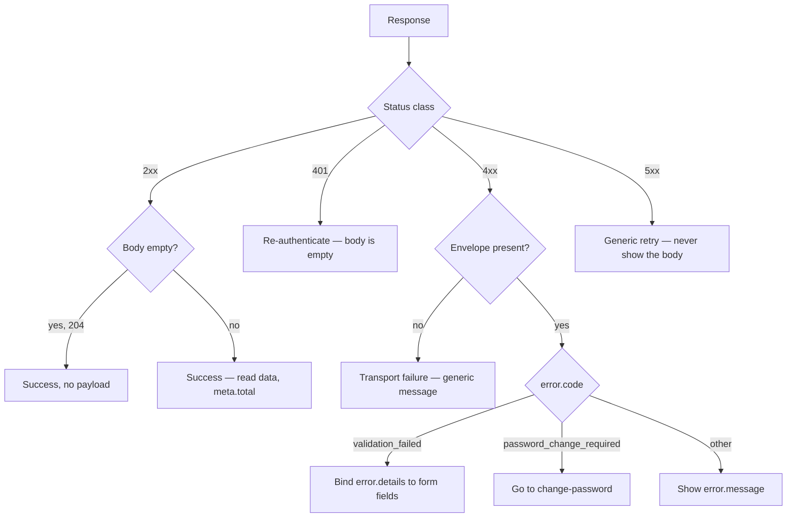

# API contracts

> **Status:** LIVE — these describe endpoints that are built and running.
> **Last Updated:** 2026-09-18 (ERT-1145, first issue)

One contract per module, written as the module lands. A contract here describes what the front-end
sends, what comes back, what comes back when it goes wrong, and in what order to call things.

**Every payload in these files was captured from a running server**, not composed. That is the rule
that makes them worth reading.

| Contract | Endpoints | Ticket |
|---|---|---|
| [Authentication](AUTHENTICATION_API_CONTRACT.md) | 3 | ERT-190 |
| [User administration](USER_ADMINISTRATION_API_CONTRACT.md) | 4 | ERT-190 |
| [Requirement catalogue](REQUIREMENT_CATALOGUE_API_CONTRACT.md) | 1 | ERT-340 |
| [Reference data](REFERENCE_DATA_API_CONTRACT.md) | 2 | ERT-350 |

Ten endpoints, all HR-side. The portal is not built; see *Not built yet* below.

**Where these and the generated spec disagree about a field name, the spec wins.** It is generated
from the live route tree at `/swagger/documentation.yaml`, so it cannot describe a route that does not
exist. These contracts carry what a generator cannot: worked payloads, the failure `code` a client
branches on, and call order. `test/ApiContractsTest.kt` fails the build on a mounted `/api` route with no
section in any contract here.

| Question | Answer lives in |
|---|---|
| How do I call it? | these contracts |
| What is the exact wire schema? | the generated spec at `/swagger/documentation.yaml` |
| Why is this endpoint shaped this way? | [docs/api-contract.md](../docs/api-contract.md) |
| What is the product requirement? | [the PRD](../docs/employee-requirements-tracker-prd_1.md) |
| When is the rest being built? | [docs/roadmap.md](../docs/roadmap.md) |

---

## Conventions

Held here rather than repeated in four files. Everything below applies to every contract.

| | |
|---|---|
| Base path | `/api` |
| Content type | `application/json` on every request with a body |
| Timestamps | ISO-8601 UTC — `2026-09-18T09:42:18.742663Z`. Sub-second precision is present on some fields and absent on others; parse, do not pattern-match |
| Ids | Alphanumeric `A-Z a-z 0-9`. An employee id is **8** characters (`dkUE1OJC`); every other id is **12** (`e00000000001`). **Case-sensitive — never normalise one** |
| Auth | `Authorization: Bearer <token>`, scheme `hr-jwt` |

**A request with a body and no `Content-Type` is `415`, not `422`.** Nothing was parsed, so it is not
"well-formed but unprocessable" — the header is the fault. A wrong type such as `text/plain` is the
same. This is the most common first mistake against this API.

### CORS — read this before debugging a browser

`CORS_ALLOWED_HOSTS` is **empty by default**, so on a fresh deployment a browser client has no allowed
origin and every call dies at the preflight with no useful message. It is comma-separated and
**`https` only**. `allowCredentials` is on, and the only request headers permitted are `Authorization`
and `Content-Type`.

A front-end that "cannot reach the API" while `curl` works is almost always this. It is a deployment
variable, not a code change.

### Authentication

Obtain a token from `POST /api/auth/login` and send it as `Authorization: Bearer <token>`.

**Do not decode the token to find out who the user is.** It carries `sub`, `role` and `pwd_change`
only — no email, no name — so identity comes from the sign-in response or `GET /api/auth/me`.

**`JWT_TTL_MINUTES` (default 60) is the revocation window.** The verifier checks claims and does not
resolve the subject against the `users` table per request, so an account that is deactivated or has
its password reset **keeps working until its token expires**. Read a `401` as "re-authenticate", never
as "this account no longer exists".

---

## The response envelope

Every `/api` response, success or failure, is the same four-field envelope. One generic
`BaseResponse<T>` decodes all of it.

```json
{
  "result": "success",
  "data": { "id": "dkUE1OJC", "email": "admin@example.com" }
}
```

```json
{
  "result": "success",
  "data": [ { "id": "d00000000001", "name": "Unassigned" } ],
  "meta": { "total": 1 }
}
```

```json
{
  "result": "fail",
  "error": {
    "code": "validation_failed",
    "message": "Some fields need attention.",
    "details": [
      { "code": "email.invalid_format", "field": "email", "message": "Not a valid email address" }
    ]
  }
}
```

```json
{
  "result": "error",
  "error": { "code": "internal_error", "message": "An unexpected error occurred." }
}
```

| Field | Notes |
|---|---|
| `result` | `success` \| `fail` \| `error`, derived from the status class — 2xx, 4xx, 5xx. No handler sets it, so it cannot disagree with the status line |
| `data` | **only ever the success payload.** Deliberately not JSend, which puts failure reasons in `data`; that would make `data` a DTO on success and an error map on failure, and one generic type would stop working |
| `meta` | response metadata beside the payload, never inside it. `total` on every list endpoint. `page` and `pageSize` are reserved and currently absent |
| `error` | carries both `fail` and `error` reasons. Three fields: `code`, `message`, `details?` |

**Absent fields are omitted, never `null`.** A success with no payload is exactly
`{"result":"success"}`.

**`code` is what you branch on; `message` is what you show when you have no copy of your own.** The
code is a *domain* identifier rather than the HTTP status, because one status covers several different
UI flows — under `422` alone there is `email.invalid_format` (highlight a field) and `role.invalid`
(the value was not in the allowed set), which `422` cannot tell apart.

**`details` is the single slot for per-field context, and a one-field failure is a list of length
one.** That is the point: a client binds errors to a form with one expression and never branches on
how many failed.

```kotlin
fun ApiError.fieldErrors(): Map<String, String> =
    details.orEmpty().mapNotNull { d -> d.field?.let { it to (d.message ?: d.code) } }.toMap()
```

### Four responses that carry no envelope

These surface in production rather than in development, and they belong in a client's own test suite.

| Response | What arrives |
|---|---|
| `401` on a gated route | **empty body, zero bytes**, plus `WWW-Authenticate: Bearer realm="Employee Requirements Tracker"` |
| `204` from change-password and reset-password | **empty body, zero bytes.** A `Content-Type: application/json` header is still sent with nothing behind it — branch on length, not on the header |
| `405`, `304` | the framework's own handling, no envelope |
| a proxy `502`, a `504`, a container OOM | never reaches this application, so no `"result": "error"` |

**A client's 5xx branch must key on the status class, not on `result`.** `result` is a convenience.

**`401` from `POST /api/auth/login` carries a body and no challenge**, unlike a `401` from a gated
route. That is correct rather than inconsistent: there is no scheme to re-present to a caller who is
trying to *obtain* a credential in the first place.

### The failure body never names a cause

No stack trace, no SQL fragment, no driver message, no table name, no file path — those name library
versions and schema internals. The cause is logged server-side and the client gets a code. A
`result: "error"` body carries no `details` at all.

---

## Error codes

The table a front-end branches on. Codes are `snake_case`, except field-scoped validation codes,
which are `<field>.<rule>` — **the dot is meaningful**: it marks a code that appears inside a
`details` entry with `field` set.

| `code` | Status | When | What the UI should do |
|---|---|---|---|
| `authentication_failed` | 401 | sign-in failed, **or** a wrong current password on change-password | One generic message. Do not try to say which part was wrong — the server will not tell you, deliberately |
| `forbidden` | 403 | an `HR_OFFICER` reached an `HR_ADMIN` route | Hide the route. The body never names the role required |
| `not_found` | 404 | unmatched route | Client routing bug |
| `user_not_found` | 404 | unknown **or malformed** account id in a path | One message. The two cases are identical on purpose |
| `password_change_required` | 409 | the account owes a password change | Route to the change-password screen |
| `user.email_taken` | 409 | creating an account on an address already in use | Keep the form open, mark the address |
| `user.cannot_deactivate_self` | 409 | an admin deactivating their own account | Disable the control on the signed-in row |
| `validation_failed` | 422 | one or more fields did not validate | Bind `details` to the form |
| `request_malformed` | 422 | body was `application/json` but not the expected shape | Client bug — the payload is wrong |
| `unsupported_media_type` | 415 | `Content-Type` missing or not `application/json` | Client bug — the header is missing |
| `internal_error` | 500 | anything unhandled | Generic retry |

### Field-scoped codes, inside `details`

| `code` | `field` | Message the server sends |
|---|---|---|
| `email.invalid_format` | `email` | `Not a valid email address` |
| `role.invalid` | `role` | `A role is one of HR_OFFICER, HR_ADMIN` |
| `full_name.required` | `fullName` | `A full name is required` |
| `password.too_short` | `initialPassword` / `newPassword` | `A password must be at least 12 characters` |
| `password.too_long` | `initialPassword` / `newPassword` | bcrypt truncates past 72 **bytes**, so a longer one is refused rather than silently becoming its own prefix |

**Validation stops at the first failure.** A request with a bad role, a bad address, a blank name and
a short password returns **one** `details` entry — `role.invalid` — not four. The order is role,
email, password, name, then the duplicate check. A form that submits and re-submits surfaces them one
at a time.

**Codes that exist in the mapper but that no endpoint can return yet** are deliberately absent:
`duplicate_email.reason_required`, `department_unknown`, `employment_type_unknown` and
`employment_type_no_requirements` arrive with hire creation (ERT-450). A documented code a client
cannot receive is the same fiction as a documented endpoint.

---

## Decoding a response, in one place

**Inspect the status in exactly one adapter**, so the responses that carry no envelope arrive as
ordinary typed failures rather than as a null envelope or a thrown exception.



```kotlin
@Serializable
data class BaseResponse<T>(
    val result: String,                  // "success" | "fail" | "error"
    val data: T? = null,
    val meta: Meta? = null,
    val error: ApiError? = null,
)

@Serializable
data class ApiError(val code: String, val message: String, val details: List<ApiErrorDetail>? = null)

@Serializable
data class ApiErrorDetail(val code: String, val field: String? = null, val message: String? = null)

sealed interface ApiResult<out T> {
    data class Success<out T>(val data: T, val meta: Meta? = null) : ApiResult<T>
    data class Fail(val error: ApiError) : ApiResult<Nothing>     // 4xx — the user can act
    data class Error(val error: ApiError) : ApiResult<Nothing>    // 5xx / transport
}
```

**`result` is a `String`, not an enum.** kotlinx throws on an unknown enum value, so a server that
ever added a fourth label would break every deployed client at the decode step. Decode with
`ignoreUnknownKeys = true` for the same reason.

Three cases worth covering in the client's own suite, because they surface in production rather than
in development: **a 401 with an empty body**, **a 502 returning HTML**, and **a 200 whose `data` is
missing**.

---

## Not built yet

The rest of the Phase 1 surface, so the shape of the whole API is visible. **No payloads —
deliberately. These are not contracts yet.** Each gets its own file as its module lands.

| Method | Path | Module | Ticket |
|---|---|---|---|
| `POST` | `/api/employees` | Hire creation | ERT-450 |
| `GET` | `/api/employees`, `/api/employees/{id}` | HR read side | ERT-510, ERT-520 |
| `GET` | `/api/portal/{token}` | Portal access | ERT-630 |
| `POST` | `/api/portal/recover`, `/api/employees/{id}/recovery-pin` | Portal access | ERT-650 |
| `GET` | `/api/portal/{token}/checklist` | Document upload | ERT-740 |
| `POST` `DELETE` | `/api/portal/{token}/requirements/{id}/…` | Document upload | ERT-750, ERT-760 |
| `POST` | `/api/portal/{token}/submit`, `/report-problem` | Review and submit | ERT-920, ERT-930 |
| `GET` | `/api/submissions/{id}/file`, `/api/employee-requirements/{id}/versions` | HR document access | ERT-810, ERT-820 |
| `POST` | `/api/employees/{id}/resend-link`, `/extend-link`, `/revoke-link` | Link lifecycle | ERT-1030 |

**Two things to design against now, because they are expensive to retrofit into a client.**

The portal is **write-mostly**: it reports document *status* and never returns document *content*, a
preview, a download URL, or an original filename. A portal screen that assumes it can show the hire
their own uploaded file will have to be rebuilt.

The portal's failures are **deliberately uninformative**. An unknown, malformed, expired, suspended or
revoked token all return one constant response; a wrong recovery PIN and an unrecognised address are
byte-identical, cookie included. Do not build a UI that tries to tell the user which it was — the
server will not say, because any difference makes the endpoint an oracle for whether a link, or a
hire, is real.

---

## Operational routes

Outside `/api` and outside the envelope.

| Path | Purpose | Exposure |
|---|---|---|
| `GET /health` | liveness probe; carries no personal data | open |
| `GET /metrics` | Prometheus scrape | open in dev, HR-authenticated otherwise; hidden from the spec |
| `/swagger` | interactive Swagger UI | open in dev, HR-authenticated otherwise |
| `/swagger/documentation.yaml` | the generated machine-readable spec | open in dev, HR-authenticated otherwise |
| `/openapi` | pre-rendered static HTML reference | **dev only — not mounted otherwise** |

```json
{
  "status": "UP",
  "service": "employee-requirements-tracker",
  "version": "0.1.0-SNAPSHOT"
}
```

**`/swagger/documentation.yaml` serves JSON, not YAML**, despite the extension. Generate a client from
it with a JSON parser.

**The service does not start at all if the database is unreachable** — it fails fast rather than
starting and reporting unhealthy, so there is no degraded mode for a client to detect.
