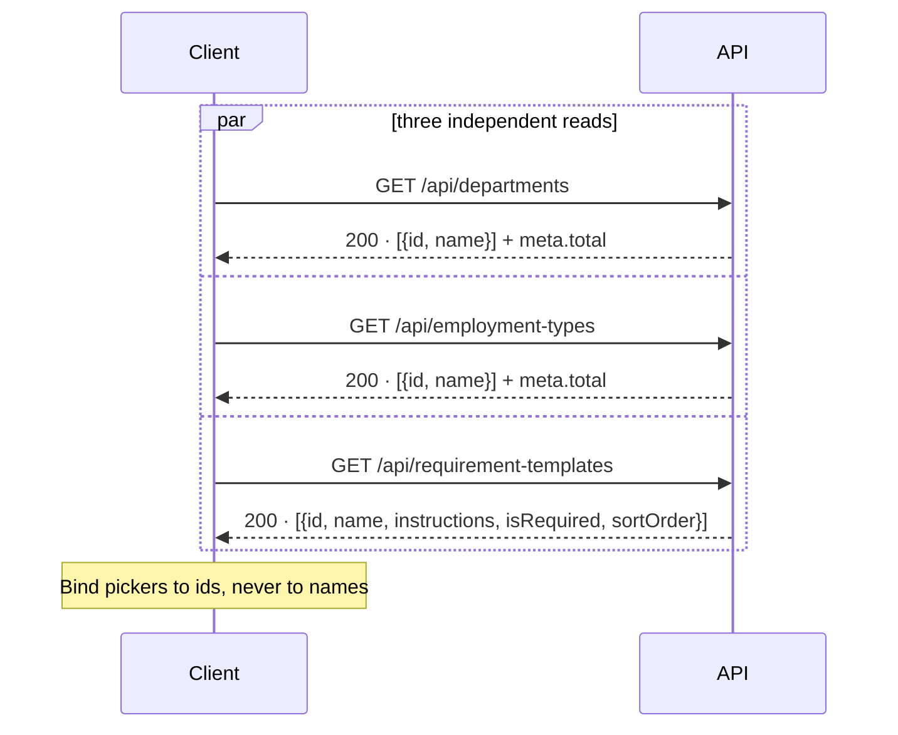

# Reference Data API Contract

> **Status:** LIVE
> **Last Updated:** 2026-09-18 (ERT-1145, first issue)

The two lists the add-hire form binds to, so HR picks a department and an employment type from the
real list rather than typing an id. Read-only.

**Seeded, not managed.** There is no create, update or delete in Phase 1.

Read [the conventions](README.md) first.

---

## Endpoints

| Method | Path | Auth | Description |
|--------|------|------|-------------|
| GET | `/api/departments` | bearer | Every department, in name order |
| GET | `/api/employment-types` | bearer | Every employment type, in name order |

---

## The shape, and why

**Two resources rather than one `/api/reference-data`.** `meta.total` is meaningless over a
heterogeneous payload, every other path in this system is one resource per path, and the Phase 2 admin
screen edits the employment-type mapping and will want `/api/employment-types` as a resource of its
own.

**Both ids are 12-character entity ids and are structurally indistinguishable**, which is exactly why
the server checks them separately when a hire is created: a single `exists(id)` scanning both tables
would answer `true` for a department id handed in the `employmentTypeId` slot. A client should treat
the two as different types even though the wire cannot tell them apart.

**The employment type chosen here selects the requirement set a hire is given**, and that set is
**snapshotted at creation** — editing the catalogue afterwards does not move a hire already
collecting.

---

## 1. `GET /api/departments`

**Roles:** any authenticated user not owing a password change.

```bash
curl -s http://localhost:8080/api/departments -H "Authorization: Bearer $TOKEN"
```

### Response — `200`

```json
{
  "result": "success",
  "data": [
    { "id": "d00000000001", "name": "Unassigned" }
  ],
  "meta": { "total": 1 }
}
```

| Field | Notes |
|-------|-------|
| `id` | 12 characters. Bind the picker to this, never to `name` |
| `name` | Display only. A correction to a name must not break a client |

In **name** order.

---

## 2. `GET /api/employment-types`

**Roles:** any authenticated user not owing a password change.

```bash
curl -s http://localhost:8080/api/employment-types -H "Authorization: Bearer $TOKEN"
```

### Response — `200`

```json
{
  "result": "success",
  "data": [
    { "id": "e00000000004", "name": "Part-time" },
    { "id": "e00000000002", "name": "Probationary" },
    { "id": "e00000000003", "name": "Project-based" },
    { "id": "e00000000001", "name": "Regular" }
  ],
  "meta": { "total": 4 }
}
```

In **name** order — **alphabetical, not an HR preference**. `employment_types` has no `sort_order`
column and insertion order is not a decision anyone made, so the list is sorted by the only column
that gives a deterministic answer. Note that `Regular`, the most common type, sorts last.

A deliberate ordering is a Phase 2 change (§8.11), not something a client should impose by
re-sorting — if the order matters to the screen, say so and the column gets added.

---

## Failures

Identical on both routes.

| Status | `code` | Cause |
|--------|--------|-------|
| `401` | — | no token, or an invalid one. Empty body |
| `409` | `password_change_required` | the caller owes a password change |

**An empty list is a `200` with `[]`, never a `404`.** Show an empty state, not an error.

---

## Suggested client flow

### Loading the add-hire form

Three independent reads — these two plus
[the requirement catalogue](REQUIREMENT_CATALOGUE_API_CONTRACT.md). None depends on another.



The requirement catalogue is shown on this screen for information — it tells HR what the hire will be
asked for. **Which subset this particular hire receives is decided server-side** from the employment
type, at creation. Do not compute it client-side from the employment type; that logic does not exist
on the client and the snapshot is the authority.

---

## Guarantees

- **Ordering is deterministic** on both routes, by `name`.
- **Both responses carry `id` and `name` and nothing else.** These tables have nothing else.
- **An id returned here is accepted by hire creation**, and the two existence checks are separate, so
  a wrong-slot id is refused by name rather than silently accepted.

## Known limits

- **One seeded department.** `Unassigned` is the only row, so any client behaviour that depends on
  choosing between departments is currently untestable against seeded data. The same was true of the
  ordering — a single row makes "in name order" vacuous, which is why the repository test inserts
  three more.
- **`employment_types` has no `sort_order`**, so the order is alphabetical rather than useful.
  `Regular` sorting last is the visible cost.
- **Neither list is paged**, and neither is capped. `meta.total` is the row count.
- **There is no admin surface.** Adding a department is a migration until Phase 2.
- **Neither endpoint appeared in PRD Appendix B until ERT-350 added them.** The gap was found by the
  ticket that built them, which also found that no port exposed either table — HR could not offer the
  real list and hire creation could not reject an id that does not exist.
