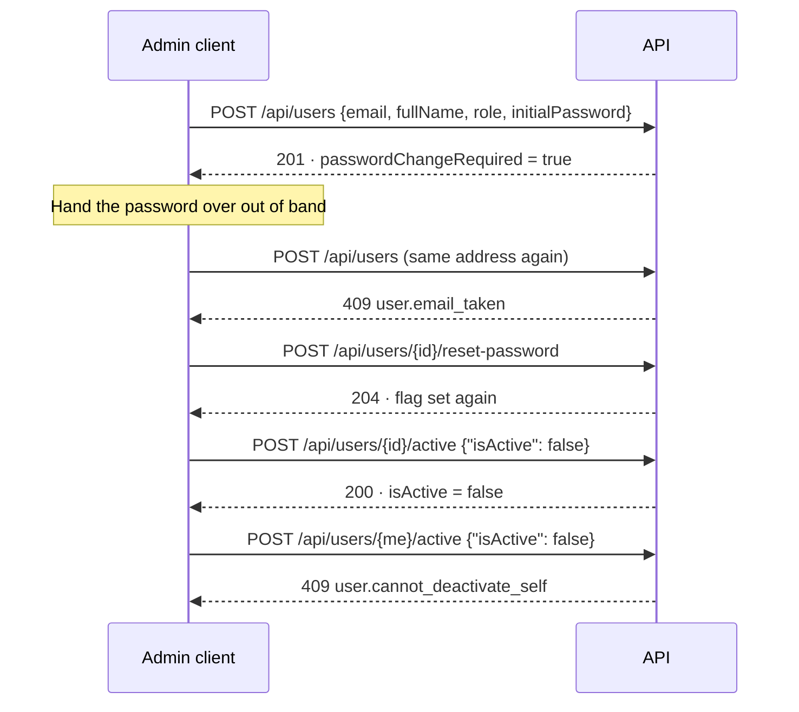

# User Administration API Contract

> **Status:** LIVE
> **Last Updated:** 2026-09-18 (ERT-1145, first issue)

Creating, listing, deactivating and resetting HR accounts. **`HR_ADMIN` only** — an `HR_OFFICER`
reaching any of these gets `403` and the attempt is audited.

**There is no delete.** Four actor columns reference `users(id)` with `on delete restrict`, so a user
who has created a hire or approved a document cannot be removed, and an audit trail naming a row that
no longer exists is not a trail. `active` is the off switch.

Read [the conventions](README.md) first, and
[Authentication](AUTHENTICATION_API_CONTRACT.md) for the password-change gate every account created
here arrives under.

---

## Endpoints

| Method | Path | Auth | Description |
|--------|------|------|-------------|
| GET | `/api/users` | `HR_ADMIN` | Every account in email order, deactivated ones included |
| POST | `/api/users` | `HR_ADMIN` | Create an account with an admin-supplied initial password |
| POST | `/api/users/{id}/active` | `HR_ADMIN` | Activate or deactivate; idempotent |
| POST | `/api/users/{id}/reset-password` | `HR_ADMIN` | Set a new password and force a change |

---

## The shape, and why

**The initial password is supplied by the admin, not generated.** A generated one would have to be
returned in a response body, and bodies get logged by proxies and pasted into tickets. Supplied, it
travels once in a request the admin composed and is never echoed. The change-required flag is what
stops "the admin knows the password" from mattering: it works exactly once, and only to replace
itself.

**A duplicate address is a `409`, not the uniform sign-in failure.** This route is behind `HR_ADMIN`,
and someone who can list every account in the organisation learns nothing from being told one exists
— while an admin who cannot be told is left retrying a creation that will never work. The uniformity
that `POST /api/auth/login` maintains buys nothing here.

**A malformed id in the path is a `404`, byte-identical to a well-formed unknown one.** Answering
`422 person_id.invalid_format` for a malformed id and `404` for an unknown one would tell a caller
which of their guesses were the right *shape*, which is an enumeration oracle. A path names a
resource; an id that cannot exist names one that does not.

**The role refusal never names the role required.** That would let an officer map the admin surface by
probing it.

---

## 1. `GET /api/users`

**Roles:** `HR_ADMIN`.

Every account in email order, **deactivated ones included** — an admin needs to see who has been
switched off, and there is no delete they could have used instead.

```bash
curl -s http://localhost:8080/api/users -H "Authorization: Bearer $TOKEN"
```

### Response — `200`

```json
{
  "result": "success",
  "data": [
    {
      "id": "dkUE1OJC",
      "email": "admin@example.com",
      "fullName": "Bootstrap Administrator",
      "role": "HR_ADMIN",
      "isActive": true,
      "passwordChangeRequired": false,
      "createdAt": "2026-09-18T09:42:18.742663Z"
    }
  ],
  "meta": { "total": 1 }
}
```

| Field | Notes |
|-------|-------|
| `id` | 8 characters — this is a person id, not an entity id |
| `role` | `HR_OFFICER` or `HR_ADMIN` |
| `isActive` | `false` means deactivated, not deleted. **A deactivated user keeps working until their token expires** |
| `passwordChangeRequired` | `true` on a freshly created or freshly reset account |

No password material is published. `HrUserDto` has no hash field.

### Failures

| Status | `code` | Cause |
|--------|--------|-------|
| `403` | `forbidden` | the caller is an `HR_OFFICER`. The attempt is audited |
| `409` | `password_change_required` | the caller owes a password change |

---

## 2. `POST /api/users`

**Roles:** `HR_ADMIN`.

### Request

| Field | Type | Required | Notes |
|-------|------|----------|-------|
| `email` | string | yes | Case-insensitively unique. `409` if taken |
| `fullName` | string | yes | Not blank; whitespace alone is refused |
| `role` | enum | yes | `HR_OFFICER` or `HR_ADMIN`. `422` if anything else |
| `initialPassword` | string | yes | At least 12 characters, at most 72 **bytes**. **Never echoed** |

```bash
curl -s -X POST http://localhost:8080/api/users \
  -H "Authorization: Bearer $TOKEN" \
  -H 'Content-Type: application/json' \
  -d '{"email":"officer@example.com","fullName":"Jamie Cruz","role":"HR_OFFICER","initialPassword":"OfficerStart123"}'
```

### Response — `201`

```json
{
  "result": "success",
  "data": {
    "id": "DklJ6Nze",
    "email": "officer@example.com",
    "fullName": "Jamie Cruz",
    "role": "HR_OFFICER",
    "isActive": true,
    "passwordChangeRequired": true,
    "createdAt": "2026-09-18T09:42:38.322186Z"
  }
}
```

`passwordChangeRequired` is `true` and the body carries no credential. Hand the password over out of
band; its owner enters the first-sign-in flow in
[Authentication](AUTHENTICATION_API_CONTRACT.md#suggested-client-flow).

### Failures

| Status | `code` | Cause |
|--------|--------|-------|
| `409` | `user.email_taken` | an account already exists on that address, in any case |
| `422` | `role.invalid` · `email.invalid_format` · `password.too_short` · `password.too_long` · `full_name.required` | **one** entry, the first rule that failed |
| `403` | `forbidden` | the caller is an `HR_OFFICER` |

```json
{
  "result": "fail",
  "error": {
    "code": "user.email_taken",
    "message": "An account already exists for that email address"
  }
}
```

**Validation stops at the first failure**, in the order role, email, password, name, then the
duplicate check. A request wrong in four ways returns one `details` entry:

```json
{
  "result": "fail",
  "error": {
    "code": "validation_failed",
    "message": "Some fields need attention.",
    "details": [
      { "code": "role.invalid", "field": "role", "message": "A role is one of HR_OFFICER, HR_ADMIN" }
    ]
  }
}
```

A form that submits and re-submits surfaces the rest one at a time. Validating client-side first is
worth doing for exactly this reason.

---

## 3. `POST /api/users/{id}/active`

**Roles:** `HR_ADMIN`.

### Request

| Field | Type | Required | Notes |
|-------|------|----------|-------|
| `isActive` | boolean | yes | Setting the state the account already has is a `200` with no audit row |

```bash
curl -s -X POST http://localhost:8080/api/users/DklJ6Nze/active \
  -H "Authorization: Bearer $TOKEN" \
  -H 'Content-Type: application/json' \
  -d '{"isActive":false}'
```

### Response — `200`

```json
{
  "result": "success",
  "data": {
    "id": "DklJ6Nze",
    "email": "officer@example.com",
    "fullName": "Jamie Cruz",
    "role": "HR_OFFICER",
    "isActive": false,
    "passwordChangeRequired": false,
    "createdAt": "2026-09-18T09:42:38.322186Z"
  }
}
```

### Failures

| Status | `code` | Cause |
|--------|--------|-------|
| `404` | `user_not_found` | no such account — **or a malformed id**, identically |
| `409` | `user.cannot_deactivate_self` | an admin deactivating their own account |
| `403` | `forbidden` | the caller is an `HR_OFFICER` |

```json
{
  "result": "fail",
  "error": {
    "code": "user.cannot_deactivate_self",
    "message": "You cannot deactivate your own account"
  }
}
```

With a handful of staff and no self-registration, the last admin switching themselves off leaves no
way back that does not involve a database prompt. **Disable the control on the signed-in user's own
row** rather than letting the `409` be the discovery.

> **This does not revoke a live token.** A deactivated user keeps working for up to
> `JWT_TTL_MINUTES`.

---

## 4. `POST /api/users/{id}/reset-password`

**Roles:** `HR_ADMIN`.

**This is the whole of password recovery in v1.**

### Request

| Field | Type | Required | Notes |
|-------|------|----------|-------|
| `newPassword` | string | yes | At least 12 characters, at most 72 **bytes** |

```bash
curl -s -X POST http://localhost:8080/api/users/DklJ6Nze/reset-password \
  -H "Authorization: Bearer $TOKEN" \
  -H 'Content-Type: application/json' \
  -d '{"newPassword":"FreshStart123456"}'
```

### Response — `204`

**Zero bytes.** `passwordChangeRequired` is set **unconditionally**, so the password the admin chose
works exactly once and only for change-password.

### Failures

| Status | `code` | Cause |
|--------|--------|-------|
| `404` | `user_not_found` | no such account, or a malformed id |
| `422` | `password.too_short` / `password.too_long` | on `newPassword` |
| `403` | `forbidden` | the caller is an `HR_OFFICER` |

**The password is validated before the account is looked up**, so a short password sent to an unknown
id is a `422`, not a `404`. Do not infer existence from the status here.

---

## Suggested client flow

### Provisioning an account and handing it over



1. Create with a password the admin chooses. It is never echoed; the `201` carries no credential.
2. The new account owes a change, so its owner enters the first-sign-in flow.
3. A duplicate address is `409 user.email_taken` — keep the form open and mark the field.
4. A reset sets the flag again, so a reset account enters that same flow.
5. Deactivate rather than delete, and disable the control on the admin's own row.

---

## Guarantees

- **A role refusal is audited.** An `HR_OFFICER` reaching any of these writes an `ACCESS_DENIED` row
  recording the attempted action and the caller's role.
- **No response carries password material**, on any route in this module.
- **Deactivation is idempotent and writes no audit row when nothing changed.**
- **An address is unique case-insensitively.** The same address in another case is still refused.
- **`AppError.Forbidden` is a `data object`** — one value, no fields — so a second call site cannot
  render a more helpful variant naming the role.

## Known limits

- **Neither deactivation nor a reset invalidates a live token.** Both take up to `JWT_TTL_MINUTES` to
  bite. This is the same trade the [Authentication](AUTHENTICATION_API_CONTRACT.md) contract records,
  and it matters most here because these are the two routes an admin reaches for in a hurry.
- **There is no delete, and there will not be one.** `on delete restrict` on four actor columns.
- **There is no self-service reset.** An admin resetting is the whole flow; a user who cannot reach an
  admin cannot get back in.
- **The bootstrap admin cannot be re-created by changing its environment variables.** It is created
  only when the `users` table is empty. Deactivating it does not bring it back on the next boot
  either, which is the point.
- **`GET /api/users` is unpaged.** `meta.total` is the row count, and `page` / `pageSize` are
  reserved but absent. Fine for a handful of staff; it is not a design that scales, and nothing
  currently caps it.
