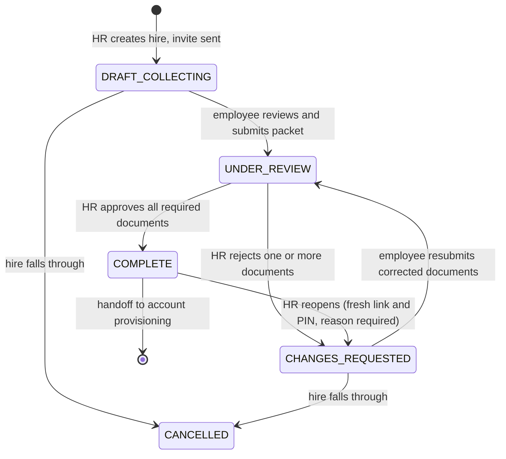

# API contract

**Status: design contract. Phase 1 endpoints are specified; most are not built yet.**

## What this document is, and what it is not

This is the **design contract**: what each endpoint is for, which business rule governs it, what it
may and may not return, and why. It exists because that information is currently spread across PRD
Appendix B (a bare method-and-path sketch), ten backlog epic files, and a security audit — and
nobody can see the shape of the API from any one of them.

**It is not an OpenAPI spec, and it must never become one.** [architecture.md](architecture.md) §9
is deliberate on this point: the spec is generated from the live route tree by
`OpenApiDocSource.Routing`, so an endpoint cannot exist without appearing in it. A hand-maintained
schema file would drift within a sprint, and a spec that lies is worse than none.

| Question | Authority |
|---|---|
| What is the exact wire shape, right now? | the generated spec at `/swagger/documentation.yaml` |
| What should this endpoint do, and why? | this document |
| What is the product requirement? | the [PRD](employee-requirements-tracker-prd_1.md) |
| When is it being built? | [roadmap.md](roadmap.md) and [backlog/](backlog/) |

When these disagree, the PRD wins on intent and the generated spec wins on shape. If this document
is the one that is out of date, fix it here — do not reconcile by hand-editing a spec file.

## What the API is authoritative for

The spec's own `info` block carries this and so does §1 of the PRD. It belongs at the top of any
contract, because it is the single most misreadable thing about this system:

> The API is authoritative for **a document was received, from a link issued to this hire, and an
> HR officer looked at it and judged it valid.**
>
> It is **not** authoritative for the identity of the person who submitted it.

`COMPLETE` is a process outcome, not identity assurance. `originalsSightedAt` is a separate field,
recorded by a named officer, and it is separate on purpose (§1, SEC-04). Any consumer treating
`COMPLETE` as proof of identity has misread the contract.

---

## Conventions

| | |
|---|---|
| Base path | `/api` |
| Content type | `application/json`, except the upload endpoint (`multipart/form-data`). A request whose `Content-Type` is missing or does not match is **415**, not 422 — the header is the fault, and nothing was parsed |
| Timestamps | ISO-8601 UTC (`2026-09-14T08:30:00Z`) |
| Ids | Alphanumeric strings, `A-Z a-z 0-9`. An employee id is **8** characters; every other id is **12**. Case-sensitive, and never to be normalised |
| HR auth | bearer JWT, scheme `hr-jwt` — **provisional, see below** |
| Portal auth | server-side session cookie, issued by `GET /api/portal/{token}` or by `POST /api/portal/recover` |

**`hr-jwt` is real once ERT-190 lands. Q4 was answered on 2026-09-16:** a handful of HR staff, local
accounts held here, two roles, bcrypt, no SSO. The mechanism is unchanged — a JWT verified against
`JWT_SECRET`, refusing to start on a default key outside dev — but it stops signing with a per-run
random key and starts issuing tokens against a `users` row, which is what finally lets a test mint a
token this application accepts. Until ERT-190 lands, every "HR auth" row below is enforced by a
scheme no test can satisfy in the positive direction.

**Path parameters.** PRD Appendix B writes `{reqId}` on portal routes and `{id}` on HR routes for
the same concept. This contract uses **`{id}` throughout**; the backlog ticket titles (ERT-750,
ERT-760) already normalised to it.

### Response envelope

Every `/api` response, success or failure, is the same envelope (ERT-145):

```json
{ "result": "success", "data": { "token": "ada9a8sd6789a" } }
{ "result": "success", "data": [ ... ], "meta": { "total": 120 } }
{ "result": "fail",    "error": { "code": "requirement_locked", "message": "..." } }
{ "result": "fail",    "error": { "code": "validation_failed", "message": "...",
                                  "details": [ { "field": "email", "code": "email.invalid_format",
                                                 "message": "..." } ] } }
{ "result": "error",   "error": { "code": "internal_error", "message": "..." } }
```

A client decodes all of it with one generic `BaseResponse<T>`. Absent fields are **omitted, never
rendered as `null`** (`explicitNulls = false`), so the denied body is exactly
`{"result":"fail","error":{"code":"not_found","message":"Not found."}}` — one constant, with nothing
in it that could differ between two causes.

| Field | |
|---|---|
| `result` | `success` \| `fail` \| `error`, derived from the status class by `resultFor` — 2xx, 4xx, 5xx. No handler supplies it, so it cannot disagree with the status line |
| `data` | **only ever the success payload.** Deliberately not JSend, which puts a `fail`'s reasons in `data`; that would make `data` a DTO on success and a field-error map on failure, and `BaseResponse<T>` would stop working |
| `meta` | response metadata beside the payload, never inside it — a count nested in `data` would force a wrapper type per list endpoint |
| `error` | carries both `fail` and `error` reasons. Three fields: `code`, `message`, `details?` |

`code` is a stable identifier a client branches on, and it is a **domain** identifier rather than
the HTTP status: under 422 alone this system has `email.invalid_format` (highlight the field) and
`duplicate_email.reason_required` (ask for a justification), which are different UI flows that `422`
cannot tell apart. `message` is display text, defaulting to a lookup on `code`; a client with its own
copy ignores it.

`details` is the **single** slot for per-item context. A one-field failure is a list of length one
and a four-field failure is a longer list, so a client binds errors to a form with one expression and
never branches on how many failed. There is no `field` or `detail` at the error root: two ways to say
the same thing is one way too many.

**`result` is a convenience, not the contract.** Most 5xx a client sees never reach this application
— a proxy 502, a 504 timeout, a container OOM — so none of those carry `"result": "error"`. A client's
5xx branch must key on the status class. The same goes for `401`, `405`, `204` and `304`, which carry
no envelope at all, and for `/health`, `/metrics`, `/openapi` and `/swagger`, which are outside it by
design.

The body **never** carries a stack trace, a SQL fragment, a driver message, a table name or a file
path — those name library versions and schema internals, so the cause is logged server-side and the
client gets a code (PRD §12). A `result: "error"` body carries no `details` at all.

**Error codes are `snake_case`, except field-scoped validation codes which are `<field>.<rule>`.**
The dot is meaningful: it marks a code that appears inside a `details` entry with `field` set.

**Every route must declare its response schema** in `describe { }`:

```kotlin
responses { response(200) { schema = jsonSchema<ApiResponse<HireDto>>() } }
```

Verified, not assumed: the generator does **not** infer a body type from `call.respond`. A route
without this block publishes an operation with no schema, and nothing a client can generate from.

**Every route that reads a body must declare its request schema** in the same block:

```kotlin
requestBody { required = true; schema = jsonSchema<SignInRequest>() }
```

The same defect in the other direction, and it went unwritten for five routes: the generator infers
no body from `call.receive<T>()` either. An operation without this block gives Swagger UI no body
editor, so its "Try it out" sends a POST with no payload and no `Content-Type` — **415 from an
endpoint that is working perfectly**, which is how `POST /api/auth/login` was found untestable from
its own documentation (ERT-146). A schema that reaches `components.schemas` but no operation is not
enough; what the UI builds an editor from is `requestBody` on the operation.

`ArchitectureTest` now fails the build on a handler that calls `receive` and publishes no
`requestBody`, because the rule above existed in this document for a sprint and five routes broke it
anyway. Prose does not stop the sixth.

### `AppError` → HTTP status

Use cases return `DomainResult<T>` = `Ok(value) | Err(AppError)`; a single mapper turns the error
into a status so no route invents its own. Defined in ERT-140.

| `AppError` | Status | Notes |
|---|---|---|
| `Validation(code, field, detail)` | **422** | one entry in `details`, naming the field |
| `ValidationFailed(errors)` | **422** | one `details` entry per field, same shape as above |
| `NotFound(code, entity)` | **404** | |
| `Conflict(code, detail)` | **409** | the locked-upload case of §8.7 |
| `ReasonRequired(code, action)` | **422** | a `details` entry naming the `reason` field; `action` is not on the wire |
| `Denied` | **404** | the shared denied body, **identical in every instance** |
| `AuthenticationFailed` | **401** | the shared sign-in failure body, **identical in every instance**. HR-side only |
| `Forbidden` | **403** | the shared role-refusal body; it never names the role required |
| missing or non-matching `Content-Type` | **415** | `unsupported_media_type`; nothing was parsed, so this is not "well-formed but unprocessable". Cause logged server-side only |
| malformed JSON body, sent as `application/json` | **422** | `request_malformed`, cause logged server-side only |
| unmatched route | **404** | the **same body** a `Denied` produces |
| — | **429** | rate limiting, ERT-660 |
| unexpected `Throwable` | **500** | generic code, cause logged server-side only |

`Denied` is a **`data object`**, not a case carrying a code. There is exactly one `Denied` value, so
a wrong PIN and an unknown token cannot render differently — the guarantee is structural rather than
a convention the mapper has to honour. The mapper adds no detail to it, and an unmatched route
renders the identical body, so a mistyped portal sub-path is not distinguishable from a denied one.

`AuthenticationFailed` and `Forbidden` are `data object`s too (ERT-190), for the same reason and with
the same consequence: one value each, carrying no fields, so a second call site cannot render a
slightly more helpful variant. **`AuthenticationFailed` is HR-side only** — a portal failure must stay
indistinguishable from an unmatched route and therefore keeps `Denied`'s 404. Using it on a portal
path would re-open SEC-01, and no mechanical guard catches that.

`401` and `405` keep Ktor's own handling **in `StatusPages`** rather than the envelope: a
`status(Unauthorized)` handler risks dropping the `WWW-Authenticate` challenge, and neither status
discloses whether a link exists. That is unchanged — a sign-in failure reaches 401 through the mapper,
which answers the call directly and never passes through a `status` handler. A challenge-less 401 from
`/api/auth/login` is also correct: there is no scheme to re-present to a caller who is trying to
*obtain* a credential.

### Where an identifier was read decides its status

| Identifier position | Failure | Why |
|---|---|---|
| **path segment** (`/api/employees/{id}`) | **404**, identical to a well-formed unknown id | A path names a resource; an id that cannot exist names one that does not. Answering 422 `person_id.invalid_format` for a malformed id and 404 for a well-formed unknown one tells the caller which guesses were the right *shape* — an enumeration oracle (§6.6) |
| **request body field** | **422**, naming the field | Nothing is disclosed: the caller already knows what they sent |

`PersonId.of` / `EntityId.of` are unchanged and still return `Validation`. `route/mapper/PathIds.kt`
reinterprets it at the edge: `orNotFound(entity)` on the HR surface, `orDenied()` on the portal,
where **every** failure — malformed, unknown, not-yours, expired, wrong PIN — collapses to the one
`Denied` response.

#### An unknown reference id in a body is a 422, not a 404 (E8, settled 2026-09-16)

`departmentId` and `employmentTypeId` both arrive in the `POST /api/employees` **body**, so the rule
above already decides them: **422, naming the field.** A 404 would assert that the *endpoint* was not
found, which is false, and would put a create call on the same footing as a path-id lookup — where
the 404 exists to stop enumeration, a concern a body field does not have, because the caller already
knows what they sent.

**Two codes, not one:** `department_unknown` and `employment_type_unknown`. A single
`reference_unknown` could not tell HR which of the two pickers to fix, and the two ids are both
12-character `EntityId`s and structurally indistinguishable — which is the same argument that gave
`ReferenceDataRepository` two existence checks rather than one (ERT-350), reached a second time from
the wire side.

ERT-300 previously specified `AppError.NotFound` here, which the mapper sends to 404. That wording was
the loose one and is corrected; **ERT-431 implements this**, and it is the only place the rule is
stated.

**A third code on the same field: `employment_type_no_requirements` (ERT-432).** An employment type
that exists but has no active requirement templates assigned to it is also a **422 naming
`employmentTypeId`** — a hire with an empty checklist is *complete* at zero of zero required
documents and would pass straight through the §8.5 validation loop. It is deliberately not folded
into `employment_type_unknown`, for the reason that gave the other two separate codes: "that id is
not in the list" is HR's mistake and "nothing is configured for it" is an admin's (§8.11), and one
code would send both remedies to the same place. Not a `Conflict` → 409 either, on C1's reasoning:
`Conflict` renders no `details` entry, so the form could not name the picker to fix.

#### `ReasonRequired` is a 422, not a 409 (C1, settled 2026-09-16)

A duplicate email on an active hire is **not** a `Conflict`. The system does not refuse it — it
requires a typed justification and then proceeds, which is a statement about the *request being
incomplete*, not about the resource being in a conflicting state. `ReasonRequired(code, action)` maps
to **422** in `AppErrorMapper`, and `action` names the thing needing justification so the client can
render the right field.

Routing it to 409 through `AppError.Conflict` would lose exactly that: `Conflict` renders
`ApiError(code, message)` with **no `details` entry naming `reason`**, which is the entire reason
`ReasonRequired` exists as a separate case. Earlier revisions of this document said 422 in one place
and 409 in another; 422 is correct and 409 is corrected throughout.

---

### The client side of the envelope

The contract the front-end builds against. Not code in this repo — the client lives elsewhere — but
the envelope is only worth having if both halves agree.

```kotlin
@Serializable
data class BaseResponse<T>(
    val result: String,                  // "success" | "fail" | "error"
    val data: T? = null,
    val meta: Meta? = null,
    val error: ApiError? = null,
)

@Serializable
data class ApiError(val code: String, val message: String, val details: List<ApiErrorDetail>? = null)

@Serializable
data class ApiErrorDetail(val code: String, val field: String? = null, val message: String? = null)
```

One class decodes all three outcomes, because every absent field is omitted rather than null.
`result` is a `String` rather than an enum on purpose: kotlinx throws on an unknown enum value, so a
server that ever adds a fourth label would break every deployed client at the decode step. Decode
with `ignoreUnknownKeys = true` for the same reason.

Binding errors to a form is one expression, and it is the same expression whether one field failed
or four — which is what `details` is for:

```kotlin
fun ApiError.fieldErrors(): Map<String, String> =
    details.orEmpty().mapNotNull { d -> d.field?.let { it to (d.message ?: d.code) } }.toMap()
```

**One adapter should be the only place the client inspects status**, so the responses that carry no
envelope — 401, 405, a proxy 502, a body that is not JSON — arrive as ordinary typed failures rather
than as a null envelope or a thrown exception:

```kotlin
sealed interface ApiResult<out T> {
    data class Success<out T>(val data: T, val meta: Meta? = null) : ApiResult<T>
    data class Fail(val error: ApiError) : ApiResult<Nothing>     // 4xx — the user can act
    data class Error(val error: ApiError) : ApiResult<Nothing>    // 5xx / transport
}

suspend inline fun <reified T : Any> HttpResponse.toApiResult(): ApiResult<T>
```

Those three cases are worth covering in the client's own suite — a 401 with an empty body, a 502
returning HTML, and a 200 whose `data` is missing — because they are the ones that surface in
production rather than in development.

---

## State machines

### Packet status (PRD §6.2)



`ON_HOLD` is reachable from any non-terminal state (deferred start date, pending medical).
`COMPLETE` and `CANCELLED` are terminal (`PacketStatus.isTerminal`).

### Requirement status (PRD §6.1)

`RequirementStatus.employeeCanUpload` **is** the server-side lock. §8.7 requires the rejection to be
enforced in the use case, never merely hidden in the UI.

| Status | `employeeCanUpload` | Meaning |
|---|---|---|
| `PENDING` | yes | nothing uploaded yet |
| `UPLOADED` | yes — replace freely | file present, packet not yet submitted |
| `UNDER_REVIEW` | **no — locked** | packet submitted, awaiting HR validation |
| `APPROVED` | **no — locked** | HR validated and accepted |
| `REJECTED` | yes — must replace | HR found it invalid; reason attached |
| `EXPIRED` | yes | validity window lapsed (Phase 4) |

On rejection **only the rejected requirements unlock**; approved ones stay locked so the employee
cannot replace something already cleared and HR need not re-validate finished work (§7.3).

### Link status (PRD §6.3)

| Status | `opensPortal` | What the employee may be told |
|---|---|---|
| `ACTIVE` | yes | working checklist |
| `EXPIRED` | no | explanation + "request a new link" |
| `SUSPENDED` | no | explanation + "contact HR" |
| `REVOKED` | no | explanation + "contact HR" |
| `COMPLETED` | yes | read-only confirmation: requirement names, outcomes, completion date |
| `CLOSED` | no | generic "no longer available" |

**Terminal-state disclosure discipline (ERT-1040).** Only `COMPLETED`-inside-grace may name
requirements and outcomes. **Every other terminal state names nothing at all** — not the employee,
not a requirement count, not a company-specific detail. The completed confirmation renders no
document and links to none. Every terminal-state access attempt is still recorded in the trail.

**Two expiry clocks, and the earlier wins.** `link.absolute_expiry_days` (90) and
`link.idle_expiry_days` (30, `0` disables). `expiresAt` is computed and stored **when the link is
issued** and never recomputed — a settings change applies to newly issued links only (§6.4). The
idle clock is touched only on **successful** portal actions: a denied PIN attempt must not keep a
link alive, and a touch never pushes past the absolute ceiling.

---

## Rules that cut across endpoints

### The nine policy settings (§6.4)

Read from `app_settings` at runtime, never hardcoded — changing one must not need a deployment
(§8.10). Each row stores its own bounds so a well-meant edit cannot turn a token into a permanent
credential. Seeded by `V3__app_settings.sql`.

| Key | Default | Bounds | What it does |
|---|---|---|---|
| `link.absolute_expiry_days` | 90 | 7–180 | hard ceiling from issue |
| `link.idle_expiry_days` | 30 | 0–180 | dies this long after last activity; **0 disables** |
| `link.extend_on_rejection_days` | 30 | 1–90 | HR's review time must not eat the employee's window |
| `link.warn_before_expiry_days` | 7 | 1–30 | when the expiry warning is sent |
| `link.completed_grace_days` | 14 | 1–90 | how long the confirmation page stays reachable |
| `portal.session_minutes` | 45 | 5–480 | session lifetime; when it lapses, re-opening the link starts a new one |
| `portal.pin_attempts_before_lockout` | 5 | 3–10 | failures before temporary lockout |
| `portal.lockout_minutes` | 15 | 1–1440 | length of that lockout |
| `portal.pin_failures_before_suspend` | 10 | 5–50 | cumulative failures before auto-suspend |

Only the first range is stated by the PRD; the rest are chosen in the migration with a reason beside
each. **Two invariants are cross-field and cannot live in per-row bounds** — they belong in the
settings validator (ERT-310): `warn_before_expiry_days < absolute_expiry_days`, and
`pin_failures_before_suspend >= pin_attempts_before_lockout`.

### Progress arithmetic (§6.5)

- **Submission progress** = (`UPLOADED` + `UNDER_REVIEW` + `APPROVED`) ÷ total required
- **Approval progress** = `APPROVED` ÷ total required
- **Optional requirements are excluded from both numerator and denominator.**

A row reads `6/10 validated · 2 awaiting review`. The bar fills with approval progress; submitted
but unvalidated is a lighter segment. That is a client concern — the API supplies the counts.

### The access model (§6.6)

**The link opens the portal.** A valid, unexpired token resolves to the holder's checklist and opens
a session lasting `portal.session_minutes`. There is no second factor on the normal path. This
reverses the 2026-09-09 design, in which a 6-digit PIN gated every session; PRD §12 carries the dated
risk acceptance and names the write-mostly portal as the compensating control it now depends on.

**The PIN is a recovery credential.** It exists for the hire whose invitation never arrived — a
mistyped address, a spam folder, a closed mailbox.

- It is **not in the invitation email**. A code travelling with the link cannot be the remedy for the
  link never arriving.
- HR issues one on request. It is returned **once**, in the response to
  `POST /api/employees/{id}/recovery-pin`, and never emailed, logged, or echoed anywhere else.
- It is redeemed on `POST /api/portal/recover`, which is **not keyed by the token** — the hire who
  needs it has no link.
- Single-use, expiring, stored bcrypt-hashed.
- Six digits not four: the keyspace is 10⁶ and lockout is itself a denial-of-service against the
  employee.

**Two credentials, two primitives** (ERT-160), and the split is unchanged by any of this. The link
and session tokens are **looked up**, so they need a reproducible keyed digest (HMAC-SHA-256 with a
server-side pepper); 256 bits of entropy has no offline guessing attack worth a work factor. The PIN
is **verified** against one known row, never looked up, so it gets bcrypt at cost 12 — a work factor
is exactly the defence a 10⁶ keyspace needs. Lockout bounds the *online* attack; neither control
substitutes for the other.

**Rate limiting moved with the credential.** `GET /api/portal/{token}` is now the only credential
check on the normal path, so it carries the limit that used to sit on `verify`. ERT-660 covers both
it and the recovery endpoint.

### Upload limits and versioning (§7.1, §8.7)

| Control | Value |
|---|---|
| Replacements while `PENDING` / `UPLOADED` / `REJECTED` | unlimited |
| Replacement while `UNDER_REVIEW` / `APPROVED` | **blocked — 409, server-side** |
| Rate limit | 10 per requirement per hour, 30 per employee per hour |
| File size | 10 MB |
| Total storage per employee | 100 MB |
| Version retention | current + last 4; older purged automatically |
| Retention freeze | **no purging while an anomaly flag is open** |
| Rejection-loop flag | 3 rejections of one requirement flags the record — a signal, not a block |

The freeze is not bureaucratic: without it, an attacker with portal access could erase a forgery by
uploading five innocuous replacements. Deleting a current file is **not** a purge — superseded
versions are retained, and the requirement returns to `PENDING`.

Rate limits are keyed on **the link token in the path, not the source IP** — carrier NAT would
otherwise let one person lock out another. `report-problem` is additionally limited by source,
because it needs no session. A limited request is recorded in the trail with outcome `RATE_LIMITED`,
and the response says when to retry and leaks no personal data.

### Review, attest and submit (§7.2)

The Review & Submit step unlocks only when **every required requirement has a file**. On confirm,
the packet moves to `UNDER_REVIEW` and **every requirement locks**.

The attestation persists **three things together: the version of the text agreed to, the timestamp,
and the IP.** Versioned because the wording will change and which version someone accepted is the
evidence. **The IP is taken from the request, never from the client-supplied body** (ERT-920). The
consent notice sits at the same step and its text is pending Q5 — the *versioning mechanism* is the
part that is expensive to retrofit, so it exists now with placeholder text.

HR can see documents as they arrive but **approve and reject stay disabled until the packet is
submitted** (§7.2, §8.5). If the employee never submits, HR can **force-submit**; such a packet
**carries no attestation** and is marked distinctly on the record.

### Notifications (§8.9)

Seven kinds: invitation (**the only message carrying the PIN**), packet-ready-for-review to HR,
rejection with reasons, link-expiring warning, completion confirmation, email-changed notice to the
**previous** address, and HR notification of suspension. Plus a manual resend.

Exactly **one** expiry warning is sent, and only if the packet is still incomplete — a `COMPLETE`
packet gets none. `DeliveryResult` is `Sent | Failed(reason)`: delivery is fallible and **the hire
is created regardless**, with a failure indicator and a retry action on the record (§8.1).

---

## HR endpoints

All require HR auth. A request without credentials is refused before any handler runs — that is a
route concern, not a per-endpoint one, so it is not repeated in every row below.

**No HR response ever carries a token hash, a PIN hash, or a plaintext credential.** HR DTOs *may*
carry `originalFilename`, `sizeBytes` and `mimeType`, which §8.4 requires for the review screen —
that permission is HR-side only and does not extend to the portal.

### Phase 1 — specified and being built

#### HR authentication
*ERT-190 · PRD §2, §12, §14 Q4*

| Method | Path | Behaviour | Auth |
|---|---|---|---|
| `POST` | `/api/auth/login` | `{ email, password }` → **200** with a token carrying the user id as `sub`, the role as a claim and `pwd_change`, plus `expiresAt` and the user | none |
| `POST` | `/api/auth/change-password` | `{ currentPassword, newPassword }` → **204** | HR auth |
| `GET` | `/api/auth/me` | the signed-in officer and their role, read from `users` rather than from the claims | HR auth |

**A failed sign-in is uniform, and the uniformity is intended — do not "improve" the message.** A
malformed address, an unknown address, a wrong password and a deactivated account all return the same
**401** with the same body, for the reason §6.6 gives about the portal: otherwise the endpoint
enumerates who works in HR. It is uniform in **elapsed time** too — every branch verifies a password
against some hash, the absent-user case against a decoy — because byte-identical bodies are worth
nothing if one branch returns in 1 ms and the other in 100.

Every attempt, successful or not, is an audit row. A **failure** row records the attempted address in
`actor` and nothing else that varies: it always points at the sentinel subject with a null
`actor_user_id`, **even when the account exists**, so the trail is not an oracle either.

**`password_change_required` gates everything else.** While it is set, every HR route except
change-password refuses with **409** — not 403, because the caller is entitled to the route and will
be again the moment they act. That gate is what makes the bootstrap account and every HR-issued reset
safe to hand over.

The claim is read from the token, so **after changing a password, sign in again**: the old token still
carries the old claim. A replacement is deliberately not minted at change-password — issuing a token
outside the one use case that decides a sign-in succeeded would build a second, unaudited grant path.

**Token lifetime is the revocation window** (`JWT_TTL_MINUTES`, default 60). The verifier validates
claims only and does not resolve the subject against `users` per request, so deactivating an account —
or resetting its password — does not invalidate a token already issued to it.

`POST /api/auth/login` is unauthenticated and therefore in ERT-660's rate-limiting scope, alongside
the two portal entry points. It is the third public endpoint in the system and the easiest to forget.
Until then the `SIGN_IN_FAILED` audit row is the detection.

#### User administration
*ERT-190 · PRD §8.13 · **`HR_ADMIN` only***

| Method | Path | Behaviour |
|---|---|---|
| `GET` | `/api/users` | Every account in email order, **deactivated ones included**. No password material |
| `POST` | `/api/users` | `{ email, fullName, role, initialPassword }` → **201**. The account owes a password change |
| `POST` | `/api/users/{id}/active` | `{ isActive }` — idempotent; an admin **may not deactivate themselves** (409) |
| `POST` | `/api/users/{id}/reset-password` | `{ newPassword }` → **204**. Always sets `password_change_required` |

**The initial password is supplied, not generated.** A generated one would have to be returned in a
body, and bodies get logged by proxies and pasted into tickets. Supplied, it travels once in a request
the admin composed and is never echoed; the change-required flag is what stops "the admin knows the
password" from mattering.

**A duplicate address is a `409`, not the uniform sign-in failure.** This route is behind `HR_ADMIN`,
and someone who can list every account learns nothing from being told one exists — while an admin who
cannot be told is left retrying a creation that will never work.

**There is no delete.** Four actor columns reference `users(id)` `on delete restrict`, so a user who
has created a hire or approved a document cannot be removed; an audit trail naming a row that no
longer exists is not a trail. `active` is the off switch.

An `HR_OFFICER` reaching any of these gets **403** and the attempt is audited. The body does not name
the role required — that would let an officer map the admin surface by probing it.

**Two roles differ in configuration rights, not validation rights. This does not close SEC-10:** an
`HR_OFFICER` can still create a hire, change its email and approve every document unaided. §8.13 keeps
one effective role for v1 and mitigates it with the exception report.

#### `POST /api/employees` — create a hire
*ERT-450 · PRD §8.1*

Request: `firstName`, `middleInitial?`, `lastName`, `departmentId`, `position`, `employmentTypeId`,
`email`, and `duplicateReason?`.

On save, in order: the requirement set is **snapshotted** from the template catalogue, a link token is
generated and stored as a keyed digest with `expiresAt` computed from the policy then in force, and
the invitation is dispatched. **No PIN is issued at creation** — since 2026-09-16 the link alone opens
the portal, and a recovery PIN is minted only on demand (§6.6).

| Outcome | Status |
|---|---|
| created | **201** with the hire id and its requirement set, at 0% progress |
| invalid email format | **422** naming the field |
| duplicate email on an **active** hire, no reason given | **422** `ReasonRequired`, with a `details` entry naming `duplicateReason` (C1) |
| unknown department or employment type | **422** `department_unknown` or `employment_type_unknown`, naming the field (E8) |
| employment type with no requirement templates | **422** `employment_type_no_requirements`, naming `employmentTypeId` (ERT-432) |
| created but invitation delivery failed | **201** with a delivery-failure indicator on the body |

**The response must not echo the plaintext token.** Returning it to the creating client would put a
live credential into a browser, a proxy log, and the OpenAPI examples. It reaches exactly one place:
`Notifier.sendInvitation`, which renders the invitation at send time and persists no copy of it.

A duplicate override requires a **typed reason**, which is written to the audit log and surfaced in
the exception report. It also sets the `SHARED_EMAIL` anomaly flag — which does **not** freeze version
retention. Freezing applies to the four evidentiary flags enumerated in §7.1; a shared address is an
administrative fact about how the record was handled, not a statement that the documents are
contested. (E3, settled 2026-09-16.)

#### `GET /api/employees` — list with progress
*ERT-510, ERT-512 · PRD §8.3*

Query: `status`, `department`, `employmentType`, `search` (name or email).

Default view is `DRAFT_COLLECTING`, `UNDER_REVIEW` and `CHANGES_REQUESTED`, most recent first. A
hire reaching `COMPLETE` leaves the default view but stays findable by filter. Each row carries
name, department, position, employment type, packet status, both progress figures, awaiting-review
count and last activity date.

**An empty result is `200` with an empty list, never `404`.**

#### `GET /api/employees/{id}` — detail
*ERT-520 · PRD §8.4*

Hire details, overall progress, every requirement with its status, and per submission: timestamp,
filename, size, version number, and reviewer plus review timestamp where applicable. A rejected
requirement carries its reason and date. A requirement with no submission is simply pending.

Also carries the link's **expiry date and remaining days** (§8.10), and the **originals-sighted
state, shown plainly including when absent** — so `COMPLETE` is not mistaken for identity assurance.

Unknown id → **404**.

#### `GET /api/requirement-templates`
*ERT-340 · PRD §8.11*

Active templates in `sort_order`. No internal identifiers beyond the template id. The catalogue is
currently PRD Appendix A, **seeded as illustrative pending Q2** — it is data, so replacing it is a
seed change rather than a code change.

#### `GET /api/departments` and `GET /api/employment-types`
*ERT-350 · PRD §8.1, §8.2, §11*

The reference data the add-hire form binds to, so HR picks from the real list rather than typing an
id. Both return `id` and `name` only.

Departments come back in name order. Employment types do too — **alphabetical, not an HR
preference**, because `employment_types` has no `sort_order` column and insertion order is not a
decision anyone made. A deliberate ordering is an §8.11 change.

Reference data is **seeded, not managed**: there is no create, update or delete in Phase 1. An empty
list is a `200` with `[]`, never a `404`.

Two resources rather than one `/api/reference-data`, because `meta.total` is meaningless over a
heterogeneous payload and every other path here is one resource per path. **Neither endpoint appeared
in PRD Appendix B until ERT-350 added them** — the gap was found by ERT-350, which also found that no
port exposed either table. *(Corrected 2026-09-18, C41: this read "Neither endpoint appears", which
contradicted Appendix B and this document's own "Routes outside Appendix B" opener.)*

The employment type chosen here selects the requirement set a hire is given, and that set is
**snapshotted at creation** — editing the catalogue afterwards does not move a hire already
collecting (§5).

#### `GET /api/submissions/{id}/file` — short-lived signed URL
*ERT-810 · PRD §8.4, §12*

**The only caller of `DocumentStorage.signedUrlFor` in the entire application.** The URL expires
within minutes and is not reusable. Every view is audited. The file is **withheld if the malware
gate has not passed** — see the Phase 1 exit risk below.

#### `GET /api/employee-requirements/{id}/versions`
*ERT-820 · PRD §7.1, §8.4*

Version history for one requirement. No submissions → **`200` with an empty list, not `404`.**

#### Link lifecycle: resend, extend, revoke
*ERT-1030 · PRD §8.8, §6.4*

| Method | Path | Behaviour |
|---|---|---|
| `POST` | `/api/employees/{id}/resend-link` | Reissues the link — the previous token stops resolving. Also the route by which HR unsuspends a link |
| `POST` | `/api/employees/{id}/extend-link` | `{ days, reason }` — moves one link only, increments `extendedCount`, and is **refused stating the permitted range** if the result would fall outside §6.4 bounds |
| `POST` | `/api/employees/{id}/revoke-link` | `{ reason }` — immediate, unconditional, and **ends live sessions** |

All three **require a reason and are audited.** None may return the new token in the response body;
it travels only in the invitation, which is rendered at send time and never persisted.

#### `POST /api/employees/{id}/recovery-pin` — issue a one-time recovery PIN
*ERT-650 · PRD §6.6*

For a hire whose invitation never arrived. Mints a single-use, expiring 6-digit PIN, **returns it
once in this response**, and never emails, logs or echoes it anywhere else. The officer reads it to
the hire through a channel they already trust — a call to the number on the recruitment record, or
the recruiter who met them (§7.4 names the same channels, and §14 Q16 is the same open question about
whether that channel exists).

| Outcome | Status |
|---|---|
| issued | **201**, `{ pin, expiresAt }` — **the only response in the system that carries a PIN** |
| link is revoked, closed, or the packet is terminal | **409** stating why |
| no credentials | **401** |

Issuing one is an audit row naming the officer. A previously issued PIN that has not been redeemed is
superseded rather than kept, so at most one is live per link.

**This is the narrow, deliberate exception to the rule that a PIN reaches exactly one place.** Before
2026-09-16 that place was `Notifier.sendInvitation`; now it is this response, and the invitation
carries no PIN at all. The exception is what makes the PIN genuinely out-of-band — it is the only
credential in the system that never travels by email.

### Phase 2 — validation loop and accountability

Specified in the PRD, not yet ticketed. Listed so the shape of the whole API is visible.

| Method | Path | Purpose and governing rule |
|---|---|---|
| `POST` | `/api/submissions/{id}/approve` | Enabled only while the packet is `UNDER_REVIEW` or `CHANGES_REQUESTED`. **Stays disabled until HR explicitly confirms the name on the document matches the hire**, and for a photo ID, that the photo matches the person interviewed. The confirmation is logged with actor and timestamp (§8.5) |
| `POST` | `/api/submissions/{id}/reject` | `{ reason }` — **reason required**. Unlocks only that requirement; extends the absolute expiry by `extend_on_rejection_days`; emails the employee naming requirement and reason (§7.3) |
| `POST` | `/api/employees/{id}/originals-sighted` | `{ date }` — the physical checkpoint, recorded against a named officer. **Deliberately separate from `COMPLETE`** (§1, SEC-04) |
| `PATCH` | `/api/employees/{id}` | Edit. An email change **rotates token and PIN** and requires `{ verificationMethod, reason }`. **Genuinely blocked on Q16** — without an out-of-band channel, SEC-03 is unremediated in practice whatever §7.4 says |
| `POST` | `/api/employees/{id}/reopen` | `{ reason }` — `COMPLETE` → `CHANGES_REQUESTED`. **Issues a fresh link and PIN; never revives the old one**, which would re-arm a dormant link at an address the employee may no longer control. Should require a second approver (Q10) |
| `POST` | `/api/employees/{id}/force-submit` | HR submits on the employee's behalf. The packet **carries no attestation** and is marked distinctly (§7.2) |
| `GET` | `/api/employees/{id}/access-trail` | Portal access records and anomaly flags. Append-only; `DENIED` does not record *which* failure it was, even here |
| `GET` | `/api/employees/{id}/sessions` | Active portal sessions — **Phase 3**, see below |
| `DELETE` | `/api/employees/{id}/sessions/{sid}` | Terminate one session — **Phase 3**, see below |

> **Session management is Phase 3, not Phase 2 (C14, settled 2026-09-16).** PRD §8.9 lists it as P1 and
> the backlog places it in Phase 3; this document previously listed it under Phase 2, and three other
> documents disagreed with it. Priority and phase are different axes — P1 says it matters, Phase 3
> says when. The rows stay here because the *storage* they read is built in Phase 1 (ERT-620), which
> is the only part that would be expensive to retrofit.
| `GET` | `/api/settings` | The §6.4 policy with its bounds |
| `PATCH` | `/api/settings` | **Bounds-checked and audit-logged.** Must also enforce the two cross-field invariants that per-row bounds cannot express |

### Phase 3 — scale and efficiency

| Method | Path | Purpose and governing rule |
|---|---|---|
| `POST` | `/api/employees/import/validate` | CSV dry run returning row-level errors. Sends nothing |
| `POST` | `/api/employees/import/commit` | Creates validated rows. **No emails sent** |
| `POST` | `/api/employees/import/{batchId}/invite` | **Invitation is a separate, explicit action** — SEC-12. Bulk send is deliberately hard to trigger by accident |
| `GET` | `/api/reports/exceptions` | Separation-of-duties detections, shared-email records, anomaly records. §8.13 requires this to name an owner and a cadence, or it is a report nobody reads |

### Phase 4 — document lifecycle · **gated on Q1**

| Method | Path | Purpose |
|---|---|---|
| `GET` | `/api/documents/expiring?withinDays=60` | Documents nearing the end of their validity window |
| `POST` | `/api/employees/{id}/renewal-request` | Issues a **scoped** link. `LinkScope.Only(templateIds)` already exists; v1 always issues `All`, so renewal needs no new model |

---

## Portal endpoints

Public: reachable with a link token, which is itself the credential. All are rate-limited (ERT-660).
All are mobile-first: camera capture and gallery upload must work in a phone browser.

**The portal is write-mostly. It reports document *status*; it never returns document *content*.**
The employee needs to know whether a document was accepted, not to re-read their own birth
certificate (§8.6, SEC-02). Since the link alone now opens the portal, this rule is what keeps a
leaked link a fraudulent-upload problem instead of a disclosure one — PRD §12's risk acceptance is
explicitly conditional on it.

#### `GET /api/portal/{token}` — resolve the link and open a session
*ERT-630 · PRD §6.6, §8.6, Appendix B*

A valid, unexpired token issues a server-side session cookie for `portal.session_minutes` and returns
the checklist. This endpoint **is** the credential check, which is why ERT-660's limit applies to it
rather than to a verify step.

| Outcome | Response |
|---|---|
| valid token on an `ACTIVE` link | **200**, session cookie set, checklist returned (status only) |
| unknown, malformed, expired, suspended or revoked token | **404**, `Denied` — one constant response, so the endpoint cannot be used to test whether a link is real |
| `COMPLETED` within the grace window | **200**, read-only confirmation: requirement names and outcomes only |
| rate limited | **429**, stating when to retry, no personal data |

Every attempt, successful or not, is written to the access trail (§8.12).

> **Terminal states are the one exception to the constant response**, and deliberately so: an expired
> or suspended link must explain itself to the real employee, or they have no way to act. The
> explanation carries **no personal data** — no name, no requirement list, no progress figure — so it
> tells an attacker only that some link once existed at that token, which is what they already
> believe. See *Deliberate behaviours*.

#### `POST /api/portal/recover` — redeem a recovery PIN
*ERT-640…ERT-650 · PRD §6.6*

Request `{ email, pin }`. **Not keyed by the token** — the hire who needs this has no link. On
success, issues the same session cookie `GET /api/portal/{token}` would.

| Outcome | Response |
|---|---|
| correct PIN for a known address with a live recovery PIN | **200**, session cookie set |
| wrong PIN | **200**, constant body — **byte-identical to an unrecognised address** |
| unrecognised address | **200**, constant body — **byte-identical to a wrong PIN** |
| PIN already redeemed, or expired | **200**, the same constant body |
| `pin_attempts_before_lockout` reached | temporary lockout for `lockout_minutes`, same constant body |
| `pin_failures_before_suspend` reached | link auto-suspends, **HR is notified**, same constant body |
| rate limited | **429**, stating when to retry, no personal data |

The constant response is a **200**, not a 404, because a 404 on a body-addressed endpoint would still
distinguish "this address is known" from "it is not" as soon as anyone diffed two responses. It
carries no indication of whether anything happened. Every attempt reaches the access trail.

#### `GET /api/portal/{token}/checklist` — status only
*ERT-740 · PRD §8.6, §7.2*

Session required. Per requirement: name, whether it is required, status, and — for a rejection —
the reason and date. Plus overall progress, whether Review & Submit is available, and the **current
attestation version and text**, so the client knows what it is submitting against.

In `CHANGES_REQUESTED`, **only rejected requirements are editable, and they are listed first**.

**Forbidden in every portal DTO:** `fileKey`, `originalFilename`, `url`, `downloadUrl`, `signedUrl`,
`mimeType`. ERT-170 makes any of these a **build failure**, not a review comment.

#### `POST /api/portal/{token}/requirements/{id}/upload`
*ERT-750 · PRD §8.7, §7.1*

`multipart/form-data`. Returns the **updated requirement status**, so the client refreshes without a
reload — and status is all it returns.

| Outcome | Status |
|---|---|
| accepted | **200** with the new requirement status and version |
| requirement locked (`UNDER_REVIEW` / `APPROVED`) | **409** — checked server-side via `RequirementStatus.employeeCanUpload` |
| over the size limit | **422**, **stating the actual limit** |
| disallowed MIME type | **422** |
| per-employee storage cap exceeded | **422** |
| rate limited | **429** |

The size check is enforced **while streaming the multipart part**, not after `readBytes()` —
otherwise the cap is enforced by first accepting the oversized file into memory.

#### `DELETE /api/portal/{token}/requirements/{id}/file`
*ERT-760 · PRD §8.7*

Same lock rule as upload (**409** when locked). Returns the requirement to `PENDING`. **This is not
a purge** — superseded versions are retained.

#### `POST /api/portal/{token}/submit`
*ERT-920 · PRD §7.2*

Request `{ attestationVersion }`.

| Outcome | Status |
|---|---|
| submitted | **200** — packet → `UNDER_REVIEW`, **all requirements lock**, HR notified |
| a required requirement has no file | **409** |
| attestation version **missing** | **422** naming the field |
| attestation version **stale** — a newer text version is current | **409** `Conflict`, carrying the current version so the client can re-present it |

Persists the attestation version, the timestamp, and **the IP taken from the request, not the body**.

#### `POST /api/portal/{token}/report-problem`
*ERT-930 · PRD §8.6*

"This wasn't me." **Reachable without a verified session** — the person who needs it may be exactly
the person who cannot get in. Immediately **suspends the link, ends any live session, and notifies
HR**. Stays suspended until HR acts. Rate-limited by source as well as by token, since it needs no
session.

#### `POST /api/portal/request-new-link`
*PRD §8.6, §6.3*

Request `{ email }`. **Always returns 200 with an identical body**, whether or not the address is
known. See *Deliberate behaviours*.

---

## Deliberate behaviours — documented as intended

**Read this section before "fixing" anything in it.** Each item below looks like a bug, an
inconsistency, or a missing feature. Each is a control, and each has a finding behind it.
Architecture §9 requires the generated spec descriptions to carry the same framing, for the same
reason: otherwise a future engineer reads them as defects and repairs them into an enumeration
oracle.

| Behaviour | Why it is correct | Source |
|---|---|---|
| A wrong recovery PIN, an unrecognised address, a redeemed PIN and an expired one return **byte-identical** responses — same status, same body, same headers, including whether a cookie is set | Any difference makes the recovery endpoint an oracle for whether a person has been hired | §6.6, SEC-01 |
| An unknown, malformed, expired, suspended and revoked token all return **one** response from `GET /api/portal/{token}` | Any difference makes the entry point an oracle for whether a link is real — and since the link is now the whole credential, that is an oracle for a guessing attack | §6.6 |
| `PortalOutcome.DENIED` does not record **which** of those it was, even in the trail HR reads | The trail is shown to people; recording the distinction re-creates the oracle one layer down | §6.6 |
| `request-new-link` returns the same 200 whether or not the email exists | Otherwise it enumerates who has been hired | §8.6 |
| The **recovery** page returns nothing about the employee before the PIN is verified | It is reached without a link, so anyone can open it; before verification it must disclose neither a name nor whether the address was ever hired | §8.6 |
| The recovery constant response is a **200**, not a 404 | On a body-addressed endpoint a 404 would still separate "this address is known" from "it is not" the moment two responses were diffed | §6.6 |
| No portal response carries a preview, a download URL, or an original filename | A filename leaks content as surely as the document does: `NBI_Clearance_DelaCruz_1998.pdf` says everything. The realistic failure is not deliberate preview — it is `mimeType` "for the icon" and `originalFilename` "for the confirmation toast", both of which read as reasonable in review | §8.6, SEC-02 |
| Terminal states other than `COMPLETED`-in-grace disclose **nothing** | A generic message cannot confirm an address belongs to a hire | §6.3, ERT-1040 |
| The access trail is append-only and there is **no** `last_accessed_at` column | One overwritten timestamp cannot answer who, from where, or how often — the first question asked when a fraudulent submission surfaces | §8.12, SEC-05 |
| Upload rate limits key on the **link token**, not the source IP | Carrier NAT would otherwise let one person lock out another | ERT-660 |
| But `GET /api/portal/{token}`, `POST /api/portal/recover` and `POST /api/auth/login` key on **source** | A guesser supplies a different token every time, so keying on the token would count nothing. These three are the unauthenticated surface | ERT-660 |
| `COMPLETE` does not imply identity assurance; `originalsSightedAt` is separate | A substituted document can be genuine, correctly formatted, and belong to someone else. The system's job is to make the human check explicit and attributable, not to simulate it | §1, SEC-04 |
| **No email carries a PIN at all**, and only the invitation carries a link | A credential repeated in later mail multiplies the number of mailboxes holding one. Since 2026-09-16 the recovery PIN is handed over out of band and never sent — which is the only reason it can remedy an invitation that never arrived | §8.9, §6.6 |
| The invitation body is **never persisted**, not even in the outbox | A stored rendered invitation is a stored credential, and purging after delivery only shrinks the window — it does not remove it from a backup, a replica, or a write-ahead log | ERT-440 |

### One contradiction, resolved

**PRD §7.2 asks for thumbnails on the review screen. PRD §8.6 forbids the portal returning any
preview.** These are both P0 sections and they directly contradict each other.

**§8.6 wins, and §7.2 was amended on 2026-09-16 (PRD v0.5).** §8.6 carries the audit disposition for
SEC-02, and §15 names the write-mostly portal as non-negotiable. The PRD no longer asks for
thumbnails; the review screen shows requirement names and "file present". ERT-740 and ERT-910 build
to §8.6.

This section stays rather than being deleted, so that a reader who meets an older copy of §7.2 knows
the question was asked and answered, and does not re-file it. Roadmap **E1 is closed.**

### Known gaps, stated rather than hidden

Every item here now carries a number, an owner and a landing place. A gap without one is invisible,
which is how the first three sat in prose for three epics.

- **Malware scanning ships stubbed open.** ClamAV via `clamd` is the chosen implementation
  (**Q22**, Engineering / Security, due at the Phase 1 exit checkpoint); **ERT-1150** delivers it.
  ERT-710 wires the `isClean` gate and stubs it to `true`; ERT-810 refuses to serve anything that
  fails it. Until ERT-1150 lands this is a **named Phase 1 exit risk, not a delivered control.**
- **The upload MIME allowlist is settled** (**Q21**): `image/jpeg`, `image/png`, `image/heic`,
  `image/heif`, `application/pdf` — the §8.4 preview set, judged on **sniffed content** rather than
  the declared header, and read from configuration. ERT-732 implements it. Office formats are
  excluded deliberately: a `.docx` is not previewable, and a format HR must download to read is a
  format that gets reviewed less carefully — which is the control §8.5 depends on.
- **Rotating the token pepper invalidates every live link,** and there is no re-issue flow, so
  rotation is not currently possible (ERT-160). **ERT-1130** closes it, after ERT-1030 — `resend-link`
  already mints fresh credentials, and rotation is that operation in bulk plus a two-pepper
  verification window.
- **`StatusPages` logs the request URI unredacted** at two call sites, bypassing the portal-token
  redaction `Monitoring.kt` applies. Harmless only while `route/portal/` is empty. **ERT-1110**, and
  ERT-630 depends on it.
- **There is no CI.** Nothing runs `./kotlin build` or `./kotlin test` except a person, while this
  design leans throughout on guards that fail the build. **ERT-1160.**

---

## Routes outside Appendix B

Appendix B now names the reference and authentication endpoints that earlier revisions left out, so
the two documents no longer disagree about a count neither of them owns. What follows is the
**operational** surface, which is in code today and deliberately absent from Appendix B:

| Path | Purpose | Exposure |
|---|---|---|
| `GET /health` | liveness probe; carries no personal data | open |
| `/openapi` | rendered static reference | **dev only — not mounted otherwise** (ERT-1240) |
| `/swagger` | interactive Swagger UI | open in dev, HR-authenticated otherwise |
| `/swagger/documentation.yaml` | the generated machine-readable spec | open in dev, HR-authenticated otherwise |
| `GET /metrics` | Prometheus scrape (ERT-150) | open in dev, HR-authenticated otherwise; **hidden from the spec** |

The Swagger surface is gated outside dev on purpose: it publishes the exact shape of
`GET /api/portal/{token}` and `POST /api/portal/recover`, their error contracts and their rate limits
to anyone who asks, and that surface is what the audit is about.

**`/openapi` is dev-only, and it is the one row above that narrowed rather than tightened.** Mounting
it *is* running swagger-codegen: the generator executes at every boot and writes static HTML to a
relative path. In a container that is a filesystem write from a non-root user, on the cold-start
path, into an in-memory tmpfs charged against the memory limit. What it produces in exchange is HTML
Ktor itself warns about on every boot — this spec is OpenAPI 3.1, swagger-codegen officially supports
3.0.x, and the logged advice is to prefer `swaggerUI`. Outside dev that advice is taken. The two
things anyone consumes, the interactive UI and the machine-readable spec, are unchanged and still
behind HR authentication; only the pre-rendered mirror is gone.

Because `/health` now runs after the database connects at startup, **the service does not start at
all if the database is unreachable** — it fails fast rather than starting and reporting unhealthy.
That is deliberate (a server that cannot serve should not accept traffic), but it means there is no
degraded mode.
