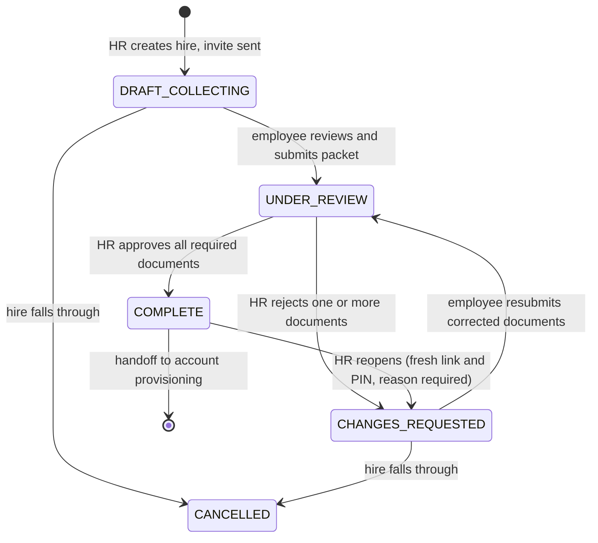

# API contract

**Status: design contract. Phase 1 endpoints are specified; most are not built yet.**

## What this document is, and what it is not

This is the **design contract**: what each endpoint is for, which business rule governs it, what it
may and may not return, and why. It exists because that information is currently spread across PRD
Appendix B (a bare method-and-path sketch), ten backlog epic files, and a security audit — and
nobody can see the shape of the API from any one of them.

**It is not an OpenAPI spec, and it must never become one.** [architecture.md](architecture.md) §9
is deliberate on this point: the spec is generated from the live route tree by
`OpenApiDocSource.Routing`, so an endpoint cannot exist without appearing in it. A hand-maintained
schema file would drift within a sprint, and a spec that lies is worse than none.

| Question | Authority |
|---|---|
| What is the exact wire shape, right now? | the generated spec at `/swagger/documentation.yaml` |
| What should this endpoint do, and why? | this document |
| What is the product requirement? | the [PRD](employee-requirements-tracker-prd_1.md) |
| When is it being built? | [roadmap.md](roadmap.md) and [backlog/](backlog/) |

When these disagree, the PRD wins on intent and the generated spec wins on shape. If this document
is the one that is out of date, fix it here — do not reconcile by hand-editing a spec file.

## What the API is authoritative for

The spec's own `info` block carries this and so does §1 of the PRD. It belongs at the top of any
contract, because it is the single most misreadable thing about this system:

> The API is authoritative for **a document was received, from a link issued to this hire, and an
> HR officer looked at it and judged it valid.**
>
> It is **not** authoritative for the identity of the person who submitted it.

`COMPLETE` is a process outcome, not identity assurance. `originalsSightedAt` is a separate field,
recorded by a named officer, and it is separate on purpose (§1, SEC-04). Any consumer treating
`COMPLETE` as proof of identity has misread the contract.

---

## Conventions

| | |
|---|---|
| Base path | `/api` |
| Content type | `application/json`, except the upload endpoint (`multipart/form-data`) |
| Timestamps | ISO-8601 UTC (`2026-09-14T08:30:00Z`) |
| Ids | Alphanumeric strings, `A-Z a-z 0-9`. An employee id is **8** characters; every other id is **12**. Case-sensitive, and never to be normalised |
| HR auth | bearer JWT, scheme `hr-jwt` — **provisional, see below** |
| Portal auth | server-side session cookie, issued by `verify`. Never the URL token alone |

**The `hr-jwt` scheme is a marked placeholder.** PRD §14 **Q4 — who the HR users are, whether they
share an account, and whether an SSO provider exists — is blocking and unanswered.** The current
verifier reads its secret from `JWT_SECRET` and refuses to start on a default key outside dev, which
is enough to keep `authenticate` blocks honest. Architecture §14 is explicit that it should be
**replaced, not extended**, once Q4 is answered. Treat every "HR auth" row below as "whatever
replaces Q4's placeholder".

**Path parameters.** PRD Appendix B writes `{reqId}` on portal routes and `{id}` on HR routes for
the same concept. This contract uses **`{id}` throughout**; the backlog ticket titles (ERT-750,
ERT-760) already normalised to it.

### Response envelope

Every `/api` response, success or failure, is the same envelope (ERT-145):

```json
{ "result": "success", "data": { "token": "ada9a8sd6789a" } }
{ "result": "success", "data": [ ... ], "meta": { "total": 120 } }
{ "result": "fail",    "error": { "code": "requirement_locked", "message": "..." } }
{ "result": "fail",    "error": { "code": "validation_failed", "message": "...",
                                  "details": [ { "field": "email", "code": "email.invalid_format",
                                                 "message": "..." } ] } }
{ "result": "error",   "error": { "code": "internal_error", "message": "..." } }
```

A client decodes all of it with one generic `BaseResponse<T>`. Absent fields are **omitted, never
rendered as `null`** (`explicitNulls = false`), so the denied body is exactly
`{"result":"fail","error":{"code":"not_found","message":"Not found."}}` — one constant, with nothing
in it that could differ between two causes.

| Field | |
|---|---|
| `result` | `success` \| `fail` \| `error`, derived from the status class by `resultFor` — 2xx, 4xx, 5xx. No handler supplies it, so it cannot disagree with the status line |
| `data` | **only ever the success payload.** Deliberately not JSend, which puts a `fail`'s reasons in `data`; that would make `data` a DTO on success and a field-error map on failure, and `BaseResponse<T>` would stop working |
| `meta` | response metadata beside the payload, never inside it — a count nested in `data` would force a wrapper type per list endpoint |
| `error` | carries both `fail` and `error` reasons. Three fields: `code`, `message`, `details?` |

`code` is a stable identifier a client branches on, and it is a **domain** identifier rather than
the HTTP status: under 422 alone this system has `email.invalid_format` (highlight the field) and
`duplicate_email.reason_required` (ask for a justification), which are different UI flows that `422`
cannot tell apart. `message` is display text, defaulting to a lookup on `code`; a client with its own
copy ignores it.

`details` is the **single** slot for per-item context. A one-field failure is a list of length one
and a four-field failure is a longer list, so a client binds errors to a form with one expression and
never branches on how many failed. There is no `field` or `detail` at the error root: two ways to say
the same thing is one way too many.

**`result` is a convenience, not the contract.** Most 5xx a client sees never reach this application
— a proxy 502, a 504 timeout, a container OOM — so none of those carry `"result": "error"`. A client's
5xx branch must key on the status class. The same goes for `401`, `405`, `204` and `304`, which carry
no envelope at all, and for `/health`, `/metrics`, `/openapi` and `/swagger`, which are outside it by
design.

The body **never** carries a stack trace, a SQL fragment, a driver message, a table name or a file
path — those name library versions and schema internals, so the cause is logged server-side and the
client gets a code (PRD §12). A `result: "error"` body carries no `details` at all.

**Error codes are `snake_case`, except field-scoped validation codes which are `<field>.<rule>`.**
The dot is meaningful: it marks a code that appears inside a `details` entry with `field` set.

**Every route must declare its response schema** in `describe { }`:

```kotlin
responses { response(200) { schema = jsonSchema<ApiResponse<HireDto>>() } }
```

Verified, not assumed: the generator does **not** infer a body type from `call.respond`. A route
without this block publishes an operation with no schema, and nothing a client can generate from.

### `AppError` → HTTP status

Use cases return `DomainResult<T>` = `Ok(value) | Err(AppError)`; a single mapper turns the error
into a status so no route invents its own. Defined in ERT-140.

| `AppError` | Status | Notes |
|---|---|---|
| `Validation(code, field, detail)` | **422** | one entry in `details`, naming the field |
| `ValidationFailed(errors)` | **422** | one `details` entry per field, same shape as above |
| `NotFound(code, entity)` | **404** | |
| `Conflict(code, detail)` | **409** | the locked-upload case of §8.7 |
| `ReasonRequired(code, action)` | **422** | a `details` entry naming the `reason` field; `action` is not on the wire |
| `Denied` | **404** | the shared denied body, **identical in every instance** |
| malformed JSON body | **422** | `request_malformed`, cause logged server-side only |
| unmatched route | **404** | the **same body** a `Denied` produces |
| — | **429** | rate limiting, ERT-660 |
| unexpected `Throwable` | **500** | generic code, cause logged server-side only |

`Denied` is a **`data object`**, not a case carrying a code. There is exactly one `Denied` value, so
a wrong PIN and an unknown token cannot render differently — the guarantee is structural rather than
a convention the mapper has to honour. The mapper adds no detail to it, and an unmatched route
renders the identical body, so a mistyped portal sub-path is not distinguishable from a denied one.

`401` and `405` keep Ktor's own handling rather than the envelope. A `status(Unauthorized)` handler
risks dropping the `WWW-Authenticate` challenge, and neither status discloses whether a link exists.

### Where an identifier was read decides its status

| Identifier position | Failure | Why |
|---|---|---|
| **path segment** (`/api/employees/{id}`) | **404**, identical to a well-formed unknown id | A path names a resource; an id that cannot exist names one that does not. Answering 422 `person_id.invalid_format` for a malformed id and 404 for a well-formed unknown one tells the caller which guesses were the right *shape* — an enumeration oracle (§6.6) |
| **request body field** | **422**, naming the field | Nothing is disclosed: the caller already knows what they sent |

`PersonId.of` / `EntityId.of` are unchanged and still return `Validation`. `route/mapper/PathIds.kt`
reinterprets it at the edge: `orNotFound(entity)` on the HR surface, `orDenied()` on the portal,
where **every** failure — malformed, unknown, not-yours, expired, wrong PIN — collapses to the one
`Denied` response.

---

### The client side of the envelope

The contract the front-end builds against. Not code in this repo — the client lives elsewhere — but
the envelope is only worth having if both halves agree.

```kotlin
@Serializable
data class BaseResponse<T>(
    val result: String,                  // "success" | "fail" | "error"
    val data: T? = null,
    val meta: Meta? = null,
    val error: ApiError? = null,
)

@Serializable
data class ApiError(val code: String, val message: String, val details: List<ApiErrorDetail>? = null)

@Serializable
data class ApiErrorDetail(val code: String, val field: String? = null, val message: String? = null)
```

One class decodes all three outcomes, because every absent field is omitted rather than null.
`result` is a `String` rather than an enum on purpose: kotlinx throws on an unknown enum value, so a
server that ever adds a fourth label would break every deployed client at the decode step. Decode
with `ignoreUnknownKeys = true` for the same reason.

Binding errors to a form is one expression, and it is the same expression whether one field failed
or four — which is what `details` is for:

```kotlin
fun ApiError.fieldErrors(): Map<String, String> =
    details.orEmpty().mapNotNull { d -> d.field?.let { it to (d.message ?: d.code) } }.toMap()
```

**One adapter should be the only place the client inspects status**, so the responses that carry no
envelope — 401, 405, a proxy 502, a body that is not JSON — arrive as ordinary typed failures rather
than as a null envelope or a thrown exception:

```kotlin
sealed interface ApiResult<out T> {
    data class Success<out T>(val data: T, val meta: Meta? = null) : ApiResult<T>
    data class Fail(val error: ApiError) : ApiResult<Nothing>     // 4xx — the user can act
    data class Error(val error: ApiError) : ApiResult<Nothing>    // 5xx / transport
}

suspend inline fun <reified T : Any> HttpResponse.toApiResult(): ApiResult<T>
```

Those three cases are worth covering in the client's own suite — a 401 with an empty body, a 502
returning HTML, and a 200 whose `data` is missing — because they are the ones that surface in
production rather than in development.

---

## State machines

### Packet status (PRD §6.2)



`ON_HOLD` is reachable from any non-terminal state (deferred start date, pending medical).
`COMPLETE` and `CANCELLED` are terminal (`PacketStatus.isTerminal`).

### Requirement status (PRD §6.1)

`RequirementStatus.employeeCanUpload` **is** the server-side lock. §8.7 requires the rejection to be
enforced in the use case, never merely hidden in the UI.

| Status | `employeeCanUpload` | Meaning |
|---|---|---|
| `PENDING` | yes | nothing uploaded yet |
| `UPLOADED` | yes — replace freely | file present, packet not yet submitted |
| `UNDER_REVIEW` | **no — locked** | packet submitted, awaiting HR validation |
| `APPROVED` | **no — locked** | HR validated and accepted |
| `REJECTED` | yes — must replace | HR found it invalid; reason attached |
| `EXPIRED` | yes | validity window lapsed (Phase 4) |

On rejection **only the rejected requirements unlock**; approved ones stay locked so the employee
cannot replace something already cleared and HR need not re-validate finished work (§7.3).

### Link status (PRD §6.3)

| Status | `opensPortal` | What the employee may be told |
|---|---|---|
| `ACTIVE` | yes | working checklist |
| `EXPIRED` | no | explanation + "request a new link" |
| `SUSPENDED` | no | explanation + "contact HR" |
| `REVOKED` | no | explanation + "contact HR" |
| `COMPLETED` | yes | read-only confirmation: requirement names, outcomes, completion date |
| `CLOSED` | no | generic "no longer available" |

**Terminal-state disclosure discipline (ERT-1040).** Only `COMPLETED`-inside-grace may name
requirements and outcomes. **Every other terminal state names nothing at all** — not the employee,
not a requirement count, not a company-specific detail. The completed confirmation renders no
document and links to none. Every terminal-state access attempt is still recorded in the trail.

**Two expiry clocks, and the earlier wins.** `link.absolute_expiry_days` (90) and
`link.idle_expiry_days` (30, `0` disables). `expiresAt` is computed and stored **when the link is
issued** and never recomputed — a settings change applies to newly issued links only (§6.4). The
idle clock is touched only on **successful** portal actions: a denied PIN attempt must not keep a
link alive, and a touch never pushes past the absolute ceiling.

---

## Rules that cut across endpoints

### The nine policy settings (§6.4)

Read from `app_settings` at runtime, never hardcoded — changing one must not need a deployment
(§8.10). Each row stores its own bounds so a well-meant edit cannot turn a token into a permanent
credential. Seeded by `V3__app_settings.sql`.

| Key | Default | Bounds | What it does |
|---|---|---|---|
| `link.absolute_expiry_days` | 90 | 7–180 | hard ceiling from issue |
| `link.idle_expiry_days` | 30 | 0–180 | dies this long after last activity; **0 disables** |
| `link.extend_on_rejection_days` | 30 | 1–90 | HR's review time must not eat the employee's window |
| `link.warn_before_expiry_days` | 7 | 1–30 | when the expiry warning is sent |
| `link.completed_grace_days` | 14 | 1–90 | how long the confirmation page stays reachable |
| `portal.session_minutes` | 45 | 5–480 | session lifetime before the PIN is required again |
| `portal.pin_attempts_before_lockout` | 5 | 3–10 | failures before temporary lockout |
| `portal.lockout_minutes` | 15 | 1–1440 | length of that lockout |
| `portal.pin_failures_before_suspend` | 10 | 5–50 | cumulative failures before auto-suspend |

Only the first range is stated by the PRD; the rest are chosen in the migration with a reason beside
each. **Two invariants are cross-field and cannot live in per-row bounds** — they belong in the
settings validator (ERT-310): `warn_before_expiry_days < absolute_expiry_days`, and
`pin_failures_before_suspend >= pin_attempts_before_lockout`.

### Progress arithmetic (§6.5)

- **Submission progress** = (`UPLOADED` + `UNDER_REVIEW` + `APPROVED`) ÷ total required
- **Approval progress** = `APPROVED` ÷ total required
- **Optional requirements are excluded from both numerator and denominator.**

A row reads `6/10 validated · 2 awaiting review`. The bar fills with approval progress; submitted
but unvalidated is a lighter segment. That is a client concern — the API supplies the counts.

### The PIN and session model (§6.6)

Access needs **two** things: the URL **and** a 6-digit PIN. The link alone opens nothing.

- The PIN is generated at hire creation, delivered **once** in the invitation, and stored hashed.
- It is entered **every time a session is opened**, and the session lasts `portal.session_minutes`.
- **No later email ever repeats it** — rejection notices, reminders and expiry warnings point at the
  portal without restating the credential.
- It **rotates** on: email change, reopen after `COMPLETE`, HR revocation, HR resend, and employee
  request.
- Six digits not four: the keyspace is 10⁶ and lockout is itself a denial-of-service against the
  employee.

Both credentials are stored hashed, but **not with the same primitive** (ERT-160). The link and
session tokens are **looked up**, so they need a reproducible keyed digest (HMAC-SHA-256 with a
server-side pepper); 256 bits of entropy has no offline guessing attack worth a work factor. The
PIN is **verified** against one known row, never looked up, so it gets bcrypt at cost 12 — a work
factor is exactly the defence a 10⁶ keyspace needs. Lockout bounds the *online* attack; neither
control substitutes for the other.

### Upload limits and versioning (§7.1, §8.7)

| Control | Value |
|---|---|
| Replacements while `PENDING` / `UPLOADED` / `REJECTED` | unlimited |
| Replacement while `UNDER_REVIEW` / `APPROVED` | **blocked — 409, server-side** |
| Rate limit | 10 per requirement per hour, 30 per employee per hour |
| File size | 10 MB |
| Total storage per employee | 100 MB |
| Version retention | current + last 4; older purged automatically |
| Retention freeze | **no purging while an anomaly flag is open** |
| Rejection-loop flag | 3 rejections of one requirement flags the record — a signal, not a block |

The freeze is not bureaucratic: without it, an attacker with portal access could erase a forgery by
uploading five innocuous replacements. Deleting a current file is **not** a purge — superseded
versions are retained, and the requirement returns to `PENDING`.

Rate limits are keyed on **the link token in the path, not the source IP** — carrier NAT would
otherwise let one person lock out another. `report-problem` is additionally limited by source,
because it needs no session. A limited request is recorded in the trail with outcome `RATE_LIMITED`,
and the response says when to retry and leaks no personal data.

### Review, attest and submit (§7.2)

The Review & Submit step unlocks only when **every required requirement has a file**. On confirm,
the packet moves to `UNDER_REVIEW` and **every requirement locks**.

The attestation persists **three things together: the version of the text agreed to, the timestamp,
and the IP.** Versioned because the wording will change and which version someone accepted is the
evidence. **The IP is taken from the request, never from the client-supplied body** (ERT-920). The
consent notice sits at the same step and its text is pending Q5 — the *versioning mechanism* is the
part that is expensive to retrofit, so it exists now with placeholder text.

HR can see documents as they arrive but **approve and reject stay disabled until the packet is
submitted** (§7.2, §8.5). If the employee never submits, HR can **force-submit**; such a packet
**carries no attestation** and is marked distinctly on the record.

### Notifications (§8.9)

Seven kinds: invitation (**the only message carrying the PIN**), packet-ready-for-review to HR,
rejection with reasons, link-expiring warning, completion confirmation, email-changed notice to the
**previous** address, and HR notification of suspension. Plus a manual resend.

Exactly **one** expiry warning is sent, and only if the packet is still incomplete — a `COMPLETE`
packet gets none. `DeliveryResult` is `Sent | Failed(reason)`: delivery is fallible and **the hire
is created regardless**, with a failure indicator and a retry action on the record (§8.1).

---

## HR endpoints

All require HR auth. A request without credentials is refused before any handler runs — that is a
route concern, not a per-endpoint one, so it is not repeated in every row below.

**No HR response ever carries a token hash, a PIN hash, or a plaintext credential.** HR DTOs *may*
carry `originalFilename`, `sizeBytes` and `mimeType`, which §8.4 requires for the review screen —
that permission is HR-side only and does not extend to the portal.

### Phase 1 — specified and being built

#### `POST /api/employees` — create a hire
*ERT-450 · PRD §8.1*

Request: `firstName`, `middleInitial?`, `lastName`, `departmentId`, `position`, `employmentTypeId`,
`email`, and `duplicateReason?`.

On save, in order: the requirement set is **snapshotted** from the template catalogue, a token and
6-digit PIN are generated and stored hashed with `expiresAt` computed from the policy then in force,
and the invitation is dispatched.

| Outcome | Status |
|---|---|
| created | **201** with the hire id and its requirement set, at 0% progress |
| invalid email format | **422** naming the field |
| duplicate email on an **active** hire, no reason given | **409** signalling a reason is required |
| unknown department or employment type | **422** |
| created but invitation delivery failed | **201** with a delivery-failure indicator on the body |

**The response must not echo the PIN or the plaintext token.** Returning them to the creating client
would put a live credential into a browser, a proxy log, and the OpenAPI examples. The PIN reaches
exactly one place: `Notifier.sendInvitation`.

A duplicate override requires a **typed reason**, which is written to the audit log and surfaced in
the exception report. It also sets the `SHARED_EMAIL` anomaly flag — which, because
`Employee.retentionFrozen` derives from `anomalyFlags.isNotEmpty()`, silently freezes version
purging for that hire. Whether a shared address should count as an anomaly for retention purposes is
**undefined in §7.1 and is an open question** (roadmap E3).

#### `GET /api/employees` — list with progress
*ERT-510, ERT-512 · PRD §8.3*

Query: `status`, `department`, `employmentType`, `search` (name or email).

Default view is `DRAFT_COLLECTING`, `UNDER_REVIEW` and `CHANGES_REQUESTED`, most recent first. A
hire reaching `COMPLETE` leaves the default view but stays findable by filter. Each row carries
name, department, position, employment type, packet status, both progress figures, awaiting-review
count and last activity date.

**An empty result is `200` with an empty list, never `404`.**

#### `GET /api/employees/{id}` — detail
*ERT-520 · PRD §8.4*

Hire details, overall progress, every requirement with its status, and per submission: timestamp,
filename, size, version number, and reviewer plus review timestamp where applicable. A rejected
requirement carries its reason and date. A requirement with no submission is simply pending.

Also carries the link's **expiry date and remaining days** (§8.10), and the **originals-sighted
state, shown plainly including when absent** — so `COMPLETE` is not mistaken for identity assurance.

Unknown id → **404**.

#### `GET /api/requirement-templates`
*ERT-340 · PRD §8.10*

Active templates in `sort_order`. No internal identifiers beyond the template id. The catalogue is
currently PRD Appendix A, **seeded as illustrative pending Q2** — it is data, so replacing it is a
seed change rather than a code change.

#### `GET /api/departments` and `GET /api/employment-types`
*ERT-350 · PRD §8.1, §8.2, §11*

The reference data the add-hire form binds to, so HR picks from the real list rather than typing an
id. Both return `id` and `name` only.

Departments come back in name order. Employment types do too — **alphabetical, not an HR
preference**, because `employment_types` has no `sort_order` column and insertion order is not a
decision anyone made. A deliberate ordering is an §8.11 change.

Reference data is **seeded, not managed**: there is no create, update or delete in Phase 1. An empty
list is a `200` with `[]`, never a `404`.

Two resources rather than one `/api/reference-data`, because `meta.total` is meaningless over a
heterogeneous payload and every other path here is one resource per path. **Neither endpoint appears
in PRD Appendix B** — the gap was found by ERT-350, which also found that no port exposed either
table.

The employment type chosen here selects the requirement set a hire is given, and that set is
**snapshotted at creation** — editing the catalogue afterwards does not move a hire already
collecting (§5).

#### `GET /api/submissions/{id}/file` — short-lived signed URL
*ERT-810 · PRD §8.4, §12*

**The only caller of `DocumentStorage.signedUrlFor` in the entire application.** The URL expires
within minutes and is not reusable. Every view is audited. The file is **withheld if the malware
gate has not passed** — see the Phase 1 exit risk below.

#### `GET /api/employee-requirements/{id}/versions`
*ERT-820 · PRD §7.1, §8.4*

Version history for one requirement. No submissions → **`200` with an empty list, not `404`.**

#### Link lifecycle: resend, extend, revoke
*ERT-1030 · PRD §8.8, §6.4*

| Method | Path | Behaviour |
|---|---|---|
| `POST` | `/api/employees/{id}/resend-link` | Reissues the link and **rotates the PIN** — the previous one stops verifying. Also the route by which HR unsuspends a link |
| `POST` | `/api/employees/{id}/extend-link` | `{ days, reason }` — moves one link only, increments `extendedCount`, and is **refused stating the permitted range** if the result would fall outside §6.4 bounds |
| `POST` | `/api/employees/{id}/revoke-link` | `{ reason }` — immediate, unconditional, and **ends live sessions** |

All three **require a reason and are audited.** None of them may return the new PIN or token in the
response body; the credential travels only in the invitation email.

### Phase 2 — validation loop and accountability

Specified in the PRD, not yet ticketed. Listed so the shape of the whole API is visible.

| Method | Path | Purpose and governing rule |
|---|---|---|
| `POST` | `/api/submissions/{id}/approve` | Enabled only while the packet is `UNDER_REVIEW` or `CHANGES_REQUESTED`. **Stays disabled until HR explicitly confirms the name on the document matches the hire**, and for a photo ID, that the photo matches the person interviewed. The confirmation is logged with actor and timestamp (§8.5) |
| `POST` | `/api/submissions/{id}/reject` | `{ reason }` — **reason required**. Unlocks only that requirement; extends the absolute expiry by `extend_on_rejection_days`; emails the employee naming requirement and reason (§7.3) |
| `POST` | `/api/employees/{id}/originals-sighted` | `{ date }` — the physical checkpoint, recorded against a named officer. **Deliberately separate from `COMPLETE`** (§1, SEC-04) |
| `PATCH` | `/api/employees/{id}` | Edit. An email change **rotates token and PIN** and requires `{ verificationMethod, reason }`. **Genuinely blocked on Q16** — without an out-of-band channel, SEC-03 is unremediated in practice whatever §7.4 says |
| `POST` | `/api/employees/{id}/reopen` | `{ reason }` — `COMPLETE` → `CHANGES_REQUESTED`. **Issues a fresh link and PIN; never revives the old one**, which would re-arm a dormant link at an address the employee may no longer control. Should require a second approver (Q10) |
| `POST` | `/api/employees/{id}/force-submit` | HR submits on the employee's behalf. The packet **carries no attestation** and is marked distinctly (§7.2) |
| `GET` | `/api/employees/{id}/access-trail` | Portal access records and anomaly flags. Append-only; `DENIED` does not record *which* failure it was, even here |
| `GET` | `/api/employees/{id}/sessions` | Active portal sessions |
| `DELETE` | `/api/employees/{id}/sessions/{sid}` | Terminate one session |
| `GET` | `/api/settings` | The §6.4 policy with its bounds |
| `PATCH` | `/api/settings` | **Bounds-checked and audit-logged.** Must also enforce the two cross-field invariants that per-row bounds cannot express |

### Phase 3 — scale and efficiency

| Method | Path | Purpose and governing rule |
|---|---|---|
| `POST` | `/api/employees/import/validate` | CSV dry run returning row-level errors. Sends nothing |
| `POST` | `/api/employees/import/commit` | Creates validated rows. **No emails sent** |
| `POST` | `/api/employees/import/{batchId}/invite` | **Invitation is a separate, explicit action** — SEC-12. Bulk send is deliberately hard to trigger by accident |
| `GET` | `/api/reports/exceptions` | Separation-of-duties detections, shared-email records, anomaly records. §8.13 requires this to name an owner and a cadence, or it is a report nobody reads |

### Phase 4 — document lifecycle · **gated on Q1**

| Method | Path | Purpose |
|---|---|---|
| `GET` | `/api/documents/expiring?withinDays=60` | Documents nearing the end of their validity window |
| `POST` | `/api/employees/{id}/renewal-request` | Issues a **scoped** link. `LinkScope.Only(templateIds)` already exists; v1 always issues `All`, so renewal needs no new model |

---

## Portal endpoints

Public: reachable with a link token, and — except where noted — a PIN-verified session. All are
rate-limited (ERT-660). All are mobile-first: camera capture and gallery upload must work in a phone
browser.

**The portal is write-mostly. It reports document *status*; it never returns document *content*.**
The employee needs to know whether a document was accepted, not to re-read their own birth
certificate (§8.6, SEC-02).

#### `GET /api/portal/{token}` — PIN prompt only
*ERT-630 · PRD §8.6, Appendix B*

Returns the PIN prompt and **nothing else**: not a name, not a requirement count, not a progress
figure, not a company detail. A bare link resolves to this and only this.

Unknown token → the same response an invalid PIN produces. See *Deliberate behaviours*.

#### `POST /api/portal/{token}/verify` — open a session
*ERT-640…ERT-650 · PRD §6.6*

Request `{ pin }`. On success, issues a server-side session cookie valid for
`portal.session_minutes`. Every attempt, success or failure, is written to the access trail.

| Outcome | Response |
|---|---|
| correct PIN, link opens the portal | **200**, session cookie set |
| wrong PIN | **404**, `Denied` — **byte-identical to unknown token** |
| unknown token | **404**, `Denied` — **byte-identical to wrong PIN** |
| `pin_attempts_before_lockout` reached | temporary lockout for `lockout_minutes` |
| `pin_failures_before_suspend` reached | link auto-suspends, **HR is notified** |
| rate limited | **429**, stating when to retry, no personal data |

#### `GET /api/portal/{token}/checklist` — status only
*ERT-740 · PRD §8.6, §7.2*

Session required. Per requirement: name, whether it is required, status, and — for a rejection —
the reason and date. Plus overall progress, whether Review & Submit is available, and the **current
attestation version and text**, so the client knows what it is submitting against.

In `CHANGES_REQUESTED`, **only rejected requirements are editable, and they are listed first**.

**Forbidden in every portal DTO:** `fileKey`, `originalFilename`, `url`, `downloadUrl`, `signedUrl`,
`mimeType`. ERT-170 makes any of these a **build failure**, not a review comment.

#### `POST /api/portal/{token}/requirements/{id}/upload`
*ERT-750 · PRD §8.7, §7.1*

`multipart/form-data`. Returns the **updated requirement status**, so the client refreshes without a
reload — and status is all it returns.

| Outcome | Status |
|---|---|
| accepted | **200** with the new requirement status and version |
| requirement locked (`UNDER_REVIEW` / `APPROVED`) | **409** — checked server-side via `RequirementStatus.employeeCanUpload` |
| over the size limit | **422**, **stating the actual limit** |
| disallowed MIME type | **422** |
| per-employee storage cap exceeded | **422** |
| rate limited | **429** |

The size check is enforced **while streaming the multipart part**, not after `readBytes()` —
otherwise the cap is enforced by first accepting the oversized file into memory.

#### `DELETE /api/portal/{token}/requirements/{id}/file`
*ERT-760 · PRD §8.7*

Same lock rule as upload (**409** when locked). Returns the requirement to `PENDING`. **This is not
a purge** — superseded versions are retained.

#### `POST /api/portal/{token}/submit`
*ERT-920 · PRD §7.2*

Request `{ attestationVersion }`.

| Outcome | Status |
|---|---|
| submitted | **200** — packet → `UNDER_REVIEW`, **all requirements lock**, HR notified |
| a required requirement has no file | **409** |
| attestation version missing or unknown | **422** |

Persists the attestation version, the timestamp, and **the IP taken from the request, not the body**.

#### `POST /api/portal/{token}/report-problem`
*ERT-930 · PRD §8.6*

"This wasn't me." **Reachable without a verified session** — the person who needs it may be exactly
the person who cannot get in. Immediately **suspends the link, ends any live session, and notifies
HR**. Stays suspended until HR acts. Rate-limited by source as well as by token, since it needs no
session.

#### `POST /api/portal/request-new-link`
*PRD §8.6, §6.3*

Request `{ email }`. **Always returns 200 with an identical body**, whether or not the address is
known. See *Deliberate behaviours*.

---

## Deliberate behaviours — documented as intended

**Read this section before "fixing" anything in it.** Each item below looks like a bug, an
inconsistency, or a missing feature. Each is a control, and each has a finding behind it.
Architecture §9 requires the generated spec descriptions to carry the same framing, for the same
reason: otherwise a future engineer reads them as defects and repairs them into an enumeration
oracle.

| Behaviour | Why it is correct | Source |
|---|---|---|
| A wrong PIN and an unknown token return **byte-identical** responses — same status, same body, same headers, including whether a cookie is set | Any difference makes `verify` an oracle for whether a link exists, and therefore for whether a person has been hired | §6.6, SEC-01 |
| `PortalOutcome.DENIED` does not record **which** of the two it was, even in the trail HR reads | The trail is shown to people; recording the distinction re-creates the oracle one layer down | §6.6 |
| `request-new-link` returns the same 200 whether or not the email exists | Otherwise it enumerates who has been hired | §8.6 |
| A bare link returns a PIN prompt and nothing else | A leaked URL must not disclose a name, a requirement count, or that the person was hired at all | §8.6, SEC-01 |
| No portal response carries a preview, a download URL, or an original filename | A filename leaks content as surely as the document does: `NBI_Clearance_DelaCruz_1998.pdf` says everything. The realistic failure is not deliberate preview — it is `mimeType` "for the icon" and `originalFilename` "for the confirmation toast", both of which read as reasonable in review | §8.6, SEC-02 |
| Terminal states other than `COMPLETED`-in-grace disclose **nothing** | A generic message cannot confirm an address belongs to a hire | §6.3, ERT-1040 |
| The access trail is append-only and there is **no** `last_accessed_at` column | One overwritten timestamp cannot answer who, from where, or how often — the first question asked when a fraudulent submission surfaces | §8.12, SEC-05 |
| Rate limits key on the **link token**, not the source IP | Carrier NAT would otherwise let one person lock out another | ERT-660 |
| `COMPLETE` does not imply identity assurance; `originalsSightedAt` is separate | A substituted document can be genuine, correctly formatted, and belong to someone else. The system's job is to make the human check explicit and attributable, not to simulate it | §1, SEC-04 |
| The invitation is the **only** message that carries the PIN | A PIN repeated in later mail multiplies the number of mailboxes holding a live credential | §8.9, §6.6 |

### One contradiction, resolved

**PRD §7.2 asks for thumbnails on the review screen. PRD §8.6 forbids the portal returning any
preview.** These are both P0 sections and they directly contradict each other.

**§8.6 wins.** It carries the audit disposition for SEC-02, and §15 names the write-mostly portal as
non-negotiable. ERT-740 builds to §8.6, and this is recorded on the roadmap escalation list as **E1
with the PRD owner**, because the fix is to amend §7.2 — not to quietly build one and hope nobody
notices the other. Stated here so a reader of §7.2 does not file its absence as a gap.

### Known gaps, stated rather than hidden

- **Malware scanning is a P0 control in §12 with no library, no owner and no question number.**
  ERT-710 wires the `isClean` gate and stubs it to `true`; ERT-810 refuses to serve anything that
  fails it. That makes it a **named Phase 1 exit risk, not a delivered control** (roadmap E5).
- **The upload MIME allowlist is never stated in the PRD.** §12 requires one enforced server-side;
  §8.4 names JPG, PNG, HEIC and PDF for *preview* and says other formats "offer download only",
  implying they are accepted. ERT-732 starts from the §8.4 preview set as configuration (roadmap E2).
- **Rotating the token pepper invalidates every live link,** and there is no re-issue flow, so
  rotation is not currently possible (ERT-160).
- **`hr-jwt` is a placeholder** pending Q4, and should be replaced rather than extended.

---

## Routes outside Appendix B

Appendix B lists 34 endpoints; architecture §9 refers to "~38". The difference is the operational
surface, which exists in code today — plus `/api/departments` and `/api/employment-types`, which are
business endpoints Appendix B simply never named (ERT-350):

| Path | Purpose | Exposure |
|---|---|---|
| `GET /health` | liveness probe; carries no personal data | open |
| `/openapi` | rendered static reference | open in dev, HR-authenticated otherwise |
| `/swagger` | interactive Swagger UI | open in dev, HR-authenticated otherwise |
| `/swagger/documentation.yaml` | the generated machine-readable spec | open in dev, HR-authenticated otherwise |
| `GET /metrics` | Prometheus scrape (ERT-150) | open in dev, HR-authenticated otherwise; **hidden from the spec** |

The Swagger surface is gated outside dev on purpose: it publishes the exact shape of
`/api/portal/{token}/verify`, its error contract and its rate limits to anyone who asks, and that
surface is what the audit is about.

Because `/health` now runs after the database connects at startup, **the service does not start at
all if the database is unreachable** — it fails fast rather than starting and reporting unhealthy.
That is deliberate (a server that cannot serve should not accept traffic), but it means there is no
degraded mode.
