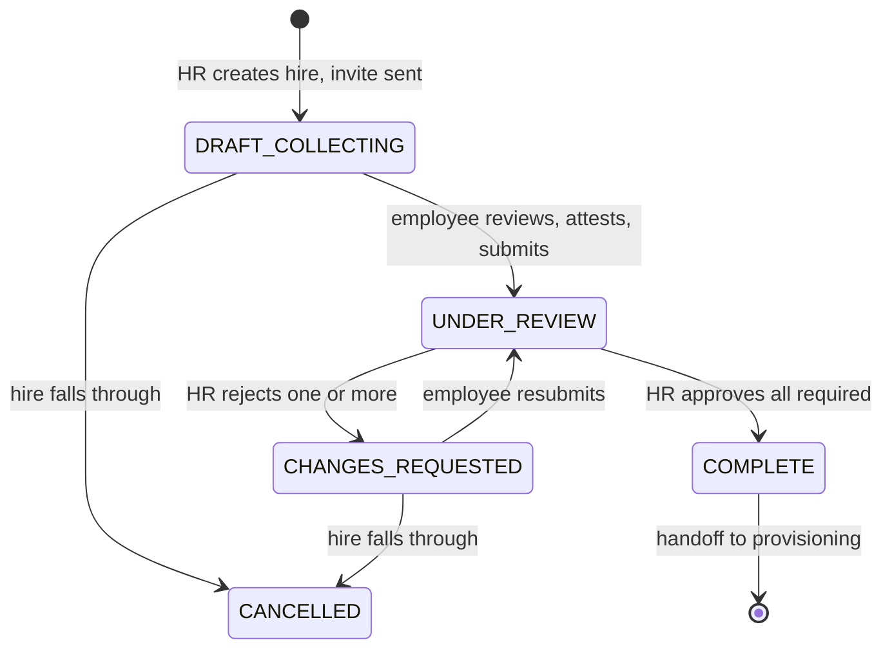

# Architecture — Employee Requirements Tracker

**Status:** v1.0 · **Last updated:** 2026-09-09
**Scope:** the Ktor backend. Companion to [the PRD](employee-requirements-tracker-prd_1.md) and
[the security audit](2026-09-09-security-audit.md).

This document describes the structure the code is built on and the reasoning behind it. Section
references like §8.6 point at the PRD; SEC-nn point at the audit.

---

## 1. What forces this design

Three properties of the problem, not of the technology:

**The rules are numerous and interact.** Three lifecycles run at once — requirement (§6.1), packet
(§6.2) and link (§6.3) — and the interesting behaviour lives in their intersection. Rejecting one
document must unlock exactly that requirement, leave approved ones locked, move the packet to
`CHANGES_REQUESTED`, extend the link's absolute expiry, and notify the employee without restating
their PIN. Logic of that shape belongs somewhere it can be exercised exhaustively in milliseconds,
not behind an HTTP call and a database.

**Several rules are load-bearing security controls.** The audit found 15 issues; all were accepted
and folded into PRD v0.4. Their remedies are not features that can be added later — they are
constraints on what the code may do. §15 says as much: the write-mostly portal, the PIN/session
model and the attestation are Phase 1 precisely because retrofitting them is a rewrite. The
architecture has to make them hard to violate rather than merely documented.

**One residual risk is accepted, and its compensating controls carry the weight.** Link and PIN
travel in the same email (§12), so mailbox compromise yields portal access. That was accepted
deliberately. What makes it survivable is the write-mostly portal — and that is an architectural
rule about what an API may return, not a coding style. If document preview is ever added back to
the portal, the accepted risk becomes unacceptable and must be re-decided.

Clean Architecture answers all three: business rules live in framework-free use cases, so they are
fast to test, and the layer boundaries are where the invariants get enforced.

---

## 2. Layer model and the dependency rule

Source dependencies point inward, always:

```
  route/  ─┐
  plugin/ ─┼──►  domain/  ──►  core/
  data/   ─┘        ▲
                    └── data/ implements domain/port interfaces
```

| Layer | May depend on | May **not** contain |
|---|---|---|
| `core/` | nothing but the Kotlin/Java stdlib | any framework type |
| `domain/` | `core/` | Ktor, Exposed, Koin, Hikari, kotlinx.serialization, `Dispatchers`, JDBC |
| `data/` | `domain/`, `core/`, any library | HTTP concerns |
| `route/` | `domain/`, `core/` | business decisions, direct `data/` access |
| `plugin/` | Ktor | domain rules |
| `di/` | everything | logic |

**This is enforced, not asserted.** [`test/ArchitectureTest.kt`](../test/ArchitectureTest.kt) walks
`src/domain` and `src/core` and fails the build on a forbidden import. It was verified by
introducing a real violation and watching it fail before being trusted.

`core/` is guarded alongside `domain/` because domain models depend on it (`EmailAddress`, `Clock`);
a framework type reaching core would reach the domain by the back door. A third test asserts the
walk actually matches files, so the guard cannot pass vacuously if the layout moves.

**Why `Dispatchers` is on the forbidden list** alongside Ktor and Exposed: a use case that picks its
own dispatcher can't be driven on a virtual-time scheduler, and it buries an I/O decision inside a
business rule. Dispatcher choice belongs at the edge, in `DatabaseFactory`.

---

## 3. Package map

```
src/
  Application.kt          assembly: plugins, then routes
  main.kt                 embeddedServer entry point

  core/                   cross-cutting, framework-free
    error/                AppError, DomainResult — failures as data, not exceptions
    time/                 Clock port
    id/                   EntityIdGenerator, PersonIdGenerator, TokenGenerator, PinGenerator
    crypto/               Hasher (PIN) and TokenDigest (link/session token) ports
    value/                EmailAddress, AccessPin, PersonId, EntityId — validating value objects

  domain/                 the rules. Pure Kotlin.
    model/                entities, status enums, LinkPolicy
    port/                 repository and service interfaces
    usecase/              one class per business rule (empty — see §5)

  data/                   adapters implementing domain ports
    db/                   DatabaseFactory (Hikari + Exposed), table/ schema
    repository/           Exposed implementations
    mapper/               row ↔ domain
    crypto/ time/ id/     BcryptHasher, SystemClock, SecureRandom generators

  route/                  thin HTTP adapters
    HealthRoutes.kt       the only endpoint today
    hr/ portal/           handlers, split by audience and auth model
    dto/                  @Serializable wire types — the OpenAPI schema source
    mapper/               dto ↔ domain

  plugin/                 Ktor installers: Serialization, StatusPages, Http,
                          Security, Monitoring, ApiDocs
  di/                     Koin modules — the composition root
```

---

## 4. Ports

The domain names what it needs; `data/` supplies it. Every method is `suspend`, so the adapter picks
its own dispatcher and the use case never sees one.

| Port | Contract | Adapter |
|---|---|---|
| `EmployeeRepository` | hires, their requirement sets; **`create` and `save` are separate** | `ExposedEmployeeRepository` — **bound** |
| `RequirementTemplateRepository` | the catalogue; read **once** at creation | `ExposedRequirementTemplateRepository` — **bound** |
| `ReferenceDataRepository` | departments and employment types; **existence**, not entities | `ExposedReferenceDataRepository` — **bound** |
| `UploadLinkRepository` | links, resolved **by token hash** | `ExposedUploadLinkRepository` — **bound** |
| `SubmissionRepository` | versions, retention purge, storage totals | *(pending)* |
| `PortalSessionRepository` | active sessions; HR termination | *(pending)* |
| `AppSettingsRepository` | the §6.4 policy, read at runtime | `ExposedAppSettingsRepository` — **bound** |
| `AuditLog` | HR-side actions | `ExposedAuditLog` — **bound** |
| `PortalAccessTrail` | append-only portal attempts, distinct IPs, failure counts | *(pending)* |
| `Notifier` | the seven notification kinds | ERT-440 outbox, then ERT-1010 SMTP *(pending)* |
| `DocumentStorage` | object storage; signed URLs **HR-side only** | filesystem for dev, GCS in production (Q20) *(pending)* |
| `HrUserRepository` | HR accounts, roles, password hashes | `ExposedHrUserRepository` — **bound** |
| `AccessTokenIssuer` | the bearer credential a signed-in HR user presents | `JwtIssuer` — **bound** |
| `Clock`, `EntityIdGenerator`, `PersonIdGenerator`, `TokenGenerator`, `PinGenerator`, `Hasher`, `TokenDigest` | infrastructure | **bound** |

Four of these encode a rule in their *shape* rather than their documentation:

- **`EmployeeRepository`** — `create` inserts and never updates; `save` updates and never inserts.
  Every other repository spells `save` as read-then-insert-or-update keyed on the id, and that shape
  **cannot express "this id must be new"**: an existing id reads as *update this row*, so a hire
  drawing a taken `PersonId` would overwrite the hire holding it rather than redrawing. A `PersonId`
  draws from 62^8, so this is reachable — most of all under §8.2's bulk import — and it loses a
  record rather than an identifier. `create` returns the hire **as stored**, which may carry a
  different id than the argument (ERT-410). `saveRequirements` keeps insert-or-update, because an
  `EntityId` draws from 62^12; that asymmetry is why the two widths are separate types.
- **`Notifier`** — only `sendInvitation` accepts an `AccessPin`. Every other method is structurally
  incapable of carrying the credential, so "no email but the invitation contains the PIN" (§8.9) is
  a compile-time property, not a review checklist item.
- **`UploadLinkRepository.findByTokenHash`** takes a hash, never plaintext. A lookup by plaintext
  would imply the token was recoverable from storage.
- **`DocumentStorage.signedUrlFor`** is documented HR-side only, and no portal use case may depend
  on this port. This is the write-mostly rule (§8.6, SEC-02) expressed as a dependency.

**`AccessTokenIssuer` is in `domain/port/` while `Hasher` and `TokenDigest` are in `core/crypto`, and
the signature decides that rather than the feeling that all three are infrastructure.** The other two
take and return strings and know nothing about this system; this one takes an `HrUser` and reads its
role, which are domain types — and `core/` may not depend on `domain/`. The domain never learns the
token is a JWT: `AccessToken` carries no format rule, so nothing above `data/auth` can parse one
(ERT-190).

---

## 5. Use cases — the contract with the next session

Each entry below is one class, one public `operator fun invoke`, returning a sealed result. Built
test-first.

**The first six landed with ERT-190** — the HR account surface. `domain/usecase/` is no longer empty,
which means `ArchitectureTest`'s tracing guard is doing real work rather than reporting `Vacuous`; its
tripwire fired as designed and was flipped to `Checked` rather than deleted.

Each also takes a `UseCaseTracer` and delegates through it — `invoke` is
`tracer.trace("XUseCase") { execute(...) }`, and the body lives in a private `execute`. See §10.1;
the architecture test fails the build on a use case that omits it.

| Use case | Rules | PRD | Phase |
|---|---|---|---|
| `CreateHireUseCase` | validate email; duplicate-on-active needs a typed reason; snapshot the requirement set; generate + hash PIN and token; compute `expiresAt` from current policy; send invitation; survive delivery failure | §8.1, §5, §6.4, §6.6 | 1 |
| `OpenPortalUseCase` | a valid token opens a session and returns status only; every other token yields one constant failure; log every attempt | §6.6, §8.6 | 1 |
| `RedeemRecoveryPinUseCase` | identical failure for a wrong PIN, an unrecognised address, a redeemed PIN and an expired one; lockout at 5; auto-suspend at 10 with HR notified; log every attempt | §6.6, §8.6 | 1 |
| `UploadDocumentUseCase` | reject server-side when the requirement is locked; enforce size, type, rate and storage caps; new version each time; purge beyond retention **unless a flag is open** | §8.7, §7.1 | 1 |
| `SubmitPacketUseCase` | blocked until every required requirement has a file; attestation required and versioned; lock all requirements; notify HR | §7.2 | 1 |
| `ApproveSubmissionUseCase` | blocked until the packet is submitted; name-match confirmation required; photo-match for photo ID; log the identity confirmation with the approval | §8.5 | 2 |
| `RejectSubmissionUseCase` | reason required; unlock only that requirement; extend link expiry; flag at 3 rejections | §7.3, §7.1 | 2 |
| `ChangeHireEmailUseCase` | out-of-band verification method required; second approver when approved documents exist; revoke the old token and issue a new one; notify the old address | §7.4, §8.8 | 2 |
| `AuthenticateHrUserUseCase` **— built** | uniform failure for a malformed address, an unknown email, a wrong password and a deactivated account, **in timing as well as in body**; every attempt audited, and the audit row does not say which branch ran | §2, Q4 | 0 |
| `ChangeHrPasswordUseCase` **— built** | current password required; clears the change-required flag; the one route reachable while that flag is set | §2, Q4 | 0 |
| `CreateHrUserUseCase` **— built** | admin supplies the initial password so none is ever returned in a body; account owes a change; duplicate address is a named conflict, not the uniform failure | §8.13, Q4 | 0 |
| `SetHrUserActiveUseCase` **— built** | deactivation, never deletion; an admin may not deactivate themselves | §8.13, Q4 | 0 |
| `ResetHrPasswordUseCase` **— built** | the whole of password recovery in v1; always sets the change-required flag | §8.13, Q4 | 0 |
| `EnsureBootstrapHrUserUseCase` **— built** | creates the first `HR_ADMIN` **only when `users` is empty**, so a deactivated bootstrap account is never resurrected | Q4 | 0 |
| `IssueRecoveryPinUseCase` | single-use, expiring, returned once and never emailed; audited with the issuing officer | §6.6 | 1 |
| `RedeemRecoveryPinUseCase` | constant response whether or not the address is known; lockout and suspend thresholds apply | §6.6 | 1 |
| `ReopenRecordUseCase` | never revive the old token; issue fresh credentials; require a reason | §7.3, SEC-08 | 2 |
| `RequestNewLinkUseCase` | constant response whether or not the address exists; rate-limited | Appendix B, SEC-09 | 2 |

**Test naming** is `<rule> - <scenario> - <outcome>`, e.g.
`hire creation - email duplicates an active hire with no reason given - fails with ReasonRequired`.

> **`DuplicateEmailRequiresReason` is not an `AppError` case and never was** — an earlier revision of this line, of `CLAUDE.md` and of ERT-431 all named it, which would have prescribed a specification change nobody approved (`AppError.kt`: "Adding a case here is a specification change"). The rule is carried by `ReasonRequired(code, action)`, whose `action` field exists precisely to name the thing needing justification. (C2, corrected 2026-09-16.)
A failing test should say which business rule broke without opening the file.

---

## 6. The three lifecycles

Keeping them separate is what makes §7.1–7.3 tractable. A rejection must not revoke the link —
correction is exactly what the employee needs to do.



| Lifecycle | Type | Transitions owned by |
|---|---|---|
| Requirement (§6.1) | `RequirementStatus` | upload, submit, approve/reject use cases |
| Packet (§6.2) | `PacketStatus` | submit, approve, reject, reopen use cases |
| Link (§6.3) | `LinkStatus` | create-hire, verify-PIN, email-change, expiry sweep |

`RequirementStatus` carries `employeeCanUpload` — the §6.1 table transcribed onto the type instead of
re-derived at each call site. It is the single authority for the server-side lock check §8.7 demands.

---

## 7. Data model

[`data/db/table/Tables.kt`](../src/data/db/table/Tables.kt) implements §11. Two things there are
load-bearing:

**Snapshot columns are copies, not joins.** `EmployeeRequirements.nameSnapshot` /
`isRequiredSnapshot` and `UploadLinks.expiresAt` are written once. Editing a template or a policy
later must not change the progress of anyone in flight, nor make a completed hire retroactively
incomplete (§5, §6.4). A live foreign-key read would quietly break both, and would also make the
audit log meaningless — you cannot attest to a state that mutates retroactively.

**There is one snapshot column missing, and it is the catalogue's `sort_order` (ERT-410).** The
checklist's *order* is as much a copy as its names, and nothing holds it: reading it would mean
joining `requirement_templates`, which is precisely the live read this section forbids — a template
reordered tomorrow would reshuffle a hire's checklist today. `EmployeeRepository.requirementsOf`
therefore orders by `nameSnapshot`, which is deterministic and snapshot-pure but is not the order HR
arranged. **ERT-432 owns adding `sort_order_snapshot`**, with the rows it writes.

**There is no `last_accessed_at` column anywhere, on purpose.** PRD v0.3 had one; a single
overwritten timestamp cannot answer who, from where, or how often, which is the first question asked
when a fraudulent submission surfaces (SEC-05). `PortalAccessLogs` replaces it and is append-only —
nothing updates or deletes rows there. Reintroducing such a column would undo the control.

**Four of the five actor columns are foreign keys; `audit_logs.actor` is not (ERT-190).**
`employees.created_by`, `employees.originals_sighted_by`, `submissions.reviewed_by` and
`app_settings.updated_by` each name a person who must exist, so each references `users(id)`
`on delete restrict` — a user who acted cannot be deleted out from under the record, which is also
why accounts are deactivated rather than deleted. `audit_logs.actor` keeps its free text and gains a
**nullable** `actor_user_id` beside it, because the trail must record actors that are not users: the
V2 seed, the ERT-1020 expiry sweep, a future import job. An append-only trail that can refuse a write
because it cannot name a user is worse than one carrying a string. §8.13's exception report joins on
`actor_user_id`; everything else reads `actor`.

**`users` is keyed by a `PersonId`, reusing the employee width rather than introducing a third.**
`Identifier.of` dispatches on length, and its KDoc names this case: an 8-character
`audit_logs.entity_id` means "an employee **or** a user", which is correct because `AuditEntry.entity`
already says which. A third width would make that dispatch ambiguous.

**Case-insensitive email uniqueness is two constraints, not an expression index.** H2 rejects
`create unique index ... (lower(email))` outright, so the whole suite would have run against a schema
production could not have. A `check (email = lower(email))` plus a plain unique index is standard SQL
in both engines and is strictly stronger: the check forces every stored address into canonical lower
case, so two casings can never coexist *and* every stored value is already in the form the sign-in
lookup compares against.

**There is no `last_login_at`**, for the reason there is no `last_accessed_at`. A sign-in is an
`audit_logs` row.

Files live in object storage; the database holds keys and metadata only.

---

## 8. Request flows

**HR creates a hire** — `POST /api/employees`
`EmployeeRoutes` → `CreateHireUseCase` → reads policy and templates → snapshots the requirement set →
`TokenGenerator` → `TokenDigest` → persists the link with a computed `expiresAt` →
`Notifier.sendInvitation`, which renders the message at send time and persists no copy of it →
`AuditLog`. The route maps the sealed result to 201 or 422; it makes no decision. **No PIN is
generated here** — since 2026-09-16 the link is the credential, and a recovery PIN is minted only on
demand.

**Portal entry** — `GET /api/portal/{token}`
`PortalRoutes` digests the token, resolves the link, calls `OpenPortalUseCase`. Unknown, malformed,
expired, suspended and revoked tokens all return the **same** failure, so the endpoint cannot be used
to test whether a link exists. Every attempt is written to `PortalAccessTrail` first — before the
outcome is known, so a denied attempt cannot escape through an early return. On success a
`PortalSession` opens for `sessionMinutes`, and access within the visit is carried by the session
rather than by the URL.

**Portal recovery** — `POST /api/portal/recover`
For a hire whose invitation never arrived. The request carries an address and a PIN and **no token**,
because the hire has none. `RedeemRecoveryPinUseCase` resolves the employee, verifies the PIN against
their current link, and marks it used. A wrong PIN, an unrecognised address, an already-redeemed PIN
and an expired one are one response — and the unrecognised-address path performs a dummy verification
so that bcrypt's cost does not become a timing oracle for who has been hired.

**Portal upload against a locked requirement** — `POST /api/portal/{token}/requirements/{id}/upload`
Session checked, then `UploadDocumentUseCase` consults `RequirementStatus.employeeCanUpload` and
returns `Conflict` → 409. Enforced in the use case, server-side, exactly as §8.7 requires — the UI
hiding the button is not the control.

---

## 9. API documentation

The spec is **generated from the live route tree**, not maintained by hand.

| Path | Serves |
|---|---|
| `/openapi` | rendered static reference |
| `/swagger` | interactive Swagger UI |
| `/swagger/documentation.yaml` | the machine-readable spec |

`OpenApiDocSource.Routing` reads the mounted routes, so an endpoint cannot exist without appearing in
the docs. Per-route detail is attached with `describe { }` beside the handler; `hide()` withholds a
route. The `hr-jwt` security scheme is derived from the `authenticate` blocks rather than restated.
With roughly forty endpoints in Appendix B, a hand-maintained file would drift within a sprint — and a spec
that lies is worse than none.

**A route's schema comes from the `describe { }` block it declares, not from its `route/dto/` type.** An earlier revision of this section claimed the DTO types were the source; they are the source only where a route names one in `responses { }`, which is a different and weaker claim, and the two were left standing in the same sentence. Verified, not assumed: the generator infers nothing from `call.respond`, so every route needs a `responses { response(200) { schema = jsonSchema<...>() } }` block in its `describe { }` or it publishes an operation with no body type (ERT-145). That gives the DTO layer a second job
beyond wire-format isolation and is a further reason domain models never reach a route: a model
serialised directly would publish whatever fields it happens to carry, and §8.6 forbids the portal
returning an original filename or storage key.

**The Swagger surface is gated outside dev** (open in dev, HR-authenticated otherwise). Swagger UI
publishes the exact shape of `GET /api/portal/{token}` and `POST /api/portal/recover`, their error
contracts and their rate limits to
anyone who asks, and that surface is what the audit is about.

**When portal routes are documented,** their descriptions must present the deliberate behaviours as
*intended* — identical failures for wrong PIN vs unknown token, constant response from
`request-new-link`. Otherwise a future engineer reads them as bugs and "fixes" them into an
enumeration oracle.

---

## 10. Testing

| Level | Where | Covers |
|---|---|---|
| Use case | `test/domain/usecase/` | every business rule, exhaustively. The bulk of the suite. |
| Architecture | `test/ArchitectureTest.kt` | the dependency rule, as a build failure |
| Route | `test/*Test.kt` | wiring, status codes, serialization — never a decision |
| Fakes & builders | `test/testdata/` | in-memory ports, `FixedClock`, sample data |

Loop: **red → green → refactor → review.** The review step is not optional — after a use case is
green, read it against its tests and hunt for what the happy path hid: untested branches, boundaries,
nulls, negative paths, silent failures. Each finding becomes a new named test that fails first.

**Verified constraint: Amper 0.12.0 does not discover Kotest specs.** Both 5.9.1 and 6.0.3 were
tried; a deliberately-failing `BehaviorSpec` was silently skipped under the default runner and found
zero tests even when selected explicitly by class. This matters because an undiscovered spec is
indistinguishable from a passing one — the probe was written to fail precisely so the difference was
visible.

So tests use `kotlin.test` (`@Test`, discovered by JUnit 5) with **Kotest assertions**
(`shouldBe`, `shouldBeEmpty`) and **MockK**, which work normally as libraries. BDD structure comes
from the three-part naming template rather than `given/when/then` nesting. Revisit if Amper gains
Kotest engine support.


### 10.1 Diagnostics — tracing business logic

Below the route there was no observability at all: `CallLogging` reports
`POST /api/employees -> 422` and stops, and on a portal path it collapses to
`/api/portal/[redacted]`, so neither the rule that fired nor the action attempted was visible.
`UseCaseTracer` (`core/trace/`, adapter in `data/trace/`) emits one line per invocation, behind
`TRACE_USECASES`, which defaults to off and binds a no-op:

```
2026-09-15 15:01:39.356 [eventLoopGroupProxy-4-1] e5ed898e DEBUG usecase - CreateHireUseCase ok in 42ms
2026-09-15 15:01:39.375 [eventLoopGroupProxy-4-1] e5ed898e INFO  io.ktor…Application - POST /api/employees -> 201
```

**Name, outcome, duration — never an argument.** The traced block returns `DomainResult`, so the
tracer reads the outcome itself and a call site has nothing to pass. That is the privacy design: not
a rule someone must remember, an absence of anything to hand over. The outcome word is
`AppError.code`, never the error — `Validation` and `Conflict` carry a `detail` holding whatever the
caller typed, while `Denied` is a single `data object` whose code is `not_found`, so §12 invariant 3
holds in the trace for the same reason it holds on the wire.

`e5ed898e` is a generated `requestId` in the MDC. Ktor wraps the call pipeline in an `MDCContext`, so
it reaches every suspend frame a request opens, including work on another dispatcher inside a
transaction — which is what lets a trace line be matched to its access-log line. **It is opaque by
requirement, not by accident.** The portal redaction lives inside `CallLogging`'s `format` block and
protects that one line; an id derived from the path would travel through `%X{requestId}` onto every
line in the file, and a portal path carries a live credential (§12 invariant 4).

Tracing is gated on its own variable rather than on `isDevMode()`. §14 already records that four
controls hang off `APP_ENV` and that it defaults to dev when unset; a fifth would mean a deployment
that forgot it silently began tracing.

---

## 11. Dependency injection

`coreModule` (infrastructure) + `dataModule` (adapters) + `domainModule` (use cases, added by
ERT-190). Nothing in `domain/` imports Koin — dependencies arrive through constructors, which is why a
use case can be built in a test from plain fakes with no container at all.

**Use cases are `factory`, adapters are `single`.** A use case holds no state worth sharing: every
field is a port or an injected clock, all of which are singles themselves, so a shared instance would
buy one allocation per request and cost the guarantee that two concurrent calls cannot interfere.
`JwtConfig` must stay a `single` for a sharper reason than consistency — in dev the secret is
generated per instance, so a `factory` would sign with one key and verify with another, and every
token the application issued would be refused by the request that presented it.

**Repository bindings are deliberately absent rather than stubbed with throwing placeholders.** An
unbound port fails fast and loudly at wiring time; a placeholder that compiles fails at runtime, in
production, on the one path nobody exercised. Each binding lands with the use case that needs it —
**or with the ticket that establishes the adapter**, which is how `AppSettingsRepository` and
`AuditLog` came to be bound in ERT-310/330 with no use case yet. ERT-300 exists to set the adapter
pattern before ERT-410 onward make it mechanical, and an adapter nothing can resolve has not set
one. `DataModuleTest` resolves every bound port, and keeps one deliberately-unbound port in a
tripwire test so that "resolves" cannot quietly become "resolves anything".

---

## 12. Architectural invariants

Structural, not incidental. Weakening any of these re-opens a finding the audit closed.

| Invariant | Where it lives | Source |
|---|---|---|
| The portal returns document **status** — never content, signed URLs, or original filenames | `DocumentStorage` is HR-side only; `route/dto` never carries `fileKey`/`originalFilename` | §8.6, SEC-02 |
| A bare link resolves to the holder's own checklist — and to nothing at all if the token is unknown, expired, suspended or revoked. The **recovery** page discloses nothing before the PIN is verified | `OpenPortalUseCase`, `RedeemRecoveryPinUseCase`, portal DTOs | Appendix B, §6.6 |
| A wrong recovery PIN and an unrecognised address are indistinguishable, as are an unknown and an expired token | `AppError.Denied` is a **`data object`**, so there is exactly one value and differing bodies are unrepresentable; the mapper sends it to one shared envelope constant, so it cannot carry a per-instance message or `details`; an unmatched route renders the same body; `PortalOutcome.DENIED` does not record which | §6.6 |
| Tokens and PINs stored hashed; a recovery PIN is **never emailed** and reaches exactly one response, once; no stored artefact holds a live PIN or plaintext token — the invitation body is rendered at send time and never persisted | `TokenDigest` (keyed, reproducible — tokens are looked up by digest); `Hasher` (bcrypt, salted — PINs are verified); `Notifier` signature; the outbox stores no invitation body | §6.6, §12 |
| Locked-state upload rejection is server-side | `RequirementStatus.employeeCanUpload`, checked in the use case | §8.7 |
| Requirement sets and `expiresAt` snapshotted at creation | snapshot columns | §5, §6.4 |
| Every portal access is an append-only record | `PortalAccessLogs`; no `last_accessed_at` | §8.12, SEC-05 |
| No version purging while an **evidentiary** flag is open | `AnomalyFlag.freezesRetention`, read by `Employee.retentionFrozen` and checked before purge — the classification lives on the flag, so a new flag must choose | §7.1, SEC-13 |
| `COMPLETE` is not identity assurance | `originalsSightedAt` separate; stated in the API description | §1, SEC-04 |
| An unknown email, a wrong password, a malformed address and a deactivated account are indistinguishable at sign-in — **in elapsed time as well as in body** | `AppError.AuthenticationFailed` is a **`data object`**, so one value and differing bodies are unrepresentable; every branch of `AuthenticateHrUserUseCase` verifies a password against *some* hash, the absent-user case against a decoy the injected `Hasher` produced; `SIGN_IN_FAILED` always points at `HrUser.NO_SUBJECT` with a null `actorUserId`, so the trail is not an oracle either | §2, Q4 |

---

## 13. Deferred by design

Phase 2 adds the validation loop and accountability; Phase 3 CSV import, reminders, dashboard and the
exception report; Phase 4 document lifecycle. The §9.3 seams are already open so Phase 4 costs a
migration, not a redesign:

- `Submission` is **versioned** with nullable `validFrom` / `validUntil` from the start.
- The requirement catalogue is independent of the onboarding flow — a catalogue of document types,
  not a checklist only onboarding uses.
- `LinkScope` allows `Only(templateIds)`; v1 always issues `All`, but renewal links need no new model.
- Nothing assumes an employee has exactly one packet.

---

## 14. Decisions and trade-offs

**The `AppSettingsRepository` port returns `DomainResult`; no other repository port does** (ERT-310).
It is the only port whose stored data can be wrong in a way that matters: `app_settings` holds
strings with a declared `value_type`, and `LinkPolicy`'s Kotlin defaults are *identical* to the
seeded rows — so an adapter that fell back to them would return exactly what a working one returns,
and no behavioural test could tell the two apart. The failure is therefore a value a caller must
handle. **ERT-433 must handle the `Err` rather than substituting a default**; refusing to issue a
link is the correct response to a policy nobody can read.

**One audit row per settings save, under a singleton id** (ERT-310). `audit_logs.entity_id` is 12
characters and `Identifier.of` recovers an id's kind from that length alone, so a 25-character
setting key cannot go in it and widening the column would make the dispatch ambiguous. The
resolution is not a workaround: *the thing being audited is not a row*. The link policy is one
entity whose nine fields happen to be stored as nine rows and which the Phase 2 screen saves as one
form, so `findFor(LINK_POLICY_ID)` answers the question an auditor asks. Nine rows per save would
multiply the trail ninefold to answer a question nobody asks.

**Exposed retries a failed transaction, re-running the whole block.** Discovered in ERT-310 rather
than assumed: an audit insert that violated a primary key rolled back, retried, drew a *fresh* id
from the generator and committed. Anything non-transactional inside a `factory.transaction { }` —
an id generator, a clock read, a counter — runs again on a retry. This is useful (ERT-400 wants
exactly this for a duplicate `PersonId`) but it must be known: a test that expects a transaction to
fail must make it fail on *every* attempt, which is what scripting `FixedEntityIdGenerator` with a
repeated id is for.

**A nested `factory.transaction { }` joins the outer one rather than committing independently.**
Also checked rather than assumed. It means `updateLinkPolicy` *could* have written its audit row
through the `AuditLog` port and still been atomic — verified by making the change and re-running the
suite, which stayed green, so **no test distinguishes the two designs**. The adapter writes on the
transaction it already holds anyway, because the port hop is atomic only while
`useNestedTransactions` stays false and the `Dispatchers.IO` hop preserves the transaction's context
element, and neither is this codebase's decision. One test pins the join so an upgrade that changed
it would be visible.

**Single Amper module, package layering.** A multi-module split would make the dependency rule a
compile error rather than a test failure. Rejected for now: it restructures the build, and
`ArchitectureTest` gets most of the benefit at a fraction of the cost. Revisit if the module grows
past comfortable.

**Exposed JDBC + HikariCP over R2DBC.** Blocking Exposed behind suspending ports, with the
`Dispatchers.IO` hop confined to `DatabaseFactory`. More battle-tested than Exposed's R2DBC path, and
the audit trail and access log are transactional writes where maturity matters more than non-blocking
I/O. `exposed-r2dbc` and `h2database-r2dbc` remain declared in `module.yaml` but are now unused —
harmless, and removed by **ERT-1140**. "Left for the owner to remove" was a to-do with no owner.

**Two credentials, two primitives — bcrypt for the PIN, a keyed digest for the token** (ERT-160,
superseding the earlier "bcrypt for both"). They are used differently, and one primitive cannot serve
both:

| Credential | Primitive | Why |
|---|---|---|
| Link token, session token | HMAC-SHA-256 keyed by a server-side pepper (`TokenDigest`) | It is **looked up** — `findByTokenHash`, and `upload_links.token_hash` is uniquely indexed — so the digest must be reproducible. bcrypt salts every call, so the original code could never have resolved a presented token. 256 bits of entropy leaves no offline guessing attack for a work factor to slow. |
| Access PIN | bcrypt, cost 12 (`Hasher`) | It is **verified** against one already-located row, never looked up. The keyspace is 10⁶, which falls to an offline sweep in seconds against a fast digest; a work factor makes each candidate expensive. |

Lockout and auto-suspend bound the *online* attack on the PIN — different attacks, and neither
control substitutes for the other.

**Known gap: the token pepper cannot be rotated.** Rotating `TOKEN_PEPPER` changes every digest, so
every live link and session stops resolving at once. There is no credential re-issue flow, so
recovery means re-inviting every in-flight hire by hand through the bulk path §8.2 deliberately makes
slow. Treat the pepper as permanent for the life of an environment until a re-issue flow exists.

**`APP_ENV` defaults to dev, and that default is permissive.** `isDevMode()` treats an unset variable
as development, which is what lets a fresh checkout run with no configuration — the same trade as the
in-memory H2 default. The cost is that a deployment which forgets to set `APP_ENV` gets open
`/openapi`, `/swagger` and `/metrics`, an ephemeral JWT signing key **and** an ephemeral token
pepper, with no error. Four controls now hang off one unset variable. Inverting the default is the
safer shape and is worth doing; it is recorded here rather than changed in passing because it breaks
`./kotlin run` on a fresh checkout and belongs with a deployment-configuration ticket.

**Generated OpenAPI.** See §9. Required declaring `io.ktor:ktor-server-routing-openapi` explicitly:
Amper's Ktor catalog has no key for it.

**Koin over compile-time DI.** Already declared and adequate. The domain doesn't depend on it either
way, so this is reversible.

**HR authentication is local, and Q4 is answered (2026-09-16); ERT-190 built it.** A handful of HR
staff, accounts held here, two roles, bcrypt, no SSO. The JWT *mechanism* survives and its placeholder
framing does not: the scheme no longer signs with a per-run random key outside dev, and `sub` names a
`users` row.

Token lifetime is the revocation window and that is a trade — resolving the subject against `users` on
every request would make deactivation instant at the cost of a query in front of every HR call, so the
verifier validates claims only and a deactivated account stays live for up to `JWT_TTL_MINUTES`
(default 60). Stated here rather than discovered later: the immediate control for an account disabled
for cause is revoking what the person can reach, not the token. **The `pwd_change` claim inherits that
window**, so an admin resetting a password does not eject a holder mid-session either.

**`configureSecurity` takes its `JwtConfig` as a parameter rather than reading the container**, the
same shape `configureRouting` takes `HR_AUTH`. Two properties follow, and the second is the one that
paid for itself: issue and verify cannot disagree about the secret, issuer or audience; and a test can
configure both halves. Until this, no test could mint a token the application accepts — ERT-340
recorded that gap in its own test class, and "requires HR auth" was untested in the positive direction
on every route. `testdata/HrTokens` signs through the real `JwtIssuer`, so a route test breaks when the
token shape changes rather than passing against a token production never mints.

**A JWT's `exp` is checked against the real system clock, which no injected `Clock` reaches.** This is
the one place the codebase's "never `Instant.now()` in a fixture" rule has a boundary, and it is not
theoretical: issuing test tokens at `FixedClock.DEFAULT` — a fixed date now eight months past — turned
seven route tests red at once, all with the same 401 and none pointing at the cause. `HrTokens` and
the sign-in route test issue at `Instant.now()`; everything else stays fixed.

**The bootstrap account exists only when `users` is empty.** With no SSO and no self-registration the
first account has to come from somewhere, and the alternatives are worse — a seeded row ships a known
password in version control, a CLI is a second entry point to secure. Deciding on the row **count**
rather than on "does this email exist" is what stops the account being silently re-created after an
operator deactivates it, and it means changing `HR_BOOTSTRAP_PASSWORD` and restarting rewrites
nothing: a startup path that can rewrite a live credential from an environment variable is a backdoor
with a nice name. Outside dev an empty table with those variables unset **refuses to start**, the same
shape as `JWT_SECRET` and `TOKEN_PEPPER` — but it reads the table *first*, so an established
deployment that has since dropped the variables starts normally rather than turning a secret-store
cleanup into an outage.

**Two roles differ in configuration rights, not validation rights, and that does not close SEC-10.**
`HR_OFFICER` can still create a hire, change its email and approve every document unaided; §8.13
retains one effective role for v1 and mitigates it with the exception report. `HR_ADMIN` adds the §6.4
settings, the catalogue and user administration. `SYSTEM_ADMIN` and `RECRUITMENT` are dropped: nothing
in §8 asks for either, and a role with no requirement behind it becomes a place to put permissions
nobody has thought about. Operator access is database access, not an application role.

**`AppError` gained `AuthenticationFailed` and `Forbidden`, both `data object`s.** That is the same
device `Denied` uses and it is the enforcement, not the documentation: an unknown email, a wrong
password, a malformed address and a deactivated account are all *one instance carrying no fields*, so
two call sites cannot render two different bodies and "byte-identical" stops being a convention
someone has to remember. `AuthenticationFailed` is **HR-side only** — a portal failure must stay
indistinguishable from an unmatched route and so must keep using `Denied`'s 404.

**The link opens the portal; the PIN is a recovery credential (2026-09-16).** This reverses the
2026-09-09 decision that required a PIN on every session. The engineering consequence is that
`GET /api/portal/{token}` becomes the credential check rather than a prompt, so it carries the rate
limit that used to sit on `verify`, and the recovery path needs an entry point **not keyed by the
token** — the hire who needs it does not have a link. PRD §12 carries the risk acceptance; the
compensating control is the write-mostly portal, which is now load-bearing rather than merely cheap.

**The invitation is sent inline and its body is never persisted (ERT-440).** An outbox row holding a
rendered invitation holds a live credential at rest, and "purge the row after delivery" only shrinks
the window — it does not remove the credential from a backup, a replica, or a write-ahead log. The
only reason to store it would be to resend the *same* credential, and nothing needs that: `resend-link`
reissues. So the invitation renders at send time from the token held in memory for the duration of
`CreateHireUseCase`, and its outbox row records recipient, kind, employee, status, attempts and last
error — enough to answer "was it sent?" and to drive §8.1's failure indicator, with nothing in it
worth stealing. The other six kinds carry no credential and queue normally. This is the `Notifier`
port's own rule one layer down: only `sendInvitation` may carry a credential, and therefore only the
invitation may not be stored.

**Object storage: filesystem now, GCP Cloud Storage as the target (Q20).** Nothing in Phase 1 depends
on the provider, because `DocumentStorage` hides it — but "undecided" is only free while the key
scheme leaks no structure a migration would have to undo. ERT-710's opaque key
(`{employeeId}/{requirementId}/v{version}/{random}`, no filename component) ports unchanged. Naming
the target is what makes the adapter's *shape* right now: it is written against put / get / delete /
**presign-with-a-TTL**, so `signedUrlFor` is designed as a short-lived signed URL rather than a path
this application serves. The filesystem adapter must therefore mint its own expiring, MAC'd URL —
reusing `TokenDigest` and the existing pepper, so no new secret appears — or ERT-810 is rewritten
when the provider lands.

**GCP is multi-instance by default, and two tickets assume one instance.** The PIN counters are safe
(DB-backed, via `countRecentFailures`) and ERT-1010's poller claims rows with a conditional update, so
a double send is impossible. **Rate limiting is what actually breaks**: ERT-660 is in-memory, and on
Cloud Run or GKE each instance would keep its own counter. Either pin Phase 1 to a single instance and
record it, or ERT-660 needs a shared store. ERT-1120 carries the constraint.

### Open questions that block architectural work

| # | Question | Blocks | Owner | Due |
|---|---|---|---|---|
| 5 | What consent notice must appear on the portal? | the attestation *text* — not its versioning, which is the expensive half and is built | Legal / compliance | Phase 1 exit |
| 6 | How does `COMPLETE` reach account provisioning? | the handoff seam | IT | Phase 1 exit |
| 16 | Is a phone number available for out-of-band verification (§7.4)? | `ChangeHireEmailUseCase` — without a channel, SEC-03 is unremediated in practice regardless of what §7.4 says. It also now gates the **recovery-PIN** hand-off in §6.6, which needs the same channel | HR | Phase 2 |
| 22 | Is ClamAV acceptable, and who runs it? | `DocumentStorage.isClean` stays stubbed open until this lands — a named Phase 1 exit risk, not a delivered control | Engineering / Security | Phase 1 exit |
| 1 | How do tenured employees enter the system? | Phase 4 only | HR / IT | Before Phase 4 |

**Answered since the last revision:** Q4 (local accounts, two roles, no SSO), Q12 (SMTP relay),
Q20 (GCP Cloud Storage), Q21 (the §8.4 preview set, sniffed). PRD §14 holds the register.

---

## 15. What was fixed in the scaffold

The generated project did not build. Recorded here because two of these were silent.

| Problem | Resolution |
|---|---|
| `$ktor.server.routingOpenapi` is not a valid Amper catalog key — **the project failed before compiling** | removed; `ktor-server-routing-openapi` declared directly in `libs.versions.toml` |
| `configureExposed()` was `suspend` but called from non-suspend `rootModule()` — **compile error** | replaced by injected `DatabaseFactory` |
| `openAPI()` and `swaggerUI()` mounted on the same `"openapi"` path | split to `/openapi` and `/swagger` |
| `openAPI()` wrote `index.html` and `.swagger-codegen/` into **`docs/`**, this folder | `outputPath` redirected to `build/openapi-docs` |
| `jwtSecret = "secret"` hardcoded | read from env; refuses to start on a default outside dev |
| CORS `anyHost()` | explicit `CORS_ALLOWED_HOSTS`; nothing cross-origin by default |
| StatusPages echoed `"500: $cause"` to clients | logged server-side; clients get a code |
| Demo `City` / `ExposedUser` CRUD, `MySession` | deleted |
