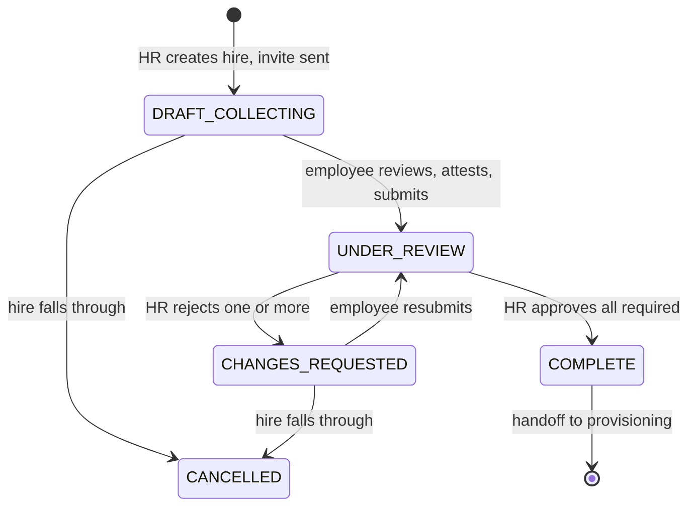

# Architecture — Employee Requirements Tracker

**Status:** v1.0 · **Last updated:** 2026-09-09
**Scope:** the Ktor backend. Companion to [the PRD](employee-requirements-tracker-prd_1.md) and
[the security audit](2026-09-09-security-audit.md).

This document describes the structure the code is built on and the reasoning behind it. Section
references like §8.6 point at the PRD; SEC-nn point at the audit.

---

## 1. What forces this design

Three properties of the problem, not of the technology:

**The rules are numerous and interact.** Three lifecycles run at once — requirement (§6.1), packet
(§6.2) and link (§6.3) — and the interesting behaviour lives in their intersection. Rejecting one
document must unlock exactly that requirement, leave approved ones locked, move the packet to
`CHANGES_REQUESTED`, extend the link's absolute expiry, and notify the employee without restating
their PIN. Logic of that shape belongs somewhere it can be exercised exhaustively in milliseconds,
not behind an HTTP call and a database.

**Several rules are load-bearing security controls.** The audit found 14 issues; all were accepted
and folded into PRD v0.4. Their remedies are not features that can be added later — they are
constraints on what the code may do. §15 says as much: the write-mostly portal, the PIN/session
model and the attestation are Phase 1 precisely because retrofitting them is a rewrite. The
architecture has to make them hard to violate rather than merely documented.

**One residual risk is accepted, and its compensating controls carry the weight.** Link and PIN
travel in the same email (§12), so mailbox compromise yields portal access. That was accepted
deliberately. What makes it survivable is the write-mostly portal — and that is an architectural
rule about what an API may return, not a coding style. If document preview is ever added back to
the portal, the accepted risk becomes unacceptable and must be re-decided.

Clean Architecture answers all three: business rules live in framework-free use cases, so they are
fast to test, and the layer boundaries are where the invariants get enforced.

---

## 2. Layer model and the dependency rule

Source dependencies point inward, always:

```
  route/  ─┐
  plugin/ ─┼──►  domain/  ──►  core/
  data/   ─┘        ▲
                    └── data/ implements domain/port interfaces
```

| Layer | May depend on | May **not** contain |
|---|---|---|
| `core/` | nothing but the Kotlin/Java stdlib | any framework type |
| `domain/` | `core/` | Ktor, Exposed, Koin, Hikari, kotlinx.serialization, `Dispatchers`, JDBC |
| `data/` | `domain/`, `core/`, any library | HTTP concerns |
| `route/` | `domain/`, `core/` | business decisions, direct `data/` access |
| `plugin/` | Ktor | domain rules |
| `di/` | everything | logic |

**This is enforced, not asserted.** [`test/ArchitectureTest.kt`](../test/ArchitectureTest.kt) walks
`src/domain` and `src/core` and fails the build on a forbidden import. It was verified by
introducing a real violation and watching it fail before being trusted.

`core/` is guarded alongside `domain/` because domain models depend on it (`EmailAddress`, `Clock`);
a framework type reaching core would reach the domain by the back door. A third test asserts the
walk actually matches files, so the guard cannot pass vacuously if the layout moves.

**Why `Dispatchers` is on the forbidden list** alongside Ktor and Exposed: a use case that picks its
own dispatcher can't be driven on a virtual-time scheduler, and it buries an I/O decision inside a
business rule. Dispatcher choice belongs at the edge, in `DatabaseFactory`.

---

## 3. Package map

```
src/
  Application.kt          assembly: plugins, then routes
  main.kt                 embeddedServer entry point

  core/                   cross-cutting, framework-free
    error/                AppError, DomainResult — failures as data, not exceptions
    time/                 Clock port
    id/                   EntityIdGenerator, PersonIdGenerator, TokenGenerator, PinGenerator
    crypto/               Hasher port
    value/                EmailAddress, AccessPin, PersonId, EntityId — validating value objects

  domain/                 the rules. Pure Kotlin.
    model/                entities, status enums, LinkPolicy
    port/                 repository and service interfaces
    usecase/              one class per business rule (empty — see §5)

  data/                   adapters implementing domain ports
    db/                   DatabaseFactory (Hikari + Exposed), table/ schema
    repository/           Exposed implementations
    mapper/               row ↔ domain
    crypto/ time/ id/     BcryptHasher, SystemClock, SecureRandom generators

  route/                  thin HTTP adapters
    HealthRoutes.kt       the only endpoint today
    hr/ portal/           handlers, split by audience and auth model
    dto/                  @Serializable wire types — the OpenAPI schema source
    mapper/               dto ↔ domain

  plugin/                 Ktor installers: Serialization, StatusPages, Http,
                          Security, Monitoring, ApiDocs
  di/                     Koin modules — the composition root
```

---

## 4. Ports

The domain names what it needs; `data/` supplies it. Every method is `suspend`, so the adapter picks
its own dispatcher and the use case never sees one.

| Port | Contract | Adapter |
|---|---|---|
| `EmployeeRepository` | hires, their requirement sets | `data/repository` *(pending)* |
| `RequirementTemplateRepository` | the catalogue; read **once** at creation | *(pending)* |
| `UploadLinkRepository` | links, resolved **by token hash** | *(pending)* |
| `SubmissionRepository` | versions, retention purge, storage totals | *(pending)* |
| `PortalSessionRepository` | active sessions; HR termination | *(pending)* |
| `AppSettingsRepository` | the §6.4 policy, read at runtime | *(pending)* |
| `AuditLog` | HR-side actions | *(pending)* |
| `PortalAccessTrail` | append-only portal attempts, distinct IPs, failure counts | *(pending)* |
| `Notifier` | the seven notification kinds | *(pending)* |
| `DocumentStorage` | object storage; signed URLs **HR-side only** | *(pending)* |
| `Clock`, `EntityIdGenerator`, `PersonIdGenerator`, `TokenGenerator`, `PinGenerator`, `Hasher` | infrastructure | **bound** |

Three of these encode a rule in their *shape* rather than their documentation:

- **`Notifier`** — only `sendInvitation` accepts an `AccessPin`. Every other method is structurally
  incapable of carrying the credential, so "no email but the invitation contains the PIN" (§8.9) is
  a compile-time property, not a review checklist item.
- **`UploadLinkRepository.findByTokenHash`** takes a hash, never plaintext. A lookup by plaintext
  would imply the token was recoverable from storage.
- **`DocumentStorage.signedUrlFor`** is documented HR-side only, and no portal use case may depend
  on this port. This is the write-mostly rule (§8.6, SEC-02) expressed as a dependency.

---

## 5. Use cases — the contract with the next session

`domain/usecase/` is deliberately empty. Each entry below is one class, one public
`operator fun invoke`, returning a sealed result. Built test-first in the business session.

| Use case | Rules | PRD | Phase |
|---|---|---|---|
| `CreateHireUseCase` | validate email; duplicate-on-active needs a typed reason; snapshot the requirement set; generate + hash PIN and token; compute `expiresAt` from current policy; send invitation; survive delivery failure | §8.1, §5, §6.4, §6.6 | 1 |
| `VerifyPortalPinUseCase` | identical failure for wrong PIN and unknown token; lockout at 5; auto-suspend at 10 with HR notified; log every attempt | §6.6, §8.6 | 1 |
| `UploadDocumentUseCase` | reject server-side when the requirement is locked; enforce size, type, rate and storage caps; new version each time; purge beyond retention **unless a flag is open** | §8.7, §7.1 | 1 |
| `SubmitPacketUseCase` | blocked until every required requirement has a file; attestation required and versioned; lock all requirements; notify HR | §7.2 | 1 |
| `ApproveSubmissionUseCase` | blocked until the packet is submitted; name-match confirmation required; photo-match for photo ID; log the identity confirmation with the approval | §8.5 | 2 |
| `RejectSubmissionUseCase` | reason required; unlock only that requirement; extend link expiry; flag at 3 rejections | §7.3, §7.1 | 2 |
| `ChangeHireEmailUseCase` | out-of-band verification method required; second approver when approved documents exist; revoke old token+PIN, issue new; notify the old address | §7.4, §8.8 | 2 |
| `ReopenRecordUseCase` | never revive the old token; issue fresh credentials; require a reason | §7.3, SEC-08 | 2 |
| `RequestNewLinkUseCase` | constant response whether or not the address exists; rate-limited | Appendix B, SEC-09 | 2 |

**Test naming** is `<rule> - <scenario> - <outcome>`, e.g.
`hire creation - email duplicates an active hire with no reason given - fails with DuplicateEmailRequiresReason`.
A failing test should say which business rule broke without opening the file.

---

## 6. The three lifecycles

Keeping them separate is what makes §7.1–7.3 tractable. A rejection must not revoke the link —
correction is exactly what the employee needs to do.



| Lifecycle | Type | Transitions owned by |
|---|---|---|
| Requirement (§6.1) | `RequirementStatus` | upload, submit, approve/reject use cases |
| Packet (§6.2) | `PacketStatus` | submit, approve, reject, reopen use cases |
| Link (§6.3) | `LinkStatus` | create-hire, verify-PIN, email-change, expiry sweep |

`RequirementStatus` carries `employeeCanUpload` — the §6.1 table transcribed onto the type instead of
re-derived at each call site. It is the single authority for the server-side lock check §8.7 demands.

---

## 7. Data model

[`data/db/table/Tables.kt`](../src/data/db/table/Tables.kt) implements §11. Two things there are
load-bearing:

**Snapshot columns are copies, not joins.** `EmployeeRequirements.nameSnapshot` /
`isRequiredSnapshot` and `UploadLinks.expiresAt` are written once. Editing a template or a policy
later must not change the progress of anyone in flight, nor make a completed hire retroactively
incomplete (§5, §6.4). A live foreign-key read would quietly break both, and would also make the
audit log meaningless — you cannot attest to a state that mutates retroactively.

**There is no `last_accessed_at` column anywhere, on purpose.** PRD v0.3 had one; a single
overwritten timestamp cannot answer who, from where, or how often, which is the first question asked
when a fraudulent submission surfaces (SEC-05). `PortalAccessLogs` replaces it and is append-only —
nothing updates or deletes rows there. Reintroducing such a column would undo the control.

Files live in object storage; the database holds keys and metadata only.

---

## 8. Request flows

**HR creates a hire** — `POST /api/employees`
`EmployeeRoutes` → `CreateHireUseCase` → reads policy and templates → snapshots the requirement set →
`TokenGenerator` + `PinGenerator` → `Hasher` → persists link with a computed `expiresAt` →
`Notifier.sendInvitation` (the one message carrying both halves) → `AuditLog`. The route maps the
sealed result to 201 or 409/422; it makes no decision.

**Portal PIN verification** — `POST /api/portal/{token}/verify`
`PortalRoutes` hashes the token, resolves the link, calls `VerifyPortalPinUseCase`. Wrong PIN and
unknown token return the **same** failure, so the endpoint cannot be used to test whether a link
exists. Every attempt is written to `PortalAccessTrail` first. On success a `PortalSession` opens for
`sessionMinutes`; access is carried by the session from then on, not the URL.

**Portal upload against a locked requirement** — `POST /api/portal/{token}/requirements/{id}/upload`
Session checked, then `UploadDocumentUseCase` consults `RequirementStatus.employeeCanUpload` and
returns `Conflict` → 409. Enforced in the use case, server-side, exactly as §8.7 requires — the UI
hiding the button is not the control.

---

## 9. API documentation

The spec is **generated from the live route tree**, not maintained by hand.

| Path | Serves |
|---|---|
| `/openapi` | rendered static reference |
| `/swagger` | interactive Swagger UI |
| `/swagger/documentation.yaml` | the machine-readable spec |

`OpenApiDocSource.Routing` reads the mounted routes, so an endpoint cannot exist without appearing in
the docs. Per-route detail is attached with `describe { }` beside the handler; `hide()` withholds a
route. The `hr-jwt` security scheme is derived from the `authenticate` blocks rather than restated.
With ~38 endpoints in Appendix B, a hand-maintained file would drift within a sprint — and a spec
that lies is worse than none.

`route/dto/` types are what the schema is generated from — but only where a route declares them. Verified, not assumed: the generator infers nothing from `call.respond`, so every route needs a `responses { response(200) { schema = jsonSchema<...>() } }` block in its `describe { }` or it publishes an operation with no body type (ERT-145). That gives the DTO layer a second job
beyond wire-format isolation and is a further reason domain models never reach a route: a model
serialised directly would publish whatever fields it happens to carry, and §8.6 forbids the portal
returning an original filename or storage key.

**The Swagger surface is gated outside dev** (open in dev, HR-authenticated otherwise). Swagger UI
publishes the exact shape of `/api/portal/{token}/verify`, its error contract and its rate limits to
anyone who asks, and that surface is what the audit is about.

**When portal routes are documented,** their descriptions must present the deliberate behaviours as
*intended* — identical failures for wrong PIN vs unknown token, constant response from
`request-new-link`. Otherwise a future engineer reads them as bugs and "fixes" them into an
enumeration oracle.

---

## 10. Testing

| Level | Where | Covers |
|---|---|---|
| Use case | `test/domain/usecase/` | every business rule, exhaustively. The bulk of the suite. |
| Architecture | `test/ArchitectureTest.kt` | the dependency rule, as a build failure |
| Route | `test/*Test.kt` | wiring, status codes, serialization — never a decision |
| Fakes & builders | `test/testdata/` | in-memory ports, `FixedClock`, sample data |

Loop: **red → green → refactor → review.** The review step is not optional — after a use case is
green, read it against its tests and hunt for what the happy path hid: untested branches, boundaries,
nulls, negative paths, silent failures. Each finding becomes a new named test that fails first.

**Verified constraint: Amper 0.12.0 does not discover Kotest specs.** Both 5.9.1 and 6.0.3 were
tried; a deliberately-failing `BehaviorSpec` was silently skipped under the default runner and found
zero tests even when selected explicitly by class. This matters because an undiscovered spec is
indistinguishable from a passing one — the probe was written to fail precisely so the difference was
visible.

So tests use `kotlin.test` (`@Test`, discovered by JUnit 5) with **Kotest assertions**
(`shouldBe`, `shouldBeEmpty`) and **MockK**, which work normally as libraries. BDD structure comes
from the three-part naming template rather than `given/when/then` nesting. Revisit if Amper gains
Kotest engine support.

---

## 11. Dependency injection

`coreModule` (infrastructure) + `dataModule` (adapters); a `domainModule` joins them when use cases
exist. Nothing in `domain/` imports Koin — dependencies arrive through constructors, which is why a
use case can be built in a test from plain fakes with no container at all.

**Repository bindings are deliberately absent rather than stubbed with throwing placeholders.** An
unbound port fails fast and loudly at wiring time; a placeholder that compiles fails at runtime, in
production, on the one path nobody exercised. Each binding lands with the use case that needs it.

---

## 12. Architectural invariants

Structural, not incidental. Weakening any of these re-opens a finding the audit closed.

| Invariant | Where it lives | Source |
|---|---|---|
| The portal returns document **status** — never content, signed URLs, or original filenames | `DocumentStorage` is HR-side only; `route/dto` never carries `fileKey`/`originalFilename` | §8.6, SEC-02 |
| A bare link resolves to a PIN prompt and nothing else | `VerifyPortalPinUseCase`, portal DTOs | Appendix B, SEC-01 |
| Wrong PIN and unknown token are indistinguishable | `AppError.Denied` is a **`data object`**, so there is exactly one value and differing bodies are unrepresentable; the mapper sends it to one shared envelope constant, so it cannot carry a per-instance message or `details`; an unmatched route renders the same body; `PortalOutcome.DENIED` does not record which | §6.6 |
| Tokens and PINs stored hashed; PIN in the invitation only | `Hasher`; `Notifier` signature | §6.6, §12 |
| Locked-state upload rejection is server-side | `RequirementStatus.employeeCanUpload`, checked in the use case | §8.7 |
| Requirement sets and `expiresAt` snapshotted at creation | snapshot columns | §5, §6.4 |
| Every portal access is an append-only record | `PortalAccessLogs`; no `last_accessed_at` | §8.12, SEC-05 |
| No version purging while an anomaly flag is open | `Employee.retentionFrozen`, checked before purge | §7.1, SEC-13 |
| `COMPLETE` is not identity assurance | `originalsSightedAt` separate; stated in the API description | §1, SEC-04 |

---

## 13. Deferred by design

Phase 2 adds the validation loop and accountability; Phase 3 CSV import, reminders, dashboard and the
exception report; Phase 4 document lifecycle. The §9.3 seams are already open so Phase 4 costs a
migration, not a redesign:

- `Submission` is **versioned** with nullable `validFrom` / `validUntil` from the start.
- The requirement catalogue is independent of the onboarding flow — a catalogue of document types,
  not a checklist only onboarding uses.
- `LinkScope` allows `Only(templateIds)`; v1 always issues `All`, but renewal links need no new model.
- Nothing assumes an employee has exactly one packet.

---

## 14. Decisions and trade-offs

**Single Amper module, package layering.** A multi-module split would make the dependency rule a
compile error rather than a test failure. Rejected for now: it restructures the build, and
`ArchitectureTest` gets most of the benefit at a fraction of the cost. Revisit if the module grows
past comfortable.

**Exposed JDBC + HikariCP over R2DBC.** Blocking Exposed behind suspending ports, with the
`Dispatchers.IO` hop confined to `DatabaseFactory`. More battle-tested than Exposed's R2DBC path, and
the audit trail and access log are transactional writes where maturity matters more than non-blocking
I/O. `exposed-r2dbc` and `h2database-r2dbc` remain declared in `module.yaml` but are now unused —
harmless, and left for the owner to remove.

**bcrypt, not a fast digest, for token and PIN.** The PIN keyspace is only 10⁶; a leaked database
falls to an offline sweep in seconds against SHA-256. A work factor makes each candidate expensive.
Lockout and auto-suspend bound the *online* attack — different attacks, and neither control
substitutes for the other.

**Generated OpenAPI.** See §9. Required declaring `io.ktor:ktor-server-routing-openapi` explicitly:
Amper's Ktor catalog has no key for it.

**Koin over compile-time DI.** Already declared and adequate. The domain doesn't depend on it either
way, so this is reversible.

**JWT is a marked placeholder.** PRD §14 **Q4 — who the HR users are, whether they share an account,
and whether an SSO provider exists — is blocking and unanswered.** The current scheme reads its
secret from `JWT_SECRET` and refuses to start on a default key outside dev, which is enough to keep
`authenticate` blocks honest. It should be replaced, not extended, once Q4 is answered.

### Open questions that block architectural work

| # | Question | Blocks |
|---|---|---|
| 4 | How do HR users authenticate? SSO? | the whole auth model |
| 16 | Is a phone number available for out-of-band verification (§7.4)? | `ChangeHireEmailUseCase` — without a channel, SEC-03 is unremediated in practice regardless of what §7.4 says |
| 5 | What consent notice must appear on the portal? | the attestation text and its versioning |
| 6 | How does `COMPLETE` reach account provisioning? | the handoff seam |
| 1 | How do tenured employees enter the system? | Phase 4 only |

---

## 15. What was fixed in the scaffold

The generated project did not build. Recorded here because two of these were silent.

| Problem | Resolution |
|---|---|
| `$ktor.server.routingOpenapi` is not a valid Amper catalog key — **the project failed before compiling** | removed; `ktor-server-routing-openapi` declared directly in `libs.versions.toml` |
| `configureExposed()` was `suspend` but called from non-suspend `rootModule()` — **compile error** | replaced by injected `DatabaseFactory` |
| `openAPI()` and `swaggerUI()` mounted on the same `"openapi"` path | split to `/openapi` and `/swagger` |
| `openAPI()` wrote `index.html` and `.swagger-codegen/` into **`docs/`**, this folder | `outputPath` redirected to `build/openapi-docs` |
| `jwtSecret = "secret"` hardcoded | read from env; refuses to start on a default outside dev |
| CORS `anyHost()` | explicit `CORS_ALLOWED_HOSTS`; nothing cross-origin by default |
| StatusPages echoed `"500: $cause"` to clients | logged server-side; clients get a code |
| Demo `City` / `ExposedUser` CRUD, `MySession` | deleted |
