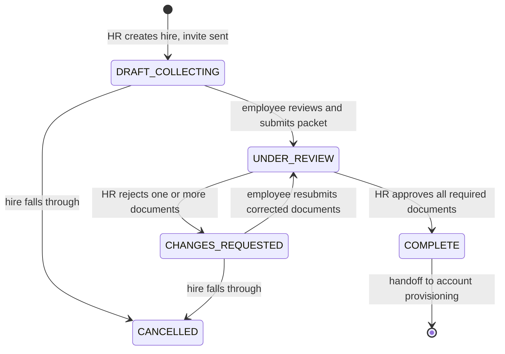
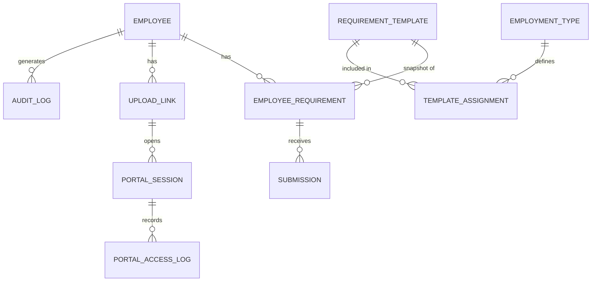

# Employee Requirements Tracker — Product Requirements Document

**Status:** Draft v0.4
**Owner:** _TBD_
**Last updated:** 2026-09-09

**Changes since v0.1:** Non-goals confirmed against the existing HRIS. Added CSV bulk import, an employee-controlled review-and-submit phase, document expiry tracking for existing employees, upload/correction limits, full link lifecycle, and HR email correction.

**Changes since v0.2:** Link expiry raised to a 90-day ceiling and made admin-configurable (§6.4, §8.10), with an idle clock, rejection-based extension, expiry warning email, and per-link extension.

**Changes since v0.3:** Incorporates the security and business-rules audit of 2026-09-09 (14 findings). Adds portal access PIN and sessions (§6.6), a write-mostly portal (§8.6), out-of-band verification of email changes (§7.4), identity-binding rules at validation (§8.5), employee attestation at submission (§7.2), a portal access trail with anomaly flags (§8.12), an HR exception report (§8.13), and evidence-retention freezes (§7.1). One residual risk is formally accepted in §12.

---

## 1. Problem Statement

When a new employee is hired, HR must collect a set of pre-employment documents (IDs, clearances, certificates, medical results) before the employee can be fully onboarded. Today this happens over email, chat, and physical hand-offs, so HR has no single place to see who has submitted what, and new hires have no clear checklist of what is still missing.

The cost of leaving this unsolved: HR spends time chasing individuals and manually reconciling attachments, documents get lost across threads, and onboarding milestones slip because a missing document is discovered late. Company account creation is gated on requirement completion, so a stalled document collection stalls the entire downstream onboarding process.

### What this system is and is not authoritative for

**It is authoritative for:** a document was received, from a link issued to this hire, and an HR officer looked at it and judged it valid.

**It is not authoritative for:** the identity of the person who submitted it, or whether the documents belong to the person who was hired.

That second line is not a limitation to be engineered away later — it is a property of collecting documents remotely from someone who does not yet have a company account. Identity binding is performed by HR as a human judgement (§8.5) and confirmed against originals in person. `COMPLETE` means the paperwork is in and looks right. It does not mean the person has been verified, and no downstream process should read it that way.

---

## 2. Users

| Persona | Description | Primary need |
|---|---|---|
| **HR Officer** (primary) | Creates hire records, monitors collection progress, validates submitted documents | See at a glance who is behind and what is missing |
| **New Hire** | Recently hired, has no company account yet, will not get one until requirements are complete | Upload documents once, from any device, without creating an account |
| **HR Admin** (secondary) | Configures the requirement catalog and expiry policies | Change the checklist without a developer |
| **Existing Employee** (Phase 4) | Tenured staff with an expiring document that needs re-collection | Renew one document without a full onboarding flow |

---

## 3. Goals

1. **Single source of truth** — every pre-employment document for a hire lives in one record, retrievable in under 10 seconds.
2. **Self-service submission** — new hires submit 100% of documents through the upload link, with zero email attachments needed.
3. **Visible progress** — HR can see completion percentage for every in-progress hire on one screen, without opening each record.
4. **Clean handoff** — when a hire reaches `COMPLETE`, downstream account creation can begin with confidence that every document has been validated.
5. **No surprise expiries** — documents with a validity period are flagged before they lapse, not after.

---

## 4. Non-Goals

| Out of scope | Why |
|---|---|
| Employee master data — payroll, leave, attendance, the 201 file | **A full HRIS already exists in the organization.** This system collects and validates pre-employment documents and hands off; it must not duplicate or compete with the HRIS. |
| e-Signature of contracts and offer letters | Contracts are reviewed and signed manually by HR today, and that process is not the bottleneck this system addresses. |
| New hire accounts, passwords, or employee login | Company accounts are created by a separate process **after** requirements are complete. Adding a login here would block the exact flow we are making frictionless. Access is by tokenized link plus an access PIN (§6.6) — a credential to open one packet, not an account. |
| Company account provisioning | Handled by a separate downstream system. This system's job ends at `COMPLETE`. |
| OCR / automatic data extraction from uploaded documents | High complexity, low v1 value. HR validates visually. |
| Multi-company or multi-branch tenancy | Single organization for now. |

---

## 5. Key Concepts

- **Employee** — a hired person being onboarded. Created by HR, individually or via CSV import.
- **Requirement** — a single document type to be collected, e.g. "NBI Clearance". Defined once, reused.
- **Requirement Set** — the requirements that apply to a given employee, derived from Employment Type at creation. This is the **denominator of the progress bar**.
- **Submission** — an uploaded file against one requirement. Versioned; carries a status.
- **Packet** — the employee's complete set of submissions, submitted for review as a unit. The employee controls when the packet is submitted.
- **Upload Link** — a tokenized, expiring URL pointing at one employee's own checklist. On its own it grants nothing; it must be paired with the access PIN.
- **Access PIN** — a 6-digit code issued with the hire record and delivered once, in the invitation email. Required to open every portal session.
- **Portal Session** — a short-lived, authenticated window opened by link + PIN. Access is carried by the session, not by the URL.
- **Validity Window** — for documents that expire (clearances, medical results), the period during which the document is considered current.

### Requirement Set snapshotting

The requirement set is **copied onto the employee record at creation time**, not read live from the template. Editing a template later must not change the progress of anyone already in flight, and must never make a completed hire retroactively incomplete. Template edits apply only to hires created after the edit.

---

## 6. State Machines and Access Model

Three lifecycles interact — requirement, packet, and link. Keeping them distinct is what makes scenarios 1–3 tractable. §6.6 then defines how the portal is actually opened, which is a separate concern from how long the link lives.

### 6.1 Requirement status

| Status | Employee can upload? | Meaning |
|---|---|---|
| `PENDING` | Yes | Nothing uploaded yet |
| `UPLOADED` | Yes (replace freely) | File present, packet not yet submitted |
| `UNDER_REVIEW` | **No — locked** | Packet submitted, awaiting HR validation |
| `APPROVED` | **No — locked** | HR validated and accepted |
| `REJECTED` | Yes (must replace) | HR found it invalid; reason attached |
| `EXPIRED` | Yes | Validity window lapsed (Phase 4) |

### 6.2 Employee / packet status



`ON_HOLD` is available from any non-terminal state for hires that pause (deferred start date, pending medical).

### 6.3 Upload link status

| Status | Employee sees | Trigger |
|---|---|---|
| `ACTIVE` | Working checklist | Created with the hire |
| `EXPIRED` | Explanation + "request a new link" | Expiry lapsed (see §6.4) |
| `SUSPENDED` | Explanation + "contact HR" | Too many failed PIN attempts (§6.6), or the employee reported a problem |
| `REVOKED` | Explanation + "contact HR" | Email changed, or HR revoked manually |
| `COMPLETED` | Read-only confirmation of what was accepted | Employee reached `COMPLETE` |
| `CLOSED` | Generic "this link is no longer available" | Grace window after `COMPLETED` elapsed |

### 6.4 Link expiry policy

Every duration below is an **admin-configurable setting**, not a constant in code. The values shown are defaults.

| Setting | Default | What it does |
|---|---|---|
| `link.absolute_expiry_days` | **90 days (3 months)** | Hard ceiling from link issue. The link dies at this point regardless of activity. |
| `link.idle_expiry_days` | 30 days | Link dies this long after the last employee activity, whichever comes first. Set to `0` to disable and rely on the absolute ceiling alone. |
| `link.extend_on_rejection_days` | 30 days | Pushes the absolute expiry out when HR rejects a document, so HR's own review time never eats the employee's window. |
| `link.warn_before_expiry_days` | 7 days | When the employee receives an expiry warning email. |
| `link.completed_grace_days` | 14 days | How long the read-only confirmation page stays reachable after `COMPLETE` before `CLOSED`. |
| `portal.session_minutes` | 45 minutes | How long a PIN-verified session lasts before the PIN is required again. |
| `portal.pin_attempts_before_lockout` | 5 | Failed PIN entries before a temporary lockout. |
| `portal.lockout_minutes` | 15 minutes | Length of that lockout. |
| `portal.pin_failures_before_suspend` | 10 | Cumulative failures before the link is suspended and HR notified. |

**Two clocks, not one.** A 90-day ceiling on its own means an abandoned link stays live for three months holding access to birth certificates and medical records. An idle clock on its own means a link touched periodically never dies. Running both, with the earlier one winning, gives the long window the process actually needs without leaving dormant credentials open for a full quarter. If the idle clock proves annoying in practice, it can be switched off in settings rather than in a release.

**Rejection extends the window.** Without the extension rule above, a hire rejected on day 85 gets five days to fix it. The extension makes the reject-and-resubmit loop safe under an absolute ceiling.

**Configuration bounds.** The settings UI enforces a minimum and maximum on each value — suggested 7 to 180 days for absolute expiry — so a well-meant edit cannot turn a token into a permanent credential.

**Config changes apply to newly issued links only.** `expires_at` is computed and stored when the link is issued, exactly like the requirement-set snapshot in §5. Changing the setting must not silently extend or kill links already in the wild. A separate, explicit "apply to active links" bulk action can be offered if HR needs it.

**Expiry is recoverable.** An expired link is not a dead end — the employee self-serves a fresh one through `request-new-link` (§8.6), and HR can resend at any time. This is what makes a bounded window safe to enforce.

### 6.5 Progress calculation

- **Submission progress** = `UPLOADED + UNDER_REVIEW + APPROVED` / total required — what the employee has done.
- **Approval progress** = `APPROVED` / total required — what HR has actually validated.

**Recommendation:** the bar fills with approval progress, with submitted-but-unvalidated shown as a lighter segment on the same bar. The row reads `6/10 validated · 2 awaiting review`. This keeps HR's own review backlog visible rather than letting a hire look finished when nothing has been checked. Optional requirements are excluded from both numerator and denominator.

### 6.6 Portal access control

The link on its own opens nothing. Access requires **two things: the URL and a 6-digit access PIN.**

- The PIN is generated when the hire record is created, delivered **once** in the invitation email alongside the link, and stored hashed like the token.
- It is entered every time a session is opened. A verified session lasts `portal.session_minutes`; when it lapses, the PIN is required again.
- The PIN is **never repeated in a later email**. Rejection notices, reminders, and expiry warnings point at the portal without restating the credential, so a forwarded notification carries nothing useful.
- The PIN rotates on email change, on reopen after `COMPLETE`, on HR revocation, and on employee request.

#### What this covers, and what it does not

Both the link and the PIN travel in the same email. This is a **single-channel control**, and the spec should say so plainly rather than imply more protection than exists.

| Threat | Covered? |
|---|---|
| URL leaks on its own — shared-computer browser history, screenshot, pasted into a group chat, referrer leakage | **Yes.** The URL alone is inert. |
| Employee forwards the link casually | **Partly.** Forwarding the whole email still hands over both parts. |
| HR mistypes the address and a stranger receives the invitation | **No.** The stranger receives both. |
| The employee's mailbox is compromised or has a forwarding rule | **No.** |
| Attacker persuades HR to resend to a new address | **No** — mitigated separately by §7.4 out-of-band verification. |

**An alternative was considered and rejected:** asking the holder to type the employee's email address instead of a PIN. The address is printed in the `To:` field of the message they are already reading, and is often guessable from a name. It adds a step without adding a secret.

**Two consequences follow, and neither is optional.** They are what make the accepted risk (§12) survivable:

1. **The portal must never return document content** (§8.6). Mailbox compromise then costs a fraudulent upload — recoverable — rather than bulk disclosure of a person's birth certificate, IDs and medical results, which is a reportable breach.
2. **Email changes must be verified out-of-band** (§7.4), because that path is now the softest way in.

#### Brute-force protection

**Six digits, not four.** A million combinations instead of ten thousand, at no usability cost — six-digit codes are routine. Four digits is defensible only with aggressive lockout, and lockout is itself a denial of service against the employee, who then cannot submit anything.

| Control | Default |
|---|---|
| Failed attempts before temporary lockout | `portal.pin_attempts_before_lockout` (5), then `portal.lockout_minutes` (15) |
| Cumulative failures before the link auto-suspends | `portal.pin_failures_before_suspend` (10), with HR notified |
| Failure response | Identical for a wrong PIN and an unknown link — never reveal which was wrong |
| Logging | Every attempt, success or failure, to the access trail (§8.12) |

A burst of failed attempts is one of the few signals of an attack while it is still happening. It must reach a person, not only a log file.

---

## 7. Scenario Handling

These are the four scenarios raised in review, with a recommended resolution for each.

### 7.1 Employee uploads the wrong document — what are the correction limits?

**Recommendation: no hard cap on corrections while a requirement is in an editable state.** A cap punishes the honest employee with a bad phone camera far more often than it stops abuse, and the real risks (storage, spam) are better handled by rate limits than by a counter.

| Control | Recommended value | Rationale |
|---|---|---|
| Replacements per requirement | **Unlimited** while `PENDING`, `UPLOADED`, or `REJECTED` | Corrections are the normal case, not the exception |
| Replacement when locked | **Blocked** in `UNDER_REVIEW` and `APPROVED` | Prevents the document HR is looking at from changing mid-review |
| Upload rate limit | 10 per requirement per hour, 30 per employee per hour | Abuse and runaway-client protection |
| File size | 10 MB per file | Comfortably fits a phone photo or scanned PDF |
| Total storage per employee | 100 MB | Backstop against pathological cases |
| Version retention | Current + last 4 versions | Enough for audit; older versions purged automatically |
| Retention freeze | **No purging while a fraud or anomaly flag is open** | The superseded version is the evidence. An attacker with portal access could otherwise erase a forgery by uploading five innocuous replacements. |
| Rejection-loop flag | After 3 rejections of the same requirement, flag the record for HR attention | Not a block — a signal that the instructions are unclear, which is an HR problem to fix, not the employee's |

Every replacement creates a new `submission` version. The previous version is retained (subject to retention limit) so HR can see what changed, and the audit log records each upload.

Note the tension in the retention freeze: evidence preservation and data minimisation pull against each other, and legal should set the balance (§14, Q18).

### 7.2 Employee review phase before final submission

The employee uploads documents individually, then **explicitly reviews and submits the packet as a unit**. Uploading a file is not the same act as declaring "I am done."

Flow:
1. Employee uploads documents one by one. Each lands in `UPLOADED`. All are freely replaceable.
2. When every required requirement has a file, a **Review & Submit** step unlocks, showing a summary of all documents with thumbnails and a last chance to replace any of them.
3. Employee **attests and confirms**. The packet moves to `UNDER_REVIEW`; every requirement locks.
4. HR is notified that a packet is ready for validation.

**The attestation.** Confirming is a declaration, not just a button press. Before submission completes, the employee affirms that the documents are their own and genuine, and acknowledges that falsification may result in withdrawal of the offer or termination. The privacy consent notice sits at the same step, once §14 Q5 is answered.

Persist the attestation with the packet: the **version of the text agreed to**, the timestamp, and the IP. Version it, because the wording will change and you will need to know which version a given employee accepted. Without this, when a forgery surfaces there is no record of the employee having claimed anything, which weakens both the disciplinary position and any resulting labour case.

**HR visibility before submission:** HR can *see* uploaded documents as they arrive — that is the whole point of the progress view — but **approve and reject actions stay disabled until the packet is submitted.** Reviewing a document the employee is about to replace wastes HR's time and creates confusing status churn.

**If the employee never submits:** the packet stays in `DRAFT_COLLECTING` indefinitely. Reminders escalate (§8.9), and HR can send a direct nudge. HR may also **force-submit** a packet on the employee's behalf when the employee is unresponsive but the documents are all there.

A force-submitted packet **carries no attestation** and is marked distinctly on the record. If force-submitted and employee-submitted packets look identical, no attestation can be relied on without checking, which devalues all of them.

### 7.3 One document is invalid after submission — what happens to the link?

The link stays **`ACTIVE` for the entire correction loop**. Revoking it on rejection would be self-defeating, since correction is exactly what we need the employee to do.

1. HR validates the packet. Approving all required documents ends the process; rejecting any moves the packet to `CHANGES_REQUESTED`.
2. **Only rejected requirements unlock.** Approved documents stay locked so the employee cannot accidentally replace something already cleared, and HR does not have to re-validate work already done.
3. The employee gets an email naming each rejected document and its reason. The portal shows the same, with the rejected items surfaced at the top — requirement name, status and reason, never the document itself (§8.6).
4. Employee replaces the rejected documents and submits again. The packet returns to `UNDER_REVIEW` — but **only the resubmitted documents need re-validation**, not the whole packet.
5. Loop repeats until all required documents are `APPROVED`.

**On completion:**
- Packet status → `COMPLETE`. Link status → `COMPLETED`.
- The portal switches to a **read-only confirmation page** listing each requirement name and its outcome, plus the completion date. It does not render or link to the documents themselves. The employee is not dropped onto an error page — they get proof their submission was accepted, which prevents a wave of "did it go through?" messages to HR.
- After the configured grace window (`link.completed_grace_days`, default 14 days), the link moves to `CLOSED` and no longer resolves.
- `COMPLETE` is the handoff signal for the downstream account-provisioning process.

If HR later discovers a problem with an approved document, HR can **reopen** a completed record. This reverts the packet to `CHANGES_REQUESTED` and re-notifies the employee.

**Reopen issues a fresh credential; it never revives the old one.** A record reopened months later would otherwise re-arm a dormant link at an address the employee may no longer control — a former employer's domain, a deactivated account, a recycled address. Reopen therefore revokes the old token, issues a new link and a new PIN, and requires HR to reconfirm that the address is still current. Reopening requires a reason and is logged; where approved documents are involved, it should require a second approver (§14, Q10).

### 7.4 HR updates an unreachable email address

HR can edit the email on the hire record. Because this action redirects access to sensitive personal documents, it is the highest-risk operation in the system and is treated accordingly.

**The mechanics were never the weak part. The trigger is.** As originally written, the procedure fired once HR had decided to make the change, and said nothing about how that request arrived. That gap is a working attack: someone emails HR claiming to be the hire and asking for the link to be resent to a new address, HR follows the documented process correctly, and a valid credential goes to the attacker. Following the procedure *is* the vulnerability, so the procedure has to carry the control.

**Verification, before anything changes:**
- An email change is **never actionable from an inbound email alone**. HR verifies out-of-band — a phone call to the number on the recruitment record, or confirmation through the recruiter or hiring manager who has met the person.
- HR records **which verification method was used**, as a required field. The audit log must show *how* each change was verified, not merely that it happened.
- Where the packet already contains approved documents, a second HR approver is required.

**Then the mechanics:**
- The change **revokes the existing token and PIN immediately** and issues a new link and a new PIN to the new address. The old link stops working the moment the change is saved.
- HR confirms in a dialog stating plainly that the previous link will stop working.
- The change is written to the audit log with old address, new address, verification method, reason, actor, and timestamp.
- A notification is sent to the old address. It may be dead — but if it is live and the change was not legitimate, this is the only signal the real employee will ever get.
- Progress, uploaded documents, and packet status are **unaffected**. Only access changes.

---

## 8. Requirements

### P0 — Must have

#### 8.1 Create hire record
Fields: First Name, Middle Initial (optional), Last Name, Department, Position, Employment Type, Email. Email format-validated and checked for duplicates against active hires. On save, the requirement set is snapshotted, an access PIN is generated, and the invite is sent.

- [ ] Given all required fields, when HR saves, then the hire appears in the list at 0% progress
- [ ] Given a hire is created, then a 6-digit access PIN is generated, stored hashed, and included in the invitation email
- [ ] Given a duplicate email on an active hire, then HR sees a warning and must enter a typed reason before proceeding, which is written to the audit log and surfaced in the exception report (§8.13)
- [ ] Given an invalid email format, then the form blocks submission with a field-level message
- [ ] Given a hire is created, then the invite email is sent within 1 minute
- [ ] Given email delivery fails, then HR sees a failure indicator on the record and a retry action

#### 8.2 Bulk import via CSV
Downloadable template with the same columns as §8.1. Import runs as **validate → preview → confirm**, never as a single blind action.

- [ ] Given a CSV upload, then a preview shows every row with per-row validation errors before anything is created
- [ ] Given rows with errors, then valid rows can still be imported and the invalid rows are reported as a downloadable error file
- [ ] Given an unrecognized department or employment type, then the row is flagged rather than silently creating a new one
- [ ] Given a duplicate email within the file or against existing active hires, then the row is flagged
- [ ] **Given a confirmed import, then invitation emails are NOT sent automatically** — HR triggers sending as a separate, explicit action
- [ ] Given the validation preview, then each row shows name and email adjacent to each other so a shifted column is visible to a human before sending
- [ ] Given a send batch above the configured cap, then HR must re-confirm before it proceeds
- [ ] Given invitations have already been sent for a batch, then no bulk resend is possible without re-running validation
- [ ] Given an import completes, then a summary shows created, skipped, and failed counts

The separated send step is deliberate. A bad import that immediately emails fifty people cannot be undone.

#### 8.3 Hire list with progress
Default view: `DRAFT_COLLECTING`, `UNDER_REVIEW`, and `CHANGES_REQUESTED`, most recent first. Each row shows name, department, position, employment type, packet status, progress bar, fraction, awaiting-review count, and last activity date. Search by name or email; filter by department, employment type, and status.

- [ ] Given hires exist, then each row renders a progress bar per §6.5
- [ ] Given a hire reaches `COMPLETE`, then they leave the default view but remain findable via filter
- [ ] Given a packet is `UNDER_REVIEW`, then the row is visually distinct so HR can find its review queue
- [ ] Given no hires exist, then an empty state with an "Add hire" action is shown

#### 8.4 Employee detail with document preview
Hire details, overall progress, every requirement with its status, and inline preview for images (JPG, PNG, HEIC) and PDF. Other formats offer download only. Shows submission timestamp, filename, size, version number, and reviewer plus review timestamp where applicable.

- [ ] Given a submission exists, when HR clicks it, then the file renders inline without leaving the page
- [ ] Given a multi-page PDF, then all pages are viewable
- [ ] Given a requirement has no submission, then it shows as pending with no broken preview area
- [ ] Given a requirement was rejected, then the reason and date are visible
- [ ] Given prior versions exist, then HR can view the version history for that requirement

#### 8.5 Validation actions and identity binding
Approve and Reject per submission; Reject requires a reason. Enabled only when the packet is `UNDER_REVIEW` or `CHANGES_REQUESTED`.

Validation answers two separate questions, and the second is the one that is easy to skip: **is this document valid**, and **is it this person's**. Nothing technical can answer the second — a substituted document can be entirely genuine, correctly formatted, and belong to someone else. The system's job is not to make that judgement but to make the step explicit, unskippable, and attributable to a named officer.

- [ ] Given a packet in `DRAFT_COLLECTING`, then approve and reject controls are visible but disabled, with a tooltip explaining why
- [ ] Given a document under review, then Approve stays disabled until HR explicitly confirms the name on the document matches the hire record
- [ ] Given a photo ID, then HR must additionally confirm the photo matches the individual who was interviewed and hired
- [ ] Given HR approves a document, then progress increases and the identity confirmation is logged alongside the approval, with actor and timestamp
- [ ] Given HR clicks Reject, then a reason is required before the action completes
- [ ] Given a rejection, then the employee receives an email naming the requirement and the reason
- [ ] Given all required documents are approved, then the packet moves to `COMPLETE` and the link to `COMPLETED`
- [ ] Given a record at `COMPLETE`, then an **originals sighted** flag can be recorded with the date and the officer who sighted them
- [ ] Given originals have not been sighted, then the hire record displays that plainly, so `COMPLETE` is not mistaken for identity assurance (§1)

#### 8.6 Upload portal — access control and review phase
No company account. Mobile-first: camera capture and gallery upload must work in a phone browser. Implements §6.6 and §7.2 in full.

**Write-mostly.** The portal reports document *status*; it never returns document *content*. The employee needs to know whether a document was accepted, not to re-read their own birth certificate. This single rule removes most of the consequence of a leaked link, and costs nothing.

- [ ] Given a valid link and no verified session, when the portal is opened, then only the PIN prompt is returned and no requirement data of any kind
- [ ] Given a correct PIN, then a session opens for `portal.session_minutes` and the checklist is shown
- [ ] Given a wrong PIN, then the response is indistinguishable from an unknown link, and the attempt is logged
- [ ] Given the lockout or suspend thresholds in §6.6 are reached, then access is blocked and HR is notified
- [ ] Given a verified session, then the employee sees only their own requirements
- [ ] Given a submitted document, then no portal response contains a preview, a signed download URL, or the original filename
- [ ] Given the portal, then a "this wasn't me — report a problem" action is available which immediately suspends the link and notifies HR
- [ ] Given every required requirement has a file, then the Review & Submit step becomes available
- [ ] Given the review screen, then the employee can replace any document before confirming
- [ ] Given the employee confirms submission, then all requirements lock and HR is notified
- [ ] Given a packet in `CHANGES_REQUESTED`, then only rejected requirements are editable and are shown first
- [ ] Given an expired token, then an explanatory page with a "request a new link" action is shown
- [ ] Given a completed packet within the grace window, then a read-only confirmation page lists requirement names and outcomes only
- [ ] Given a closed link, then a generic unavailable message is shown with no personal data
- [ ] Given a file over the size limit, then upload is blocked with a message stating the actual limit
- [ ] Given a successful upload, then status updates immediately without a page reload

#### 8.7 Upload limits and versioning
Implements §7.1.

- [ ] Given a requirement in an editable state, then the employee can replace the file without a count-based limit
- [ ] Given a locked requirement, then upload is rejected server-side, not merely hidden in the UI
- [ ] Given the rate limit is exceeded, then a clear retry-later message is shown
- [ ] Given more than 5 versions exist, then the oldest is purged from storage
- [ ] Given a record with an open fraud or anomaly flag, then no version is purged until the flag is cleared
- [ ] Given a requirement is rejected 3 times, then the hire record is flagged for HR attention

#### 8.8 Edit hire, including email correction
Implements §7.4.

- [ ] Given an email-change request, then the form requires a recorded out-of-band verification method and a reason before the change can commit
- [ ] Given a packet that already contains approved documents, then a second HR approver is required for an email change
- [ ] Given HR changes the email, then the old token and PIN are revoked and a new link and PIN are sent to the new address
- [ ] Given HR changes the email, then a confirmation dialog warns that the previous link will stop working
- [ ] Given an email change, then a notification is sent to the previous address
- [ ] Given any edit, then the change is recorded in the audit log with actor, timestamp, reason, and verification method
- [ ] Given an email change, then uploaded documents and packet status are unchanged

#### 8.9 Notifications
Invitation, packet-ready-for-review (to HR), rejection with reasons, **link-expiring warning** (`link.warn_before_expiry_days` before lapse, only if the packet is still incomplete), completion confirmation, and manual resend from the hire record.

- [ ] Given a link is within the warning window and the packet is incomplete, then the employee receives one expiry warning email
- [ ] Given a packet is already `COMPLETE`, then no expiry warning is sent
- [ ] Given any email other than the invitation, then it never contains the access PIN
- [ ] Given a suspended link, then HR is notified with the reason

#### 8.10 Configurable link policy
Admin settings screen exposing every value in §6.4, stored in the database and read at runtime — no redeploy to change a duration.

- [ ] Given an admin changes an expiry setting, then it takes effect for links issued afterwards without a deployment
- [ ] Given an admin changes an expiry setting, then links already issued keep their stored `expires_at`
- [ ] Given a value outside the allowed bounds, then the form rejects it with a message stating the permitted range
- [ ] Given `link.idle_expiry_days` is `0`, then only the absolute ceiling applies
- [ ] Given the settings screen, then the session and PIN controls in §6.6 are configurable within bounds alongside the expiry values
- [ ] Given HR views a hire, then the link's expiry date and remaining days are visible on the record
- [ ] Given HR needs more time for one hire, then HR can extend that single link without changing the global setting
- [ ] Given any settings change, then it is written to the audit log with the old value, new value, actor, and timestamp

#### 8.11 Requirement templates
Admin-managed catalog: name, instructions, required vs optional, and (Phase 4) validity period. Mapping of sets to employment type.

- [ ] Given an admin edits a template, then in-progress hires are unaffected
- [ ] Given a requirement is optional, then it is excluded from the progress denominator

#### 8.12 Portal access trail and anomaly flags
Every portal access is an append-only record, not a mutable timestamp. This is what makes "was this really the employee?" an answerable question.

- [ ] Given any portal access attempt, then a record is written with timestamp, IP, user agent, action, and outcome
- [ ] Given three accesses from different IPs, when HR opens the hire record, then all three appear in an access trail
- [ ] Given accesses from more than one country or more than N distinct IPs, then the record is flagged for HR attention alongside the rejection-count flag
- [ ] Given a PIN failure burst, then HR is notified rather than the event only reaching a log file
- [ ] Given a flagged record, then the flag is visible in the hire list, not only on the detail screen

#### 8.13 Exception report and separation of duties
As specified, one HR officer can create a hire, change its email, approve every document, and drive it to `COMPLETE`. For v1 the single role is retained, but the log is made actionable — an unread log is not a control.

- [ ] Given a record where the same officer created the hire, changed the email, and approved every document, then it appears in the exception report
- [ ] Given records sharing an email address, then they appear in the exception report
- [ ] Given records with an access anomaly or a PIN-failure suspension, then they appear in the exception report
- [ ] Given the report, then it names an owner and a review cadence (§14, Q19)

### P1 — Should have

- **Automated reminders** — escalating nudges for incomplete packets (day 3, 7, 14), with per-hire opt-out and a distinct message for `CHANGES_REQUESTED`.
- **HR dashboard** — counts by status, packets awaiting review, hires overdue, links nearing expiry, documents expiring soon.
- **Expiry column in the hire list** — days remaining on each link, so a lapsing link is visible before it strands someone.
- **Bulk download** — all approved documents for a hire as a ZIP.
- **Multiple files per requirement** — front and back of an ID, multi-page certificates.
- **Activity timeline per hire** — chronological log surfaced in the UI.
- **Internal notes** — HR-only, not visible to the employee.
- **Target completion date** — drives an overdue flag.
- **Force-submit** — HR submits a packet on behalf of an unresponsive employee (§7.2), marked distinctly and carrying no attestation.
- **Second-approver rule** — the officer who changed an email cannot be the sole approver of that packet.
- **Session management** — HR can see and terminate active portal sessions from the hire record.

### P2 — Future considerations

- Multiple HR roles with department-scoped permissions.
- Automated export or webhook to the account-provisioning system on `COMPLETE`.
- OCR field extraction and automated validation.
- Filipino-language portal.

---

## 9. Document Tracking and Existing Employee Controls (Phase 4)

**Scope warning.** This expands the system from *onboarding collection* to *employee document lifecycle management*. It roughly doubles the domain and introduces a new persona with a different access model. It is specified here so v1 does not architecturally preclude it, and it is scheduled as a distinct phase rather than folded into the initial release.

### 9.1 Capabilities

- **Validity windows.** A requirement template can declare that its documents expire, either on a fixed date read from the document or after a duration from issue (e.g. medical result valid 12 months). Submissions carry `valid_from` and `valid_until`.
- **Expiry monitoring.** A dashboard of documents expiring within a configurable lead time (e.g. 60 days), plus already-expired documents, filterable by department.
- **Renewal request.** HR triggers a renewal for one employee and one requirement. This generates a **scoped link covering only that requirement**, not a full re-onboarding checklist.
- **Document history.** Per employee and requirement, the full chain of versions with validity windows, so HR can answer "what was on file in March?"
- **Existing employee roster.** A view of tenured employees and their document status, separate from the onboarding list.

### 9.2 The hard question this raises

Tenured employees already exist in the HRIS. This system would need employee records for them, which means deciding between three options:

1. **Sync from HRIS** — import employee identity, keep documents here. Cleanest, but needs an HRIS integration point that may not exist.
2. **Manual entry** — HR adds tenured employees as needed. No integration required, but creates a second roster that drifts from the HRIS.
3. **Onboarding-only, forever** — document tracking applies solely to people who came through this system. Simplest, but coverage grows only as staff turn over.

This is Open Question #1 and it is blocking for Phase 4, though not for Phase 1.

### 9.3 What v1 must do to keep this cheap later

- Model submissions as **versioned** with nullable `valid_from` / `valid_until` from the start.
- Keep the requirement catalog **independent of the onboarding flow** — it is a catalog of document types, not a checklist that only onboarding uses.
- Make the upload link **scopable to a subset of requirements**, even if v1 always scopes it to all of them.
- Do not hardcode the assumption that an employee has exactly one packet.

---

## 10. Screens

1. **Hire list** — search, filters, progress bars, "Add hire" and "Import CSV".
2. **Add / edit hire** — form per §8.1, showing which requirements will be assigned before saving; email change confirmation per §7.4.
3. **CSV import** — upload, validation preview with row errors, confirm, then separate send-invites action.
4. **Hire detail** — header with progress, requirement checklist, preview pane, validation actions, version history, resend link.
5. **Requirement template settings** — catalog CRUD, employment-type mapping, validity periods.
6. **Portal PIN entry** — the only thing a link resolves to before a session exists.
7. **Employee upload portal** — checklist with statuses, per-requirement upload, review & attest & submit screen, rejection reasons, "report a problem" action.
8. **Portal terminal states** — expired, suspended, revoked, completed-read-only, closed.
9. **Access trail** — on the hire detail screen, with anomaly flags.
10. **Exception report** — separation-of-duties and anomaly review for HR.
11. **Expiring documents dashboard** (Phase 4).

---

## 11. Data Model (draft)



| Entity | Key fields |
|---|---|
| `employee` | id, first_name, middle_initial, last_name, department_id, position, employment_type_id, email, packet_status, submitted_at, submitted_by_hr, attestation_version, attested_at, attested_ip, originals_sighted_at, originals_sighted_by, anomaly_flag, completed_at, created_at, created_by |
| `requirement_template` | id, name, instructions, is_required, expires, validity_months, renewal_lead_days, is_active, sort_order |
| `template_assignment` | employment_type_id, requirement_template_id |
| `employee_requirement` | id, employee_id, template_id, name_snapshot, is_required_snapshot, status, rejection_count |
| `submission` | id, employee_requirement_id, version, file_key, original_filename, mime_type, size_bytes, uploaded_at, status, valid_from, valid_until, reviewed_by, reviewed_at, rejection_reason, is_current |
| `upload_link` | id, employee_id, token_hash, **pin_hash**, scope, status, issued_at, expires_at, idle_expires_at, extended_count, failed_pin_count, locked_until, warned_at, revoked_at, revoked_reason |
| `portal_session` | id, upload_link_id, started_at, expires_at, ip, user_agent, ended_at |
| `portal_access_log` | id, upload_link_id, session_id, timestamp, ip, user_agent, action, outcome |
| `app_setting` | key, value, value_type, min_value, max_value, updated_by, updated_at |
| `audit_log` | id, actor, action, entity, entity_id, timestamp, metadata |

`last_accessed_at` is deliberately gone from `upload_link` — a single overwritten timestamp cannot answer who, from where, or how often. `portal_access_log` replaces it.

Files live in object storage; the database holds keys and metadata only.

---

## 12. Security and Privacy

This system holds government IDs, birth certificates, and medical records — among the most sensitive personal data an employer handles.

**P0 controls:**
- Tokens are long, random, single-purpose, stored hashed, with sliding expiry from last activity.
- Access PINs are stored hashed, never logged, never included in any email but the invitation, and rotated on email change, reopen, and revocation.
- PIN verification is rate-limited and lockout-protected (§6.6), with identical responses for a wrong PIN and an unknown link.
- The portal returns document status only — never content, a signed URL, or an original filename (§8.6).
- Token and PIN revocation is immediate and unconditional on email change, cancellation, suspension, and closure.
- Email changes require recorded out-of-band verification (§7.4).
- Every portal access attempt is logged with IP and user agent; anomalies are surfaced to a person (§8.12).
- Document access uses short-lived signed URLs; object storage is never publicly readable.
- File type allowlist and size cap enforced **server-side**, not only in the browser.
- Locked-state upload rejection enforced server-side.
- Malware scanning on upload before a file becomes previewable.
- Rate limiting on all public endpoints.
- Audit log of every view, approve, reject, download, email change, and reopen.
- Closed and revoked link pages leak no personal data — no name, no requirement list.
- Retention policy for hires who withdraw or never complete, with scheduled deletion, suspended while a fraud or anomaly flag is open.

### Accepted residual risk

**Portal access is single-channel.** The link and the PIN both travel in the invitation email, so compromise of the employee's mailbox — or delivery of the invitation to the wrong address — yields portal access. This was accepted deliberately, in exchange for avoiding the cost and deliverability problems of SMS one-time codes.

The compensating controls are the write-mostly portal (§8.6), out-of-band verification of email changes (§7.4), the access trail and anomaly flags (§8.12), and HR's identity binding at validation (§8.5). Together they mean a compromised mailbox costs a fraudulent upload that HR should catch, rather than a bulk disclosure of one person's most sensitive documents.

**Revisit this decision if** incident data shows mailbox compromise happening in practice, if volume grows enough to make a per-message SMS cost trivial against the exposure, or if the requirement catalog expands to documents whose disclosure would be materially worse.

**To confirm with legal/compliance:** applicable data-protection obligations, consent language on the portal, breach-notification duties, storage jurisdiction, and retention periods — particularly for Phase 4, where documents are held for years rather than weeks.

---

## 13. Success Metrics

### Leading (2 and 4 weeks post-launch)
| Metric | Target |
|---|---|
| % of hires created in the system rather than tracked off-system | ≥ 90% |
| % of invited hires who open the link | ≥ 85% within 48h |
| % of documents received via portal vs email/physical | ≥ 80% |
| % of packets submitted without HR nudging | ≥ 70% |
| Upload error rate | < 5% |
| PIN entry failure rate on first session | < 10% — a high rate means the invitation email is confusing, not that people are careless |
| Portal sessions blocked by lockout | < 1% |
| Median time from invitation to first upload | < 24h |

### Lagging (1 quarter)
| Metric | Target |
|---|---|
| Median time from hire creation to `COMPLETE` | 30% faster than baseline |
| Median rejection cycles per hire | ≤ 1 |
| Manual follow-up messages per hire | 50% reduction |
| Hires reaching day 1 with missing documents | Near zero |
| Records reaching `COMPLETE` without originals sighted | Zero |
| Exception report items reviewed within the stated cadence | 100% |

**Baseline first.** Measure time-to-complete on the last 10–20 hires before launch, or none of the lagging targets are verifiable. Rejection cycles per hire is worth watching closely — a high number usually means the requirement instructions are unclear, which is a cheap fix with a large payoff.

---

## 14. Open Questions

### Blocking
| # | Question | Owner |
|---|---|---|
| 1 | For Phase 4, how do tenured employees get into this system — HRIS sync, manual entry, or onboarding-only coverage? (§9.2) Blocking for Phase 4, not Phase 1. | HR / IT |
| 2 | What is the actual requirement checklist, and does it genuinely differ by employment type — or only by department, or not at all? | HR stakeholder |
| 3 | Which documents have validity periods, and how long? | HR stakeholder |
| 4 | Who are the HR users — one shared account or several? How do they authenticate, and does an SSO provider already exist? | Stakeholder / IT |
| 5 | What data-protection regime applies, and what consent notice must appear on the portal? | Legal / compliance |
| 6 | How does `COMPLETE` reach the account-provisioning process — manual handoff, export, or API? | IT |
| 7 | Are documents retained here long-term, or archived into the HRIS after completion? | HR / IT |
| 15 | Who owns the day-1 originals-sighting checkpoint, and what happens when originals do not match what was submitted? | HR |
| 16 | Is a phone number available on the recruitment record for out-of-band verification of email changes (§7.4)? If not, what channel replaces it? | HR |

### Non-blocking
| # | Question | Owner |
|---|---|---|
| 8 | Expected volume: hires per month, and peak? Determines whether CSV import is used weekly or twice a year. | HR |
| 9 | Confirm the §7.1 upload limits and the §6.4 expiry defaults — particularly whether the 30-day idle clock should be on at launch or disabled in favour of the 90-day ceiling alone. | HR |
| 10 | Should HR be able to reopen a `COMPLETE` record, and should that require a second approver? | HR |
| 11 | Multiple files per requirement in v1, or one file each? | Design / HR |
| 12 | Email delivery mechanism and sending domain. | Engineering / IT |
| 13 | Reminder cadence, and whether reminders send automatically or need HR approval. | HR |
| 14 | Is a Filipino-language portal needed? | HR |
| 17 | Confirm the §6.6 defaults — PIN length, session duration, lockout and suspend thresholds. | HR / IT |
| 18 | Where evidence preservation (§7.1 retention freeze) conflicts with data minimisation, which wins? | Legal |
| 19 | Who owns the exception report (§8.13), and on what cadence is it reviewed? | HR |

---

## 15. Phasing

**Phase 1 — Core loop and access model.** Create hire → invite with link and PIN → PIN-gated session → employee uploads → review, attest, submit → HR sees progress and previews documents. §8.1, 8.3, 8.4, 8.6, 8.7, 8.9, plus a configurable requirement list.

Three things belong in Phase 1 that might look deferrable, and are not:
- **The write-mostly portal** (§8.6) — a rule about what the API returns. Deciding it later means unbuilding a preview feature and re-testing every portal endpoint.
- **The PIN and session model** (§6.6) — retrofitting authentication onto a live public endpoint is a rewrite, not an addition.
- **The review-and-submit phase with attestation** (§7.2) — it changes the data model, and every status depends on it.

**Phase 2 — Validation loop and accountability.** Approve/reject with reasons and identity binding (§8.5), `CHANGES_REQUESTED` handling, the full link lifecycle including the completed read-only state (§7.3), admin-managed templates, email correction with out-of-band verification (§7.4), the portal access trail (§8.12), audit log in the UI.

**Phase 3 — Scale and efficiency.** CSV bulk import (§8.2), automated reminders, dashboard, exception report (§8.13), bulk download, activity timeline, due dates, force-submit, session management.

**Phase 4 — Document lifecycle.** Validity windows, expiry monitoring, renewal requests, existing employee roster (§9). Gated on Open Question #1.

If Phase 1 must be trimmed, cut the validation workflow before cutting the upload portal — the portal is the reason the system exists. Do not cut the access model or the review-and-submit phase; both are cheap now and expensive later.

---

## Appendix A — Example requirement catalog

Illustrative only. **Replace with the company's actual checklist** (Open Question #2). The Expires column feeds Phase 4.

| Requirement | Required | Expires |
|---|---|---|
| Government-issued ID | Yes | Per ID |
| Birth certificate | Yes | No |
| Tax identification number | Yes | No |
| Social security number | Yes | No |
| Health insurance number | Yes | No |
| Housing fund number | Yes | No |
| Police / background clearance | Yes | Yes — typically 1 year |
| Pre-employment medical result | Yes | Yes — typically 6–12 months |
| Transcript of records or diploma | Yes | No |
| Certificate of employment (previous employer) | Conditional | No |
| Tax form from previous employer | Conditional | No |
| ID photos | Yes | No |
| Marriage certificate | Optional | No |
| Dependents' birth certificates | Optional | No |

## Appendix B — API sketch

**HR (authenticated)**
```
POST   /api/employees                          create hire
POST   /api/employees/import/validate          CSV dry run, returns row-level errors
POST   /api/employees/import/commit            create validated rows, no emails sent
POST   /api/employees/import/{batchId}/invite  explicit send step
GET    /api/employees?status=&department=      list with progress
GET    /api/employees/{id}                     detail with requirements + submissions
PATCH  /api/employees/{id}                     edit; email change rotates token + PIN,
                                               requires { verificationMethod, reason }
POST   /api/employees/{id}/resend-link          reissues link and PIN
POST   /api/employees/{id}/extend-link          body: { days, reason }
POST   /api/employees/{id}/revoke-link          body: { reason }
GET    /api/employees/{id}/access-trail         portal access records + anomaly flags
GET    /api/employees/{id}/sessions             active portal sessions
DELETE /api/employees/{id}/sessions/{sid}       terminate a session
POST   /api/employees/{id}/originals-sighted    body: { date }
GET    /api/reports/exceptions                  separation-of-duties + anomalies
GET    /api/settings
PATCH  /api/settings                            bounds-checked, audit-logged
POST   /api/employees/{id}/force-submit
POST   /api/employees/{id}/reopen              body: { reason }
GET    /api/submissions/{id}/file              signed URL
GET    /api/employee-requirements/{id}/versions
POST   /api/submissions/{id}/approve
POST   /api/submissions/{id}/reject            body: { reason }
GET    /api/requirement-templates
GET    /api/documents/expiring?withinDays=60   Phase 4
POST   /api/employees/{id}/renewal-request     Phase 4, scoped link
```

**Public (link + PIN)**
```
GET    /api/portal/{token}                                 PIN prompt only; no packet data
POST   /api/portal/{token}/verify                          body: { pin } — opens a session
GET    /api/portal/{token}/checklist                       session required; status only
POST   /api/portal/{token}/requirements/{reqId}/upload     multipart; 409 if locked
DELETE /api/portal/{token}/requirements/{reqId}/file       remove before submission
POST   /api/portal/{token}/submit                          body: { attestationVersion }
POST   /api/portal/{token}/report-problem                  suspends the link, notifies HR
POST   /api/portal/request-new-link                        body: { email } — always 200
```

Three rules bind these endpoints:

- `GET /api/portal/{token}` returns **nothing about the employee** before a session exists — not a name, not a requirement count, not a progress figure. The PIN prompt is all a bare link resolves to.
- `verify` returns an identical failure for a wrong PIN and an unknown token, so the endpoint cannot be used to test whether a link is real.
- `request-new-link` returns an identical response whether or not the email exists, so it cannot be used to discover who has been hired.

No public endpoint returns document bytes, a signed URL, or an original filename.
